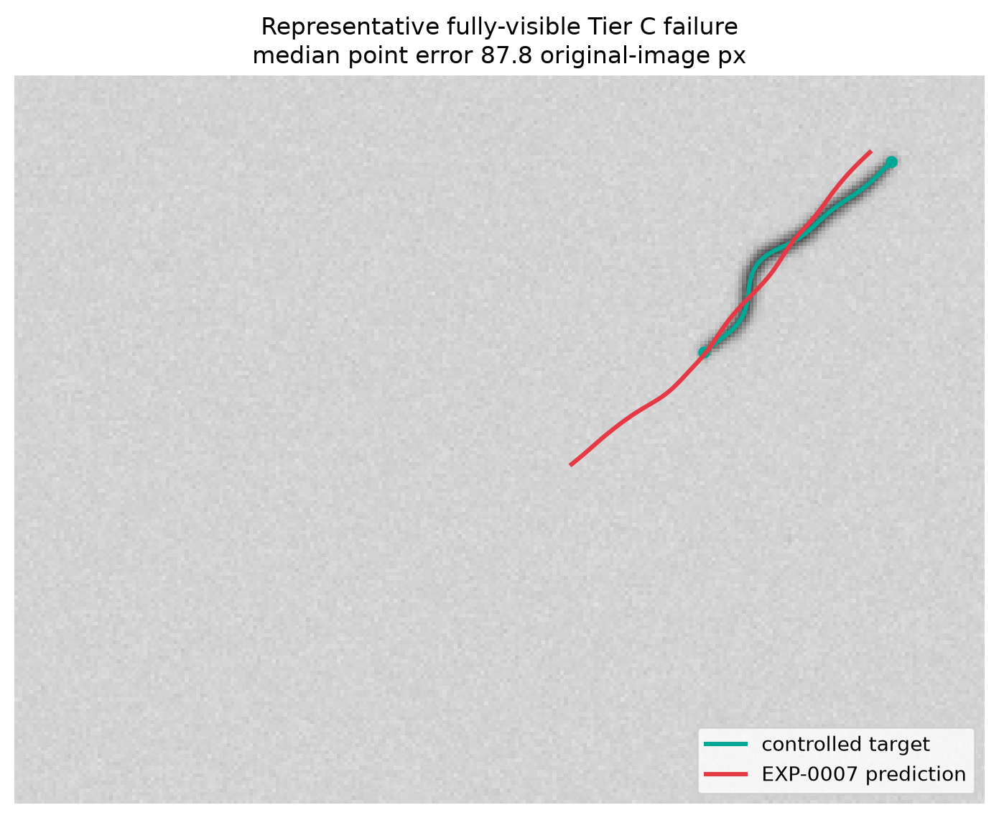

# Worm Pose Gen

Research code for 2D *C. elegans* centerline and body-angle estimation from NIR
behavior video. The original completed study is a **negative result**: no learned model
met the frozen reliability gates, so there is no deployment-authorized final
model. The repository nevertheless contains a reproducible data audit,
leakage-safe evaluation protocol, classical candidate proxies, controlled crop
benchmarks, tested geometry/HDF5 infrastructure, and an explicitly opt-in
exploratory inference path for the rejected diagnostic checkpoint.

A literature-grounded follow-on program is now active under
[`worm_pose_scientific_experiment_plan.md`](worm_pose_scientific_experiment_plan.md).
Its current evidence/status is tracked in
[`docs/SCIENTIFIC_EXPERIMENT_STATUS.md`](docs/SCIENTIFIC_EXPERIMENT_STATUS.md).
EXP-001 has a frozen 256-frame development candidate pool and a browser-based
single-annotator workflow for a 30-frame primary tranche plus 10 delayed blind
repeats; the independent Tier-C EXP-008 branch has
measured a provisional differentiable-refinement capture basin. These additions
do not turn the rejected checkpoint into a deployable model.

The canonical research specification is
[`worm_pose_agent_orchestrator.md`](worm_pose_agent_orchestrator.md). The final
conclusions are in [`docs/FINAL_REPORT.md`](docs/FINAL_REPORT.md), and the
visual evidence trail is in [`docs/EXPERIMENT_FLOW.md`](docs/EXPERIMENT_FLOW.md).

## Install and verify

Python 3.13 and `uv` are required. Every project `uv` command must go through
the checked-in wrapper so the repository-local environment/cache and physical
CUDA-device mapping are applied consistently.

```bash
scripts/bootstrap_environment.sh --require-cuda
scripts/project_env.sh uv sync --frozen --python 3.13
scripts/project_env.sh uv run --no-sync --frozen python scripts/preflight.py --require-cuda
scripts/project_env.sh uv run --no-sync --frozen python -m unittest discover -s tests
```

See [`docs/ENVIRONMENT.md`](docs/ENVIRONMENT.md) for the exact Python, Torch,
Lightning, GPU UUID/PCI identity, storage paths, and resource limits.

## Reproduce training and evaluation

EXP-0007 used a staged, preregistered primary-fold run. Its exact baseline,
step-300 comparison, resume authorization, checkpoint identities, and commands
are documented in
[`experiments/exp_0007_spatial_rescue/notes.md`](experiments/exp_0007_spatial_rescue/notes.md).
That locked record is canonical; a single `train.py` command is insufficient
because continuation past step 300 requires the immutable comparison artifact.
The record also identifies the required external-root placeholder and separates
the manual qualitative review from executable CLI stages.

Do not resume or run additional folds unless the executable decision artifacts
authorize them. The completed experiment returned `PRIMARY_FOLD_FAIL`; folds
0/1, repeats, temporal modeling, and holdout evaluation were therefore not run.

## Exploratory HDF5 inference

The shipped checkpoint is named `exp_0007_rejected_diagnostic.ckpt` on purpose.
It is not a final model. Inference refuses to run without an explicit
acknowledgment and marks every output
`validation_status=exploratory_rejected_checkpoint`.

```bash
scripts/project_env.sh uv run --no-sync --frozen python scripts/infer_hdf5.py \
  --source /path/to/read_only_recording.h5 \
  --dataset /explicit/image/dataset/path \
  --checkpoint artifacts/checkpoints/exp_0007_rejected_diagnostic.ckpt \
  --config configs/final.yaml \
  --output /path/to/new_pose_output.h5 \
  --device cuda --batch-size 64 --allow-exploratory
```

Input must be a frame-major grayscale HDF5 dataset. Source files are opened
read-only and never overwritten. Output is streamed to a same-filesystem
`.partial`, validated, marked complete, and atomically published beneath
`/worm_pose`. Before source access, inference verifies that the checkpoint SHA,
model identity, dimensions, and rejected validation status match the exact
`configs/final.yaml` bytes recorded in output provenance. See
[`docs/OUTPUT_SCHEMA.md`](docs/OUTPUT_SCHEMA.md).

## Result snapshot

The 4×4 intrinsic rescue improved the EXP-0004 primary-fold median from 116.92
to 87.54 original-image pixels. Its synchronized batch-32 CUDA
preprocessing-plus-forward microbenchmark reached 2,461 samples/s, excluding
HDF5 I/O and output serialization. It nevertheless failed the 4 px reliability
gate, endpoint/length/angle gates, and qualitative shortcut gate. Predictions
systematically collapsed toward short, straight, mislocalized poses.



## Evidence and limitations

- Four of 12 supplied recordings were usable in the bounded audit; eight had
  open/schema/image-read failures.
- No manual Tier A centerline labels were supplied. Candidate proxies are not
  ground truth, and analytic Tier C accuracy is not real-image accuracy.
- The audited 2025 holdout remains unopened beyond its disclosed Phase-1 audit
  samples because model selection failed before final-test authorization.
- The proposal-only CUDA benchmark excludes HDF5 reading and output
  serialization; it is not a storage-inclusive final-system benchmark.
- Head/tail identity, pose uncertainty, temporal inference, refinement, and
  production quality are not validated. Exploratory outputs use documented
  conservative sentinels for unavailable semantics.

The smallest evidence upgrade under the one-annotator constraint is the
30-primary + 10-repeat workflow in
[`docs/SINGLE_ANNOTATOR_WORKFLOW.md`](docs/SINGLE_ANNOTATOR_WORKFLOW.md). It
measures intra-annotator repeatability, not inter-annotator agreement. The older
multi-person recommendation remains in
[`docs/ANNOTATION_RECOMMENDATIONS.md`](docs/ANNOTATION_RECOMMENDATIONS.md) as a
stronger protocol if more annotators ever become available.
