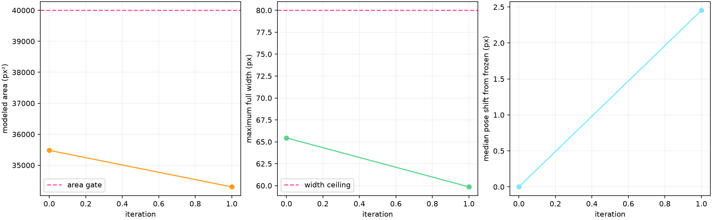
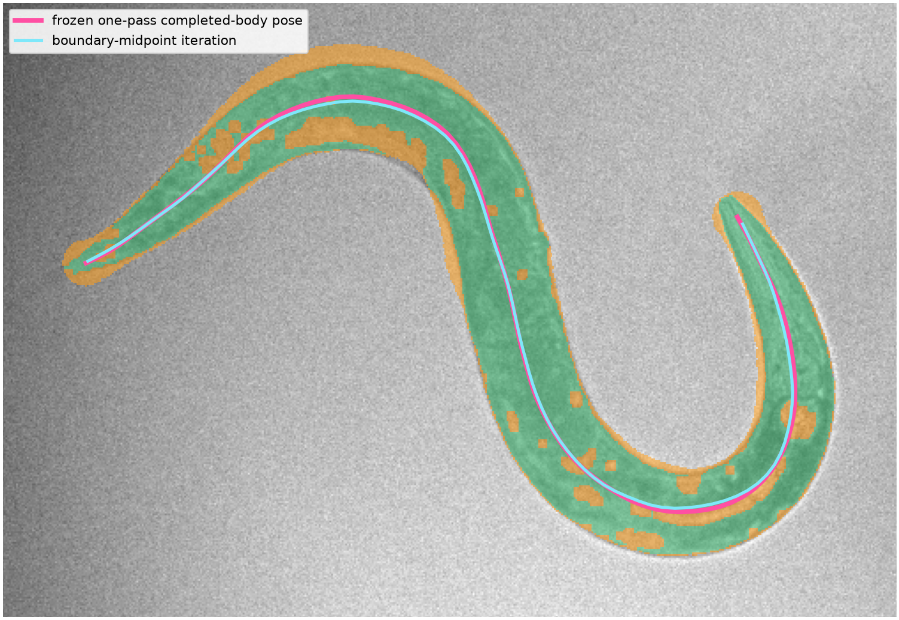
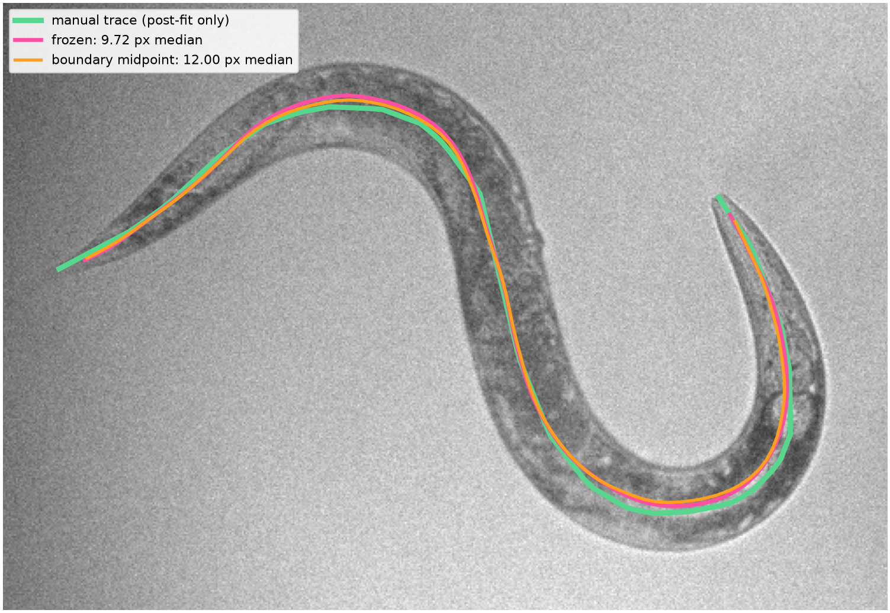

# Border-breach repair and iterative midline refinement

This audit tests two ways to improve the smooth-body experiment:

1. Seal narrow gaps that connect an internal cut-in to the outside of the segmented worm.
2. Recompute the geometric midpoint of the rendered body's two sides.

Here, **border** means the boundary of the segmented worm, not the edge of the video frame.

The result is mixed. The border repair produces a smaller, cleaner body model. Neither repair nor iteration produces a more accurate centerline on this frame, so the frozen one-pass smooth-body result remains the best pose in this audit.

## Evidence boundary

- This uses the same real frame as the prior audit: frame `3420` from `nir_videos/2023-09-19-01.h5`, dataset `/img_nir`.
- It is one disclosed development frame. This frame previously influenced a radius-6 cleanup choice, so this is a mechanism audit, not independent validation.
- The original **25,709 Section 3 pixels remain the required positives** in every fit. Repair pixels initialize the midline but are never promoted to detections.
- A completed body may contain pixels deliberately restored by the prior, so its revised area allowance is `2,500–40,000 px²`. The historical `30,000 px²` ceiling remains specific to the raw segmentation component.
- The one-annotator trace is loaded only after selection, fitting, and stopping. There is no manual body mask.
- The protected 2025 holdout remains unopened.

## Frozen starting point

We begin from the exact same Section 3 component as the previous experiment.


The earlier method fills only enclosed holes. The long gray cut-in near the upper bend is connected to the exterior, so it is missed.


That initialization has **11 endpoints** and **9 branch pixels**. Its one-pass smooth body contains every Section 3 positive, but has a modeled area of **35,481 px²**.

# Experiment A: repair narrow exterior notches

## A1. Seal a narrow mouth, then fill its pocket

For each candidate radius from `3 px` through `12 px`:

1. Morphologically close the initialization to bridge narrow mouths.
2. Find background pockets that became enclosed by that bridge.
3. Fill those pockets.
4. Keep every original positive pixel.
5. Check that the broad U-shaped opening still belongs to the exterior.

The repair is allowed only when:

- Added area is at most 10% of the original component.
- At least 99% of the original exterior background remains exterior.
- The initialization has exactly 2 endpoints, no branches, and no cycle.

We choose the smallest radius that passes every rule. The manual trace is not involved.


The first passing radius is **6 px**.

## A2. Inspect exactly what was added

- Orange: **1,028 bridge pixels** that seal narrow mouths
- Magenta: **273 pocket pixels** isolated by the bridge and then filled
- Cyan: previous initialization


The repair adds **1,301 pixels**, or **5.06%** of the original component. The broad U stays open, and **99.81%** of the previous exterior remains exterior.

The table below audits image evidence only at the newly inferred border/body pixels. It is not a centerline metric:

| Added region | Pixels | Local darkness `z >= 0` | Original threshold `z >= 2.6` |
|---|---:|---:|---:|
| Sealing bridges | 1,028 | 44.16% | 0% |
| Enclosed pockets | 273 | 9.52% | 0% |
| Total repair | 1,301 | 36.89% | 0% |

These are model-supplied pixels, not confirmed worm pixels.

## A3. Create the new initialization skeleton

For reference, direct closing needs radius `7 px` to consume the whole notch. Seal-then-fill reaches the same simple topology at radius `6 px` and makes the inferred pocket explicit.


| Measure | Enclosed holes only | Seal then fill |
|---|---:|---:|
| Skeleton components | 1 | 1 |
| Endpoints | 11 | 2 |
| Branch pixels | 9 | 0 |
| Cycle | no | no |

This fixes the stated failure mode: the border-breaching notch no longer creates a competing skeleton path.

## A4. Fit the latent midline again

The repaired initialization is skeletonized, reduced to its longest path, resampled, and projected into the same 16-coefficient cubic latent representation.


The width fit still targets only the original Section 3 positives. It uses the same containment margin, width-slope limit, and 80 px width ceiling as the frozen experiment.

## A5. Render the body and rerun the remaining steps


The notch repair reduces the modeled body:

| Measure | Frozen one-pass | Seal then fill |
|---|---:|---:|
| Modeled area | 35,481 px² | **32,639 px²** |
| Pixels added beyond Section 3 | 9,772 | **6,930** |
| Maximum full width | 65.45 px | **57.97 px** |
| Original-positive containment | 100% | 100% |

The body becomes **2,842 pixels smaller** while retaining every original positive.

We then rerun thinning, spur removal, longest-path selection, and 100-point resampling without changing them.


The modeled area is valid under the revised gate:

- Area is `32,639 px²`, below the revised `40,000 px²` limit.

The result **passes the modeled-body gate**. Its centerline is defined geometrically as the medial path between the two sides of the completed body. No visual feature is sampled or scored at the centerline.

# Experiment B: recompute the boundary midpoint

This loop begins with the frozen Step 4 body and keeps the Section 3 positives fixed.

## B1. Boundary-midpoint loop

The simple loop is:

`rendered body -> skeleton -> smooth latent midline -> containing width -> new body`

An update is accepted only if it keeps exact containment, stays below the width ceiling, and strictly reduces area.



The first update reduces area from **35,481** to **34,302 px²** and reduces maximum full width from **65.45** to **59.86 px**. The second proposal increases area, so the fixed stopping rule rejects it.



This is a geometric self-consistency update, not new image evidence. The skeleton is the medial path of the model's own rendered tube, so the loop cannot recover a missing side that the body model did not already infer.

## Post-fit centerline audit

Only now do we compare the poses with the one-annotator trace.




| Pose | Median point error | Mean tangent error | Mean endpoint error | Decision before trace was loaded |
|---|---:|---:|---:|---|
| Original classical pose | 16.58 px | 14.24 deg | **10.60 px** | accepted by original extractor |
| Frozen one-pass smooth body | **9.72 px** | **4.63 deg** | 13.77 px | passes modeled-body gate |
| Direct closing, `r=7` | 11.52 px | 5.36 deg | 16.39 px | passes modeled-body gate |
| Seal then fill, `r=6` | 12.19 px | 5.42 deg | 20.85 px | passes modeled-body gate |
| Boundary-midpoint iteration | 12.00 px | 5.22 deg | 16.90 px | passes modeled-body gate |

The border repair makes the modeled body smaller, but moves the midline away from the trace. The boundary-midpoint iteration does the same.

# Verdict

We **can** fill holes that breach the segmentation boundary with a narrow-mouth seal followed by pocket filling. On this frame it repairs the initialization topology and substantially reduces false-positive modeled area.

But a perfect two-endpoint skeleton is not the same as a correct anatomical midline. Here, topology-only repair over-smooths a path that was already geometrically useful. Iterating on the rendered body is self-consistent, but cannot add new information about a missing border.

The best next version should estimate both body edges, regularize their smoothness and separation, and define the midline pointwise as their midpoint. It should accept a notch repair only when the two sides of its mouth have compatible boundary directions. Temporal agreement with adjacent video frames can provide another independent cue when one frame is ambiguous.

Before any method is promoted, its rules must be frozen and run unchanged over all 30 development annotations, reporting both error and acceptance coverage.

## Rebuild and inspect

Run from the repository root:

```bash
scripts/project_env.sh uv run --no-sync --frozen python \
  scripts/build_boundary_notch_repair_experiment.py

scripts/project_env.sh uv run --no-sync --frozen python \
  scripts/build_iterative_smooth_body_prior_experiment.py
```

Machine-readable results:

- [`boundary_notch_repair_experiment/metrics.json`](boundary_notch_repair_experiment/metrics.json)
- [`iterative_smooth_body_prior_experiment/metrics.json`](iterative_smooth_body_prior_experiment/metrics.json)

Pixel-level masks, paths, widths, candidates, and poses are stored in the adjacent compressed NPZ files.
