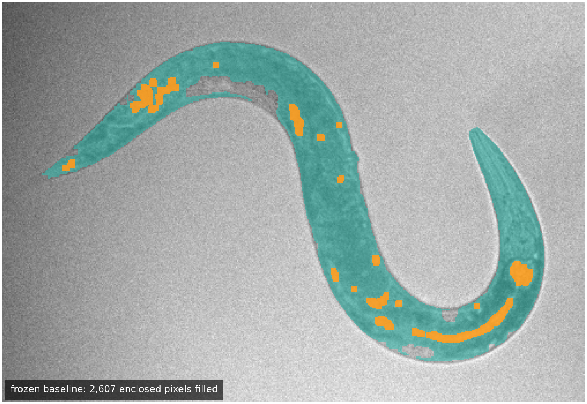
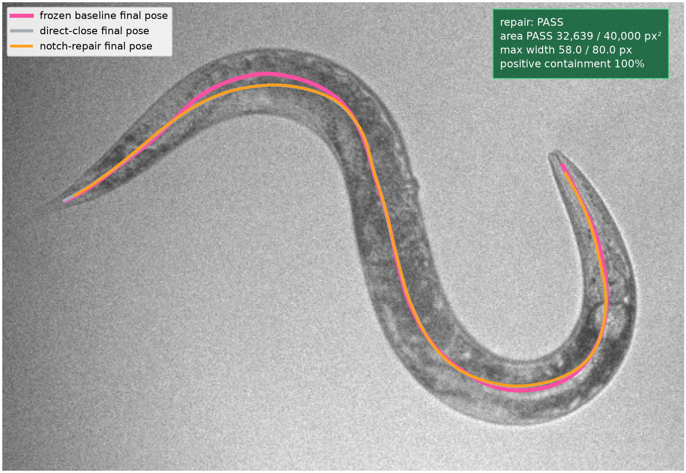
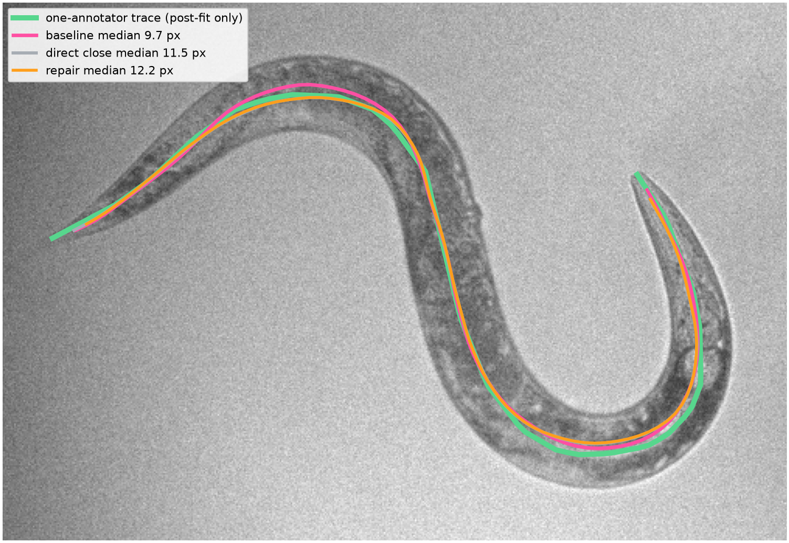

# Geometry-only repair of a narrow exterior notch

This audit tests one targeted change to the smooth-body stage: seal a narrow
gap that connects a deep cut-in to the exterior of the segmented worm, then
fill the pocket isolated by that seal. Here, **boundary** means the boundary of
the segmented worm, not the edge of the video frame.

The repair produces a smaller, topologically simpler containing body. It does
not by itself improve the annotated centerline on this frame, so the result is
kept as a specific mask-topology mechanism rather than a general accuracy
claim.

## Evidence boundary

- The input is frame `3420` from `nir_videos/2023-09-19-01.h5`, dataset
  `/img_nir`.
- This is one disclosed development frame, not independent validation.
- All **25,709 Section 3 pixels remain required positives**. Repair pixels
  initialize the midline but are never promoted to detections.
- A completed body may contain pixels deliberately restored by the prior, so
  its area allowance is `2,500-40,000 px^2`. The historical `30,000 px^2`
  ceiling applies only to the raw segmentation component.
- The one-annotator trace is loaded only after candidate selection, fitting,
  and gating. There is no manual body mask.
- The protected 2025 holdout remains unopened.

## Frozen starting point

The input is the exact Section 3 component from the classical extractor.


The previous initialization fills only enclosed holes. The long cut-in near
the upper bend is connected to the exterior, so it is not filled.



That initialization has **11 endpoints** and **9 branch pixels**. Its one-pass
smooth body contains every Section 3 positive and has a modeled area of
**35,481 px^2**.

## A1: seal a narrow mouth, then fill its pocket

For each candidate radius from `3 px` through `12 px`, the algorithm:

1. morphologically closes the initialization to bridge narrow mouths;
2. finds background pockets newly enclosed by that bridge;
3. fills those pockets;
4. keeps every original positive pixel; and
5. checks that the broad U-shaped opening remains exterior.

A candidate passes only when it adds at most 10% of the original component,
retains at least 99% of the original exterior background, and produces one
acyclic path with exactly two endpoints and no branches. The smallest passing
radius is selected without the manual trace.


The first passing radius is **6 px**.

## A2: audit the inferred pixels

The selected repair adds **1,028 bridge pixels** and **273 pocket pixels**.


The total addition is **1,301 pixels**, or **5.06%** of the original component.
The broad U stays open, and **99.81%** of the previous exterior remains
exterior.

| Added region | Pixels | Local darkness `z >= 0` | Original threshold `z >= 2.6` |
|---|---:|---:|---:|
| Sealing bridges | 1,028 | 44.16% | 0% |
| Enclosed pockets | 273 | 9.52% | 0% |
| Total repair | 1,301 | 36.89% | 0% |

These are model-supplied pixels, not image-confirmed worm pixels.

## A3: verify the initialization topology

Direct closing needs radius `7 px` to consume the whole notch. Seal-then-fill
reaches the same simple topology at radius `6 px` while keeping the inferred
pocket explicit.


| Measure | Enclosed holes only | Seal then fill |
|---|---:|---:|
| Skeleton components | 1 | 1 |
| Endpoints | 11 | **2** |
| Branch pixels | 9 | **0** |
| Cycle | no | no |

The border-breaching notch no longer creates a competing skeleton path.

## A4: refit the smooth containing body

The repaired initialization is skeletonized, reduced to its longest path,
resampled, and projected into the same 16-coefficient cubic latent
representation.


The width fit still targets only the original Section 3 positives, using the
same containment margin, width-slope limit, and `80 px` full-width ceiling.

## A5: render the body and regenerate the pose


| Measure | Frozen one-pass | Seal then fill |
|---|---:|---:|
| Modeled area | 35,481 px^2 | **32,639 px^2** |
| Pixels beyond Section 3 | 9,772 | **6,930** |
| Maximum full width | 65.45 px | **57.97 px** |
| Original-positive containment | 100% | **100%** |

The repaired body is **2,842 pixels smaller** while retaining every original
positive. Thinning, spur removal, longest-path selection, and 100-point
resampling are then rerun unchanged.



The `32,639 px^2` body passes the modeled-body gate.

## Post-fit centerline audit

Only after the geometry is complete is the result compared with the
one-annotator trace.



| Pose | Median point error | Mean tangent error | Mean endpoint error |
|---|---:|---:|---:|
| Original classical pose | 16.58 px | 14.24 deg | **10.60 px** |
| Frozen one-pass smooth body | **9.72 px** | **4.63 deg** | 13.77 px |
| Direct closing, `r=7` | 11.52 px | 5.36 deg | 16.39 px |
| Seal then fill, `r=6` | 12.19 px | 5.42 deg | 20.85 px |

The repair succeeds at its stated topology and containment goals but moves the
midline away from the trace relative to the frozen one-pass body. A simple
two-endpoint skeleton is not proof of an anatomical midline. The following A6
stage therefore addresses only the separately observed endpoint retreat; it
does not reinterpret this result as a blanket accuracy improvement.

## Rebuild

From the repository root:

```bash
scripts/project_env.sh uv run --no-sync --frozen python \
  scripts/build_boundary_notch_repair_experiment.py
```

Machine-readable results are in
[`boundary_notch_repair_experiment/metrics.json`](boundary_notch_repair_experiment/metrics.json)
and `boundary_notch_repair_experiment/experiment_arrays.npz`.
