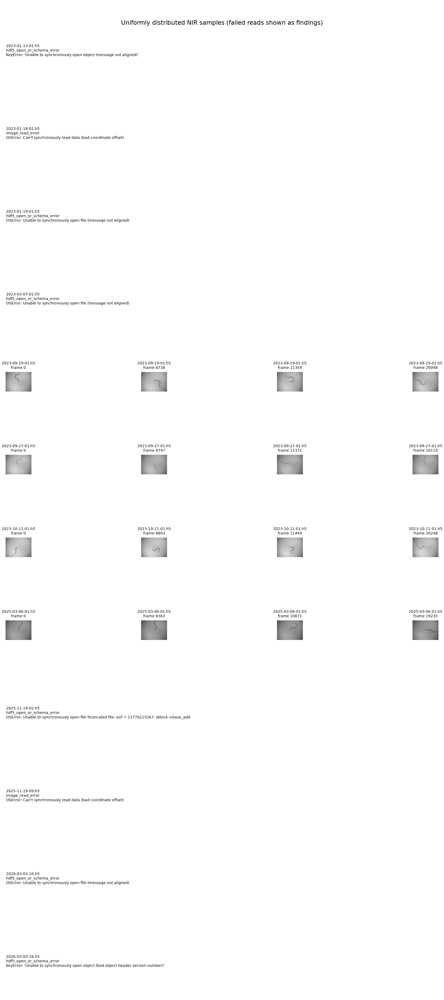
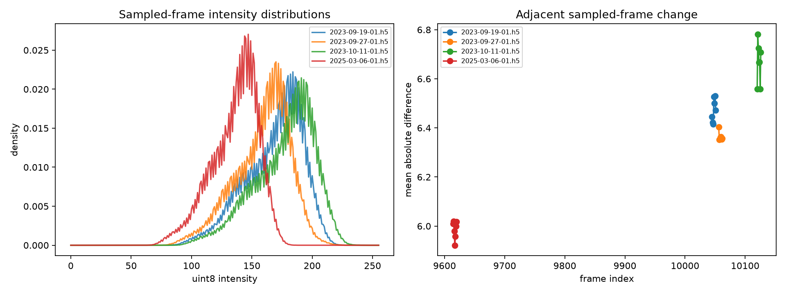
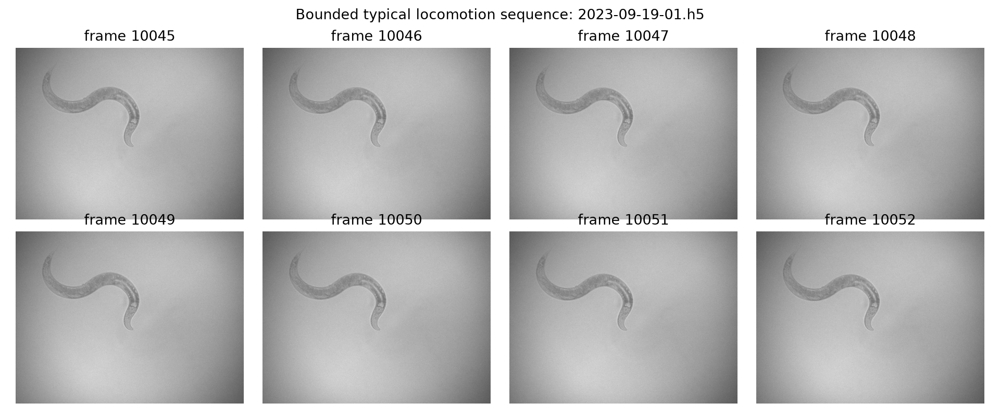
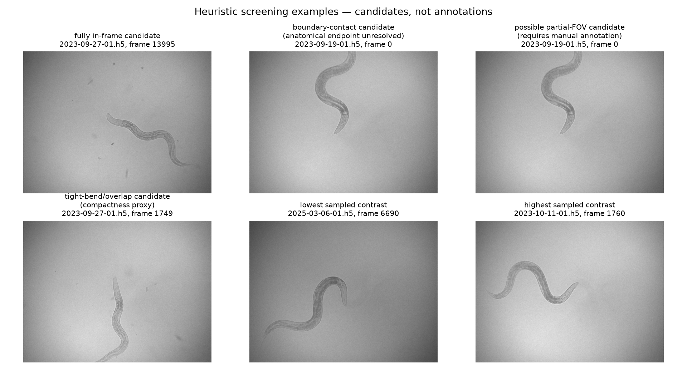

# NIR HDF5 data audit

## Executive finding

The inventory contains 12 read-only HDF5 symlinks totaling 167,133,843,404 bytes (155.66 GiB). With h5py 3.16.0 and HDF5 2.0, only four recordings permit bounded `img_nir` reads: `2023-09-19-01`, `2023-09-27-01`, `2023-10-11-01`, and `2025-03-06-01`. Eight recordings fail with corruption-like HDF5 errors. These failures are data findings; this audit did not attempt repair, copying, alternate mounts, or source modification.

The four readable recordings contain 79,704 NIR frames. They share a `[frame, y, x] = [N, 732, 968]`, uint8, grayscale schema, one-frame chunks, and Blosc filter ID 32001. Camera metadata is interleaved at approximately 40 Hz; selecting `img_metadata/q_iter_save == 1`, whose count matches `img_nir`, gives a median NIR interval of approximately 0.0500 s (20.0 Hz). This mapping and the timestamp unit are strongly supported in these files but remain inferred because no authoritative unit attribute was found.

Only 32 distinct image indices per readable recording were examined. Consequently, all frequency, foreground, boundary, body-size, overlap, and image-quality statements below are screening estimates, not labels or full-recording prevalence estimates.

## Reproduction and safety envelope

Run from the repository root:

```bash
scripts/project_env.sh uv run --no-sync --frozen python scripts/inspect_hdf5.py \
  --input-dir nir_videos --max-samples 32
```

The inspector opens exactly one HDF5 file at a time in read-only mode, reads at most 32 distinct image indices from a usable recording, and closes the handle before advancing. Sampling combines uniform temporal coverage with an eight-frame central sequence. It loads small timestamp arrays but never performs a full image scan. Source symlinks and resolved recordings are never written or copied.

Machine-readable evidence is in [data_audit_summary.json](../artifacts/data_audit_summary.json) and [data_audit_summary.csv](../artifacts/data_audit_summary.csv). JSON records resolved paths, source size/mtime identity, full recoverable schema, sample indices, timestamps, intensity statistics, per-frame heuristic results, errors, and the split proposal.

## Inventory and readability

| Recording | GiB | Recoverable `img_nir` shape | Status / first decisive error |
|---|---:|---|---|
| 2023-01-13-01 | 12.93 | not safely recoverable | object open failed: message not aligned |
| 2023-01-18-01 | 12.89 | 19,304×732×968 | image read failed: bad coordinate offset |
| 2023-01-19-01 | 12.84 | unavailable | file open failed: message not aligned |
| 2023-03-07-01 | 12.95 | unavailable | file open failed: message not aligned |
| 2023-09-19-01 | 13.42 | 20,099×732×968 | usable |
| 2023-09-27-01 | 13.43 | 20,120×732×968 | usable |
| 2023-10-11-01 | 13.52 | 20,249×732×968 | usable |
| 2025-03-06-01 | 12.84 | 19,236×732×968 | usable |
| 2025-11-19-02 | 12.82 | unavailable | file reports an impossible stored EOF / truncation |
| 2025-11-19-09 | 12.71 | 19,038×732×968 | image read failed: bad coordinate offset |
| 2026-03-03-10 | 12.56 | unavailable | file open failed: message not aligned |
| 2026-03-03-16 | 12.73 | 19,069×732×968 partly recoverable | object open failed: bad object-header version |

The exact exception text is retained in the JSON/CSV. Some damaged files expose top-level keys or dataset headers before a later object or image read fails. A recoverable shape therefore does **not** imply usable pixels. Treat all eight failed recordings as quarantined inputs, not as empty or valid negative examples.

### Recoverable schema

All four usable files expose the same main layout:

- `img_nir`: uint8 `[N, 732, 968]`, chunks `[1, 732, 968]`, Blosc-compressed, attribute `desc = "850 nm NIR image"`;
- `img_metadata/{img_id,img_timestamp,q_iter_save,q_recording}`: per-camera-image metadata; its length is approximately twice `N`;
- `pos_stage`: float64 `[N, 2]` and `pos_feature`: float32 `[N, 3, 3]`;
- `daqmx_ai`: float64 `[3, M]` and `daqmx_di`: uint32 `[2, M]`;
- scalar `recording_start` and small recording-specific datasets beneath `metadata`.

The metadata describes SWF702, “atypical” orientation in all readable files. The first three are explicitly starvation conditions; `2025-03-06-01` instead records `condition = "hamamatsu camera"`. No pixel-size or magnification field was found, so the supplied 10× magnification remains an unverified hypothesis. The audit performs no transpose, crop, rescale, or normalization.

## Timing and continuity

For each readable recording, `q_iter_save == 1` selects exactly `N` timestamps. Median selected intervals imply 19.9994 Hz in every file. No selected timestamps are duplicate or non-monotonic. However, 370, 374, 370, and 409 selected intervals respectively exceed 1.5 times the recording median (about 1.8–2.1% of intervals). These may represent dropped frames, acquisition pauses, or timestamp/mapping behavior; they must not be treated as uniform 20 Hz steps without checking the actual timestamps.

Model input and result files should therefore preserve both frame index and timestamp. Temporal windows should be broken across large timestamp gaps rather than blindly spanning them.

## Image evidence



The readable sample shows one dark, high-resolution worm against a brighter, smoothly varying background. No sampled frame visibly contains a second worm. Worm position often remains near the field center while stage-position arrays exist, which is compatible with a tracking/moving FOV, but this audit did not estimate an image registration transform and cannot prove camera/stage motion from the bounded images alone. Image dimensions and rough body dimensions are stable enough to suggest similar scale across the readable files; physical scale remains unknown.



Sampled intensity differs substantially by recording. The `(p1, median, p99)` values are:

| Recording | p1 | median | p99 | Adjacent mean absolute difference, sampled central sequence |
|---|---:|---:|---:|---:|
| 2023-09-19-01 | 105 | 173 | 209 | 6.42–6.53 |
| 2023-09-27-01 | 98 | 163 | 202 | 6.35–6.40 |
| 2023-10-11-01 | 109 | 182 | 220 | 6.56–6.78 |
| 2025-03-06-01 | 83 | 139 | 170 | 5.92–6.02 |

Thus, fixed raw-intensity thresholds are unsafe. Per-recording or local robust normalization is justified, while preserving original intensities and transformation metadata. No consecutive sampled pair is identical. The eight-frame sequence shows ordinary smooth motion and no obvious severe motion blur, but eight frames cannot establish a dataset-wide blur rate.



### Qualified foreground/body screening

The audit forms a temporal median from only the sampled frames, downsamples by 4, thresholds absolute background residual at `max(8, median + 6*MAD)`, and summarizes the largest 8-connected component. This detects moving foreground, not anatomy. It can merge old/new worm locations, lose stationary body pixels, or select illumination/background changes.

Across the four readable recordings, the proxy's median major-axis span is roughly 321–425 px and its crude width proxy is roughly 14–25 px. These are order-of-magnitude initialization ranges, not biological measurements. Proxy boundary-contact rates are 12.5%, 3.1%, 6.2%, and 25.0% respectively. With only 32 sampled frames per recording and a non-validated detector, these rates establish that truncation/boundary cases are common enough to design for, but they do not estimate true prevalence.



The screening figure deliberately says “candidate.” Anatomical head versus tail cannot be assigned reliably from static appearance in this audit, including at the boundary. Tight bends are clearly present. No definite self-overlap was established in the bounded sample, although compact tight bends can be ambiguous in projection. Fully visible and partial-FOV candidates both occur. Manual centerline/endpoint/visibility labels are needed to quantify truncation, overlap, and head/tail appearance.

## Answers to the Phase 1 questions

- **One or multiple worms?** Exactly one worm is visible in each inspected readable frame; the eight unreadable files are unknown. This is sample evidence, not a guarantee.
- **Does the FOV move?** Likely tracking or stage motion is involved (`pos_stage` exists and the worm remains broadly centered), but motion was not registered, so this remains unresolved.
- **Does image scale change?** No obvious scale jump within the four readable recordings; all share 732×968 pixels and overlapping rough body-size proxies. Pixel scale and 10× magnification are not verified.
- **Can head/tail be distinguished statically?** Not reliably from this sample. Endpoint thickness/texture is sometimes suggestive but is not validated.
- **How frequent is truncation?** Clearly nonzero and potentially substantial. The unvalidated proxy spans 3.1–25.0% by recording; do not quote it as true prevalence.
- **How frequent is self-overlap?** Unresolved. Tight bends occur; no defensible overlap frequency can be inferred from 32 frames.
- **Is illumination stable enough for simple normalization?** Within-frame backgrounds are smooth, but cross-recording medians shift by 43 intensity levels. Robust recording/local normalization should be evaluated; one global threshold should not be assumed.
- **Could backgrounds leak recording identity?** Yes. Intensity/background differences, project family, year, camera condition, stage behavior, and acquisition metadata can all identify sessions.

## Leakage-safe split proposal

The canonical grouping keys are recorded in JSON:

1. `background_group = project family inferred from the source path` (`neuropal`, `starvation`, `sexsharedneurons`);
2. within it, `session_group = project family + acquisition date`;
3. every recording remains indivisible, and same-date recordings remain together.

The preferred evaluation is leave-one-background-family-out grouped cross-validation. Whole sessions/recordings are held out, so a temporal guard interval is not applicable. This is conservative because project family is the strongest currently observable background/setup key.

That protocol cannot currently be executed: every readable recording belongs to `starvation`, while every `neuropal` and `sexsharedneurons` recording is quarantined. Within-starvation leave-one-session-out validation may be used for engineering checks, but it is not an independent-background generalization claim. If a single fixed development allocation is urgently needed, use whole 2023 sessions for training/validation and reserve the 2025 Hamamatsu-condition session untouched as a session/camera-shift test; label the remaining shared-background risk prominently. Do not assign frames from one recording to different splits.

Model-development claims that require cross-background or cross-project generalization should pause until source owners provide readable recordings or an approved independent dataset. The audit does not recommend repairing these source files in place.

## Remaining risks and next evidence

- Eight of twelve recordings are unusable in the current accepted read-only environment; their image content, orientation, timing, and backgrounds remain unknown.
- The metadata timestamp unit and NIR-selection rule are inferred rather than declared by schema attributes.
- Timestamp gap causes need acquisition-owner confirmation.
- Magnification, pixel scale, image orientation semantics, and stage-to-image transform are not established.
- Boundary/body estimates come from a deliberately rough moving-foreground proxy and require stratified manual review.
- No true labels were supplied. Audit candidates must never be called ground truth or pseudo-label accuracy.
- A small manual audit set should stratify full-FOV, endpoint-near-boundary, partial-FOV, tight-bend/overlap, low-contrast, and high-motion cases across all readable sessions before quantitative pose evaluation.
