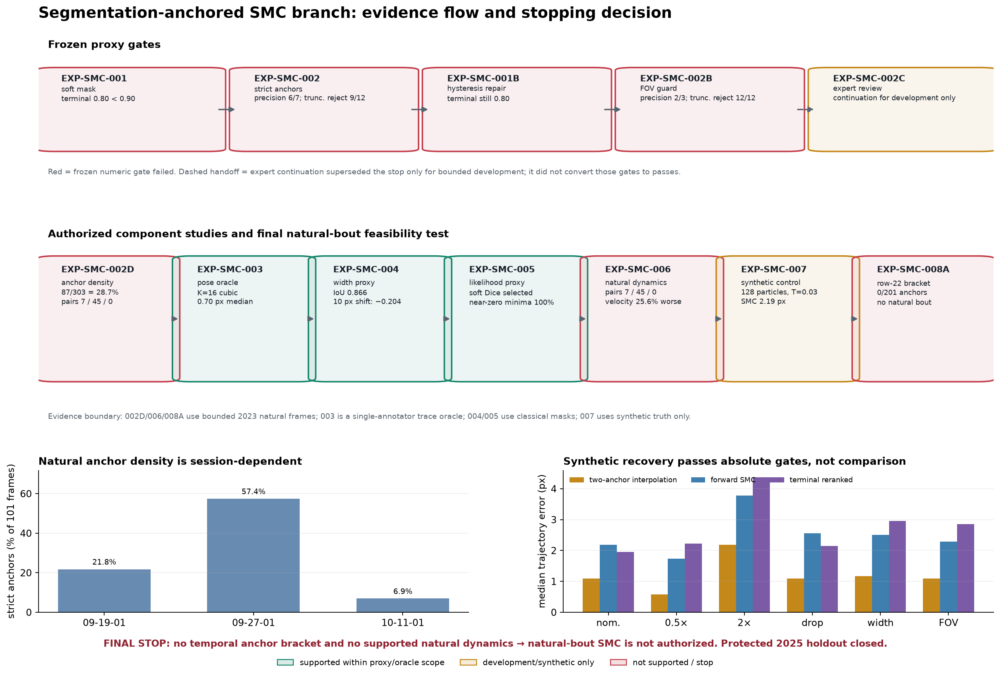
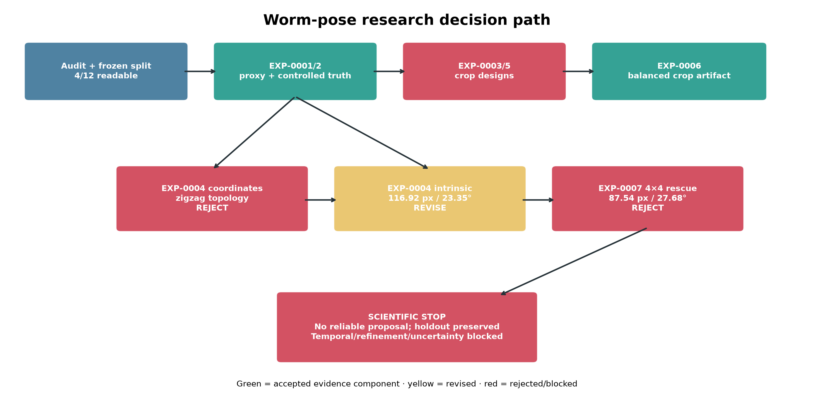
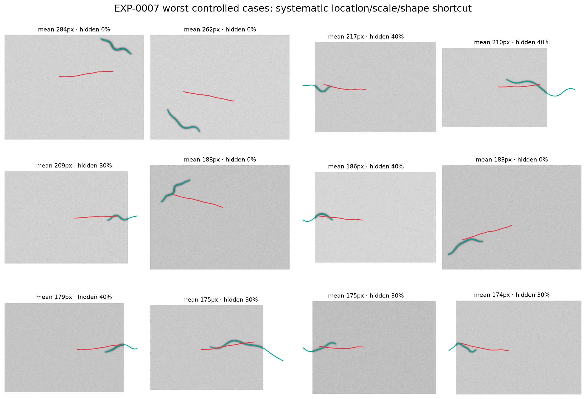
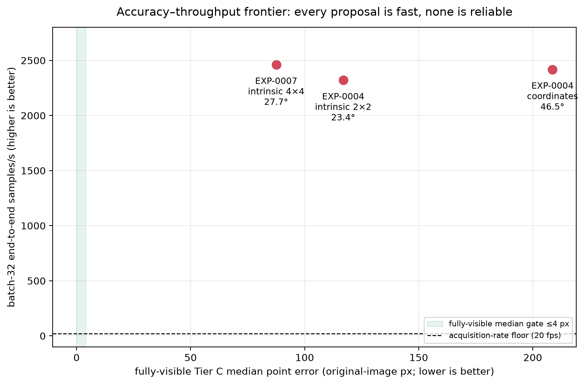
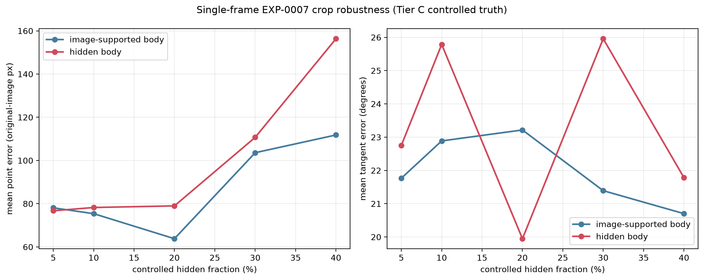
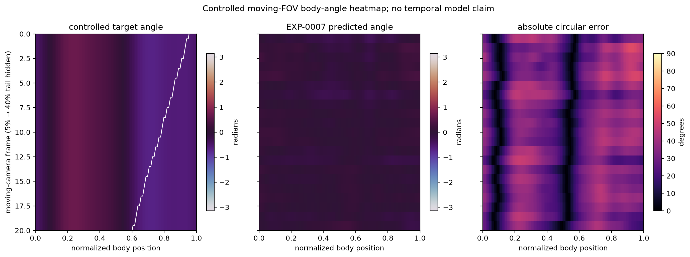
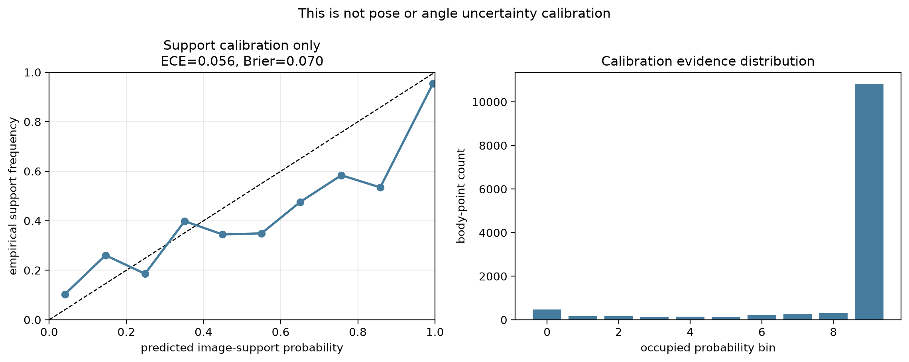

# Experiment flow

## Segmentation-anchored SMC branch — component checks passed, natural temporal path stopped



The figure is the shortest faithful summary: frozen segmentation and anchor
gates failed; an explicit expert decision then allowed bounded development
experiments without converting those failures into passes. Representation,
width, likelihood, and synthetic SMC execution were supported only inside
their oracle/proxy/control boundaries. Natural anchor continuity and dynamics
were not supported, and the row-22 hard case had no strict anchor in a
±100-frame scan. Natural-bout SMC therefore remains stopped. All work used
2023 development evidence; the protected 2025 holdout stayed closed.

### Upstream mask and anchor gates: EXP-SMC-001/002 → 001B/002B

**Hypotheses.** A conservative classical soft mask should retain terminals,
and strict mask-native skeletons should supply reliable complete-body anchors
while rejecting at least 90% of truncated frames.

- EXP-SMC-001 retained the trace at median/p10 0.980/0.958, but terminal
  containment was 0.800 against 0.900 and soft score on-trace was 0.738 against
  0.800: `NOT_SUPPORTED`.
- EXP-SMC-002 accepted 10/30 frames. Conditional precision was 6/7 and
  truncated rejection was 9/12, both below their 90% gates:
  `NOT_SUPPORTED`.
- EXP-SMC-001B added connected hysteresis with little recovered area
  (0.971% median, 2.199% p95), yet terminal containment remained 0.800:
  `NOT_SUPPORTED`.
- EXP-SMC-002B added a width-relative FOV guard. Truncated rejection became
  12/12, but only 2/3 accepted complete anchors were within 8 px:
  `NOT_SUPPORTED`.

The segmentation [`baseline random`](../experiments/exp_smc_001_segmentation_baseline/figures/random_cases.png),
[`baseline worst`](../experiments/exp_smc_001_segmentation_baseline/figures/worst_cases.png),
[`revision random`](../experiments/exp_smc_001b_hysteresis_terminal_recovery/figures/random_cases.png),
and [`revision worst`](../experiments/exp_smc_001b_hysteresis_terminal_recovery/figures/worst_cases.png)
views show broad body coverage but persistent terminal under-reach. Anchor
[`baseline accepted`](../experiments/exp_smc_002_mask_anchors/figures/accepted.png)
and [`revised accepted`](../experiments/exp_smc_002b_width_relative_fov/figures/accepted.png)
views show the safety/coverage tradeoff.

### Expert continuation and natural anchor density: EXP-SMC-002C/002D

**Hypothesis.** Expert review may distinguish an annotation mistake and an
expected hard case from gross pipeline failure, while contiguous scans test
whether strict anchors are dense enough for posture and dynamics work.

EXP-SMC-002C recorded row 2 as an annotation mistake, row 22 as an expected
hard SMC target, and the other 28 rows as adequate for development. This
superseded the prior stop for **development continuation only**; it did not
recompute the numeric gates, establish accuracy, or authorize final claims.
See the immutable [`adjudication`](../experiments/exp_smc_002c_expert_visual_adjudication/adjudication.json).

EXP-SMC-002D found 87/303 strict anchors (28.71%) across three 101-frame
windows. Densities were 22/101, 58/101, and 7/101; adjacent pairs were 7, 45,
and 0. Static posture extraction was feasible, but session-general empirical
dynamics were not. The [`timeline`](../experiments/exp_smc_002d_contiguous_anchor_density/timeline.png)
shows the fragmentation and session imbalance.

### Pose representation: EXP-SMC-003

**Hypothesis.** A fixed low-dimensional tangent basis can reconstruct known
complete traces with negligible oracle loss.

Both fixed families first passed at K=16. The frozen tie-break selected cubic
tangent splines: median/p95 point error 0.697/1.074 px and tangent error
3.305°/4.307° on 17 complete single-annotator traces. Recording-held-out PCA
was diagnostic only. Decision: `SUPPORTED_ORACLE_ONLY`. This validates a state
representation, not image inference or natural dynamics. See
[`capacity`](../experiments/exp_smc_003_latent_representation/figures/representation_capacity.png)
and [`body-position error`](../experiments/exp_smc_003_latent_representation/figures/selected_error_by_body_position.png).

### Width and observation proxies: EXP-SMC-004/005

**Hypotheses.** A simple recording-level width profile should render easy-mask
geometry without hiding pose errors, and a simple mask energy should have a
local basin around known poses.

EXP-SMC-004 obtained 0.8663 median cleaned-mask IoU with recording mean times
bounded scale; PCA-2 gained only 0.00038, and a 10 px translation reduced IoU
by 0.2041 after scale refitting. The least-complexity consequence was to begin
with fixed recording mean width. Decision: supported against a classical mask
proxy, not manual mask truth. See the
[`width summary`](../experiments/exp_smc_004_width_model/figures/width_model_summary.png).

EXP-SMC-005 selected soft Dice at 183×242. All 64 case/perturbation curves had
a minimum at zero or one adjacent grid step, outward monotonicity was 0.9714,
and median base-pose Dice was 0.8519. Decision:
`COMPLETED_SUPPORTED_ENERGY_SHAPE_ONLY`. This establishes a local likelihood
shape against classical segmentation, not global capture or calibrated
probabilities. See [`energy basins`](../experiments/exp_smc_005_observation_energy/figures/energy_perturbation_curves.png)
and [`base overlays`](../experiments/exp_smc_005_observation_energy/figures/base_pose_overlays.png).

### Natural dynamics failure: EXP-SMC-006

**Hypothesis.** Recording-balanced strict-anchor runs should support a simple
transition that predicts better than persistence.

The evidence prerequisite failed: adjacent pairs were 7/45/0 by recording,
five-frame cases were 0/16/0, and no 20-frame case existed. On 40 paired
one-step starts, persistence was 3.57 px while the best velocity diagnostic
was 4.48 px, 25.6% worse. Decision: `NOT_SUPPORTED_SESSION_GENERAL`. The
initial unpaired analysis is retained but invalid; the
[`paired horizon figure`](../experiments/exp_smc_006_dynamics_predictability/figures/dynamics_horizon.png)
is the evidence. The immutable addendum permits only a zero-drift,
block-diagonal random walk with synthetic scale for controlled testing.

### Controlled algorithm recovery: EXP-SMC-007

**Hypothesis.** With known synthetic zero-drift random-walk truth and real
strict anchors used only as starting shapes/widths, bootstrap SMC should meet
frozen absolute recovery gates under nominal and bounded stress conditions.

Calibration selected 128 particles and temperature 0.03. On two held-out
nominal seeds, forward SMC median trajectory error was 2.19 px, terminal
reranking was 1.95 px, truth survival was 1.00, and median ESS fraction was
0.89. Absolute synthetic gates passed across nominal, 0.5×/2× process scale,
dropout, width mismatch, and partial FOV. However, exact two-anchor latent
interpolation had the lowest median trajectory error in all six scenarios;
terminal reranking improved forward SMC in only 2/6. Therefore controlled
execution/truth survival is `SUPPORTED_SYNTHETIC_ONLY`, while general smoothing
benefit, SMC superiority, and H8 are `NOT_SUPPORTED`. See the
[`comparison`](../experiments/exp_smc_007_controlled_smc/figures/controlled_recovery_summary.png)
and [`trajectory`](../experiments/exp_smc_007_controlled_smc/figures/nominal_trajectory.png).

### Row-22 natural feasibility stop: EXP-SMC-008A

**Hypothesis.** The expert-designated hard frame may have strict anchors close
enough on both sides to define a short natural two-anchor SMC bout.

The unchanged final pipeline accepted 0/201 frames in the authorized
±100-frame window around row 22. There was no anchor before or after, and all
201 frames triggered branch-pixel and cycle rejection. Decision:
`NO_BOUNDED_STRICT_ANCHOR_BRACKET`. The [`timeline`](../experiments/exp_smc_008a_row22_anchor_bracket/timeline.png)
and [`local overlays`](../experiments/exp_smc_008a_row22_anchor_bracket/local_overlays.png)
show that this was an anchor-feasibility test; no SMC pose was inferred.

### Final branch decision

The component studies establish that K=16 pose geometry, simple width, soft
Dice, and SMC code are workable in bounded oracle/proxy/synthetic settings.
They do not repair the temporal evidence path. Adjacent-anchor continuity is
absent in one density window, and strict anchors are entirely absent around the
designated hard case; fitted dynamics do not beat persistence. Natural-bout
SMC and natural terminal-anchor smoothing are therefore **not authorized**.
Reopening the branch requires prospectively annotated temporal bouts or
demonstrably better anchor continuity, not a wider hidden search. Rebuild the
summary with:

```bash
scripts/project_env.sh uv run --no-sync --frozen python \
  scripts/build_smc_branch_figures.py
```

## Prior direct-regression research flow (preserved)

The project ended with a scientifically valid negative result: evidence
infrastructure was established, but neither proposal family met the frozen
ordinary-frame reliability gate. No final model was accepted and the audited
holdout was preserved.



## H0 — Can bounded real candidates and analytic truth support controlled research?

```text
EXP-0001 conservative real extraction      EXP-0002 analytic geometry
90 / 144 candidate proxies                 6,400 / 6,400 crop checks
0 / 24 reviewed gross failures             <=3.41e-13 px round trip
                 \                          /
                  v                        v
       separate real-texture proxy and exact-geometry strata
```

**Test.** Freeze conservative classical acceptance criteria, inspect random and
worst cases, and independently validate the differentiable renderer and static/
moving FOV transforms. Keep evidence tiers separate.

**Visual evidence.** The
[`random accepted proxies`](../experiments/exp_0001_classical_proxy/figures/random_accepted_overlays.png)
show usable real texture but occasional endpoint under-reach. The
[`controlled crop sequence`](../experiments/exp_0002_synthetic_crop/figures/crop_sequence_montage.png)
shows exact known support under a moving camera.

**Conclusion — PARTIALLY SUPPORTED.** These strata are sufficient for
engineering and controlled-geometry tests, but neither is Tier A manual truth.

**Consequence.** Proceed to small proposal comparisons while prohibiting
real-anatomical accuracy claims.

## H0b — Can a literal training-size window create the real crop benchmark?

```text
EXP-0003: 256 x 192 source window
        65 / 900 valid; 0 / 90 complete
                         |
                         v
EXP-0005: larger 4:3 source window + isotropic resize
        720 / 900 valid; 14 / 90 complete (gate >=60)
                         |
                         v
REJECT complete same-frame series; curved anatomy re-enters the window
```

**Test.** Hide 5/10/20/30/40% of either anatomical end while preserving a
contiguous visible complement, exact transforms, and unchanged real pixels.

**Visual evidence.** EXP-0003's
[`yield curve`](../experiments/exp_0003_real_texture_crop/figures/contract_yield.png)
shows that the physical window is too small. EXP-0005's
[`scaled crop evidence`](../experiments/exp_0005_scaled_real_crop/figures/scaled_real_crop_evidence.png)
shows the residual geometric re-entry failure.

**Conclusion — NOT SUPPORTED.** Scaling raises condition yield but does not
make the preregistered complete-frame benchmark feasible.

**Consequence.** Change the experimental unit prospectively rather than relax
the failed gate.

## H0c — Can valid conditions form a balanced static real-texture artifact?

```text
frozen EXP-0005 valid pool
          |
SHA-ranked 10 cases per recording x end x hidden fraction
          |
300 / 300 exact cases; 87 unique frames; all transforms verified
```

**Test.** Select exactly ten prevalidated conditions in each of 30 cells and
bind every source window, interpolation, support mask, and transform by digest.

**Visual evidence.** The
[`balance plot`](../experiments/exp_0006_balanced_real_crop/figures/balance.png)
shows exact cell coverage; the
[`all 40% cases`](../experiments/exp_0006_balanced_real_crop/figures/all_40_percent_cases.png)
expose the hardest selected stratum.

**Conclusion — SUPPORTED, LIMITED.** EXP-0006 is an accepted static
candidate-proxy engineering benchmark. It is not anatomical truth, a temporal
sequence benchmark, or a rescue of the rejected complete-frame hypothesis.

**Consequence.** Retain it for future gated crop work, but keep model-selection
claims anchored to Tier C until manual labels exist.

## H1 — Does intrinsic regression produce a reliable ordinary-frame proposal?

```text
same 2x2 encoder bottleneck
       /                                 \
direct 100-point coordinates             intrinsic 16-coefficient curve
208.66 px / 46.49 deg                    116.92 px / 23.35 deg
zigzag and >9,300 px length error        smooth but misplaced/scale collapsed
       \                                 /
        v                               v
                 both fail 4 px / 8 deg gates
```

**Test.** Compare only the output representation under the same data, fold,
encoder, budget, and evaluation identities.

**Visual evidence.** Random Tier C overlays show the
[`coordinate topology explosion`](../experiments/exp_0004_representation/results/coordinate_best/tier_C_random.png)
and the smoother but
[`mislocalized intrinsic predictions`](../experiments/exp_0004_representation/results/intrinsic_best/tier_C_random.png).

**Conclusion — NOT SUPPORTED.** Intrinsic geometry is structurally better, but
the shared proposal is nowhere near a reliable initializer.

**Consequence.** Reject coordinates. Preregister one intrinsic-only factor:
increase retained encoder spatial resolution from 2×2 to 4×4 without changing
the data, head, losses, or gates.

## H1b — Does a 4×4 spatial bottleneck rescue intrinsic localization?

```text
step 300: 102.15 px < 243.28 px frozen mean-pose baseline
                         |
                         v
continue exact checkpoint to step 1,200; select step 720
                         |
    primary effect: 87.54 px, 25.13% better than EXP-0004 [PASS]
    throughput: 2,461 samples/s, ratio 1.061              [PASS]
    ordinary reliability + visual shortcut               [FAIL]
                         |
                         v
PRIMARY_FOLD_FAIL: no folds, repeats, temporal branch, or holdout
```

**Test.** EXP-0007 changed only the retained grid, used an executable hashed
step-300 baseline, resumable exact training order, fixed 43-case fully-visible
Tier C gate, candidate proxies, synchronized GPU benchmark, and hash-bound
random/worst qualitative review.

**Result.** Fully-visible Tier C median/p95 point error was 87.54/233.24 px and
mean/p95-frame angle error was 27.68°/53.29° against 4/10 px and 8°/18° gates.
Candidate-proxy errors were worse. Endpoints and body length failed by large
margins. The qualitative review found systematic short, straight, displaced
predictions.




**Conclusion — NOT SUPPORTED.** More retained spatial features improved one
localization scalar but did not fix the shortcut or scientific reliability.
This is an exact/qualitative failure, not a near-gate result.

**Consequence.** The deterministic decision forbids all expansion. The 2025
audited holdout remains unopened, and temporal/refinement/uncertainty hypotheses
remain blocked.

## Cross-cutting result — speed was never the limiting factor



Every proposal exceeded the 20 fps acquisition floor by two orders of
magnitude in the common in-memory batch-32 harness. None approached the 4 px
ordinary-frame gate. The correct Pareto conclusion is not that EXP-0007 is a
fast final system; it is that accuracy, not compute, is the unresolved problem.
The benchmark excludes HDF5 reading and output serialization.

## Cropped-body and support branch



EXP-0007's independent-frame hidden-body error worsens at large crop fractions.
The moving-FOV angle heatmap shows the same failure under exact temporal crop
geometry without implying that a temporal model was tested.



Support probability had measurable calibration, but this is not pose
uncertainty:



## Final path

```text
accepted audit / geometry / persistence infrastructure
                         +
rejected diagnostic checkpoint behind explicit opt-in
                         |
                         v
NO DEPLOYMENT-AUTHORIZED MODEL
                         |
                         v
collect 256 manual labels -> test one localization-explicit architecture
```

The full numeric record is in `docs/EXPERIMENT_LOG.md` and each EXP folder.
Consequential architecture choices are in `docs/DECISIONS.md`; limitations and
the annotation protocol are in `docs/FINAL_REPORT.md` and
`docs/ANNOTATION_RECOMMENDATIONS.md`.
