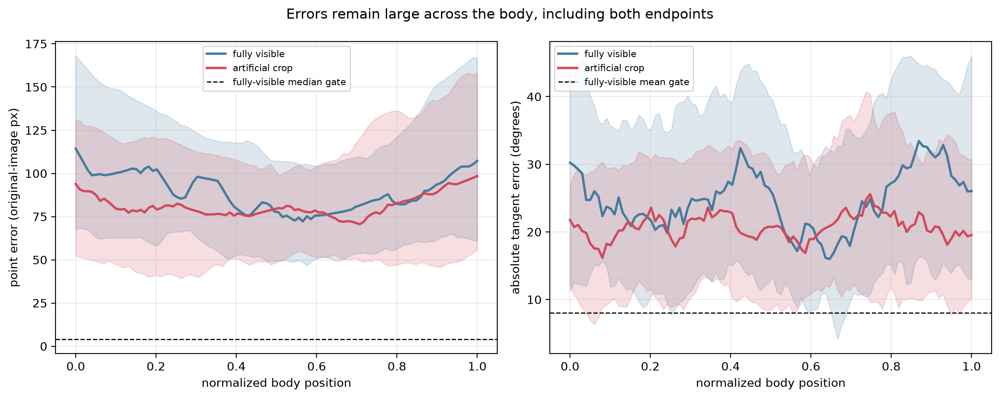

# Final report: a reliable proposal was not established

## Executive conclusion

This project produced a reproducible evaluation and inference scaffold, but no
model suitable for scientific or production use. The final preregistered
experiment, EXP-0007, improved the primary-fold fully-visible Tier C median
point error from 116.92 to 87.54 original-image pixels and remained very fast,
yet missed the 4 px gate by more than 20×, failed all angle/endpoint/length
gates, and showed a systematic short, straight, displaced mean-pose shortcut.
Its deterministic decision is `PRIMARY_FOLD_FAIL`.

Under the frozen protocol, this result forbids additional folds, repeat seeds,
temporal modeling, refinement, and untouched-holdout evaluation. Preserving the
holdout rather than spending it on an unreliable proposal is the main final
scientific decision.

## Problem and supplied data

The target was 100-point 2D *C. elegans* centerline and body angle as a function
of arc length and time in NIR behavior video, including frames where anatomy
leaves the FOV. Outputs were intended to distinguish geometric FOV membership,
image support, and pose uncertainty while exceeding the approximately 20 Hz
acquisition rate.

The supplied inventory contained 12 HDF5 symlinks totaling 155.66 GiB. A
bounded, serial audit of no more than 32 distinct frames per usable recording
found four readable starvation recordings with 79,704 grayscale uint8 frames,
shape 732×968, Blosc chunks, and median cadence near 20 Hz. Eight recordings
failed: six at open/schema inspection and two during sampled image reads. The
audit did not modify the source files. Full findings and disclosed indices are
in `docs/DATA_AUDIT.md`.

All readable recordings belong to the starvation project family, so the data
cannot establish cross-project/background generalization. Three 2023 sessions
form whole-session development folds. The distinct 2025 session is an audited
holdout: its disclosed audit samples are excluded, and its remaining frames
were never opened because model selection failed.

## Evaluation protocol

The protocol was frozen before learned-model development:

- Tier A: no manual labels were supplied;
- candidate proxy: conservative real-image classical centerlines, explicitly
  not truth;
- Tier C: analytic geometry and exact FOV transforms, explicitly not a
  substitute for real-image accuracy;
- splits: whole acquisition sessions, never adjacent-frame random splits;
- units: original 968×732 image pixels and circular degrees;
- ordinary-frame reliability: fully-visible Tier C median/p95 point error
  ≤4/10 px and mean/p95-frame angle error ≤8°/18°, plus endpoint, body-length,
  support, FOV, failure-count, and qualitative gates;
- candidate-proxy reliability: looser but still frozen 8/20 px and 15°/30°
  gates with endpoint/length/support checks;
- acceptance required all folds; early rejection could occur on primary fold 2;
- positive numeric results within 10% of a gate triggered repeat seeds, but
  exact or qualitative failures did not.

The full metric definitions and rationale are in `docs/EVALUATION.md`.

## Baselines and hypothesis sequence

| Experiment | Question | Result | Decision |
|---|---|---|---|
| EXP-0001 | Can a classical method supply conservative real candidates? | 90/144 accepted; 0/24 reviewed gross midline failures | ACCEPT, limited proxy role |
| EXP-0002 | Are intrinsic geometry, gradients, and controlled crops exact? | 6,400/6,400 crop contracts; max round trip `3.41e-13 px` | ACCEPT, Tier C only |
| EXP-0003 | Does a literal 256×192 source window make the required crop benchmark? | 65/900 valid; 0/90 complete frames | REJECT |
| EXP-0005 | Does a larger isotropically resized camera window fix it? | 720/900 valid; 14/90 complete versus ≥60 | REJECT |
| EXP-0006 | Can valid conditions form a balanced static benchmark? | 300/300 exact; 10 in every session/end/fraction cell | ACCEPT, engineering benchmark |
| EXP-0004 | Are direct coordinates or intrinsic regression reliable? | coordinates 208.66 px/46.49°; intrinsic 116.92 px/23.35° | REJECT both; revise intrinsic spatial grid |
| EXP-0007 | Does a 4×4 retained grid rescue intrinsic localization? | 87.54 px/27.68° plus systematic shortcut | PRIMARY_FOLD_FAIL |

The chronological details are in `docs/EXPERIMENT_LOG.md`; the causal visual
narrative is in `docs/EXPERIMENT_FLOW.md`.

## Accepted and rejected ideas

Accepted components are limited to infrastructure and evidence construction:

- intrinsic geometry prevents independent-coordinate topology explosion;
- exact geometric FOV and moving-camera transforms work to numerical precision;
- a balanced, immutable 300-condition real-texture crop artifact can support
  engineering checks;
- versioned atomic output, coordinate transforms, metrics, and physical-GPU
  identity checks are tested;
- conservative proxy candidates can bootstrap research when kept separate from
  truth claims.

Rejected or blocked ideas:

- direct coordinates: rejected for zigzag topology and implausible length;
- 2×2 intrinsic proposal: rejected for gross localization/scale underfit;
- 4×4 intrinsic rescue: rejected for persistent mean-pose shortcut;
- complete same-frame real crop series: rejected on geometric yield;
- temporal proposal, refinement, dynamics, particles, and calibrated pose
  uncertainty: not tested because the ordinary-frame proposal gate failed.

## EXP-0007 quantitative result

The audited run used clean evidence commit `a886a31`, fixed data/model seed
20260818, fold 2, and 722,137 parameters. The immutable step-300 checkpoint
passed only the cheap continuation rule: 102.15 px versus a frozen 243.28 px
mean-centerline baseline. Training continued to step 1,200; the selected
fully-visible-angle checkpoint was step 720, SHA-256
`7606c7fbb990fee59624f6882155dea250fecab8059988d69441254ff7bc13d0`.

| Stratum | median / p95 point px | mean / p95-frame angle | endpoint px, head / tail | median length error | Result |
|---|---:|---:|---:|---:|---|
| candidate proxy, 31 | 83.95 / 239.04 | 61.00° / 101.29° | 157.93 / 156.90 | 31.66% | FAIL |
| fully-visible Tier C, 43 | 87.54 / 233.24 | 27.68° / 53.29° | 118.01 / 125.34 | 37.75% | FAIL |
| cropped Tier C, 85 | 80.06 / 206.17 | 22.29° / 30.94° | 99.23 / 111.53 | 29.93% | diagnostic only |

Support Brier/ECE passed the ordinary-frame support gates and failed inference
count was zero. Those facts do not rescue the pose: almost all ordinary-frame
points are supported, and support calibration is not location, angle, or hidden
body uncertainty calibration.

## Qualitative successes and failure cases

The strongest qualitative successes belong to scaffolding, not the learned
proposal: EXP-0001 extracts plausible midlines on easy real worms, EXP-0002
renders smooth analytic tubes with exact crop transforms, and EXP-0006 preserves
real pixels across a balanced set of boundary conditions. These examples
support dataset construction and geometry contracts only.

The random/worst overlays confirm that high errors are not isolated endpoint
issues. The output often predicts a short, low-curvature curve near an average
location while the worm is elsewhere.

## Cropped-tail and temporal evidence

EXP-0006 successfully materialized a static candidate-proxy crop artifact with
exact transforms: 300 cases, 10 per cell across three recordings, two hidden
ends, and 5/10/20/30/40% hidden fractions. It reuses 87 source frames and does
not provide true hidden-anatomy labels.

Tier C supplies controlled hidden-body truth. On EXP-0007, point error grew
substantially at larger hidden fractions and hidden-body error reached roughly
156 px at 40% censoring. These are independent-frame diagnostics, not evidence
for temporal reconstruction.

The moving-camera heatmap below holds the latent analytic worm fixed while tail
support changes from 5% to 40% hidden. It shows large predicted angle error and
is explicitly not a temporal-model claim.

## Accuracy–throughput Pareto analysis

All three neural proposals comfortably exceeded 20 fps in the common
in-memory batch-32 harness:

| Variant | fully-visible Tier C median px | mean angle | batch-32 samples/s | params |
|---|---:|---:|---:|---:|
| EXP-0004 coordinates | 208.66 | 46.49° | 2,417.93 | 374,924 |
| EXP-0004 intrinsic 2×2 | 116.92 | 23.35° | 2,320.38 | 328,921 |
| EXP-0007 intrinsic 4×4 | 87.54 | 27.68° | 2,461.33 | 722,137 |

The EXP-0007 batch-1 forward p50/p95 was 0.863/0.884 ms and its in-memory
end-to-end p50/p95 was 1.306/1.348 ms. This harness includes deterministic
preprocessing, transfer, and forward execution, but not HDF5 reading or output
serialization. It is proposal-only evidence. Since no accurate proposal
exists, there is no meaningful accepted final-system Pareto point or
storage-inclusive throughput claim.

## Uncertainty and orientation

No calibrated pose uncertainty or head/tail predictor was accepted. The support
head's pooled Tier C calibration was ECE 0.056 and Brier 0.070, with most
evidence concentrated near probability one. This evaluates support only.

Exploratory output uses explicit sentinels—head/tail `0.5`, angle uncertainty
`pi`, quality `0`—and labels itself rejected. These values prevent missing
fields from masquerading as learned confidence; they are not calibration.

## Engineering deliverable

The reusable portion is a tested scaffold:

- importable PyTorch Lightning proposal module;
- deterministic geometry and normalization;
- one-frame and independent-batch exploratory inference;
- fail-closed temporal API;
- streamed, read-only HDF5 input and atomic versioned HDF5 output;
- explicit provenance, source identity, checkpoint/config digests, and semantic
  status attributes;
- full CPU test suite, including checkpoint-to-output integration.

Because no model was accepted, `configs/final.yaml` sets
`deployment_authorized: false`. The retained checkpoint is named and marked
`rejected_diagnostic`, and inference requires `--allow-exploratory`.
It also verifies the checkpoint and model identity against the exact
`configs/final.yaml` declaration before opening a source recording.

## Evidence limitations

1. No Tier A manual centerline or anatomical head/tail labels exist.
2. Candidate-proxy agreement is correlated with its classical generator and
   cannot establish real anatomical accuracy.
3. Tier C geometry is exact but appearance is simpler than real NIR images.
4. The balanced crop artifact is static, condition-level, and reuses frames.
5. Only the primary development fold was run for EXP-0004/7 because it was
   sufficient for preregistered rejection; cross-fold acceptance was never
   claimed.
6. The audited holdout was preserved and therefore contributes no final metric.
7. The reported CUDA benchmark is not storage-inclusive.
8. Natural truncation, self-overlap, motion blur, true head/tail, temporal
   continuity, refinement, and calibrated hidden-body uncertainty remain
   unevaluated.

## Final recommendation

Do not deploy or use the diagnostic predictions for biological measurement.
First collect the 256-frame annotation tranche in
`docs/ANNOTATION_RECOMMENDATIONS.md`, including 64 double labels, boundary and
tight-turn enrichment, temporal windows, ambiguous head/tail states, and
adjudication. Use those labels to determine whether the dominant error is
appearance localization, synthetic-domain mismatch, proxy bias, or insufficient
spatial architecture.

If additional model work is justified after annotation, the next experiment
should test one localization-explicit formulation—such as heatmaps or dense
centerline likelihoods—against the unchanged ordinary-frame gates. Do not mix
that architecture change with temporal context, refinement, or new supervision.
Only after a reliable single-frame proposal passes all development folds should
the project proceed to crop advancement, 1/5/11-frame temporal ablation,
image-space refinement, calibrated uncertainty, and finally one-time holdout
evaluation.
