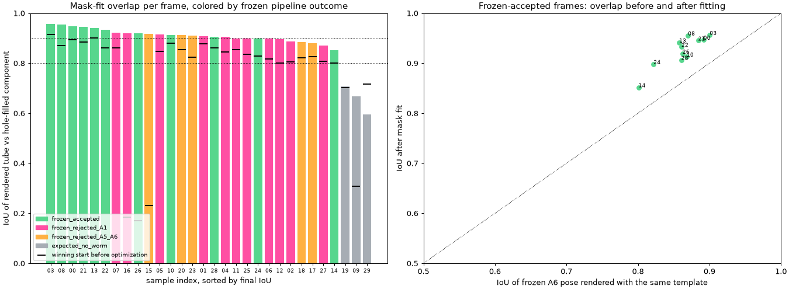

# Mask fit: pose by rendering a body model against the segmentation

This is the first step of the generative-model program: given a binary
segmentation mask, infer the body pose by optimizing a low-dimensional tube
model until its rendered mask agrees with the observed one. It replaces the
mask-then-thin-then-repair chain of Sections 1--7 of
[`POSE_ESTIMATION_TO_ENDPOINT_CURVE_EXTENSION.md`](POSE_ESTIMATION_TO_ENDPOINT_CURVE_EXTENSION.md)
with a direct fit, and it is evaluated on the same 30 archive frames.

The archive frames have no manual centerline annotations. The operating
metric is intersection-over-union (IoU) between the rendered hard mask and
the observed mask. It measures agreement with the segmentation, not
anatomical truth. Nothing here is deployment-authorized and the protected
2025 holdout was not opened.

## 1. Model

The body state is the 20-value intrinsic representation retained from the
earlier generative branch, plus one width scale:

- 16 cubic B-spline coefficients over the tangent angle along the body;
- global rotation, body length, and centroid;
- one full-body width scale multiplying a fixed unit-peak width template.

Decoding integrates 99 equal-length steps from the tangent angles, so this is
the centroid-plus-equal-segments model of the project plan. The width template
was measured on this run from the 11 frozen-accepted A6 poses: full width
along each pose's normals in its Section 3 component, normalized by the
midbody median, symmetrized, and smoothed. The template therefore has tapered
ends but no head/tail asymmetry.

The reusable implementation is `src/worm_pose_gen/mask_fit.py`.

## 2. Rendering and energy

The tube is rendered as a sigmoid of signed distance to the body: distance
from each pixel to the nearest **centerline segment**, minus the locally
interpolated radius, divided by an edge softness of `0.8 px`. Pixels outside
the camera are never instantiated, so anatomy that leaves the field of view
is censored rather than penalized.

The energy is soft Dice between that render and a soft target built from the
observed mask: the sigmoid, at the same softness, of the exact signed distance
to the mask edge (the edge is halfway between an inside and an outside pixel
center). Two details of this construction turned out to matter:

- The existing `render_worm` measures distance to the nearest centerline
  *sample*. Lengthening the body spreads the samples, which shrinks the soft
  tube between them, so the analytic length gradient carried a consistent
  shortening bias that finite differences did not show. Distance to the
  polyline segments removes it. A unit test now checks the length gradient
  against central differences.
- Comparing a soft render with a hard target, or with a distance field that
  is offset by half a pixel, moves the optimum by a fraction of a pixel in
  width and by tens of pixels in length at the coarse stage. The exact
  edge-referenced distance field removes both effects.

Optimization is Adam on a padded crop, coarse to fine: block-averaged targets
at downsample 4, 2, 1, then a low-rate settling stage at full resolution.
Learning rates are scaled per stage and decayed within a stage, and the best
full-resolution iterate is kept rather than the last one, because Adam's
normalized steps random-walk around a flat optimum. Soft penalties keep
length inside `250--750 px` and width inside `15--90 px`, and keep the body
inside the crop except where the crop edge is the camera edge.

Every frame is fit from several starts as one batch, and the start with the
lowest final energy wins:

- the frozen A6 pose, where the frozen pipeline accepted the frame;
- the longest path through the thinned mask, even when the skeleton branches;
- three moment-based starts: the mask centroid and principal axis as a
  straight body and as two constant-curvature arcs.

On a synthetic tube rendered from a known state at real frame scale, all five
starts recover the truth to a median point error of `0.2 px` and IoU `0.99`.

## 3. Observed mask

The observed mask is the Section 3 largest component of the frozen
local-darkness threshold (`31 / 2 / 2.6 / disabled / 2`), with one change:
enclosed background regions too narrow to contain a `17 x 17 px` square are
filled. Those regions are segmentation texture inside the body; the interior
of a coiled worm is far wider and is never filled, and background connected
to the image border is never filled. IoU is also reported against the
unfilled component and the raw threshold mask.

## 4. Results on the 30-frame stress set



Samples 9, 19, and 29 are known empty frames and are reported separately.
The frozen pipeline outcome is the Section 7 result on the same frame.

| Frozen pipeline outcome | Frames | Median IoU after fit | Frames with IoU >= 0.8 | Median IoU of winning start before fit |
|---|---:|---:|---:|---:|
| Accepted through A6 | 11 | 0.933 | 11 | 0.870 |
| Rejected at A1 geometry selection | 11 | 0.900 | 11 | 0.836 |
| Rejected at A5 or A6 | 5 | 0.912 | 5 | 0.823 |
| Known empty frame | 3 | 0.668 | 0 | 0.703 |

Across the 27 worm-bearing frames:

| Quantity | Value |
|---|---:|
| Median IoU vs hole-filled component | 0.912 |
| Median IoU vs unfilled component | 0.830 |
| Frames with IoU >= 0.8 / >= 0.9 | 27 / 17 |
| Median fitted length | 702 px |
| Median fitted midbody width | 47.7 px |
| Median runtime per frame (one GPU, five starts) | 19 s |

The main result is coverage. The frozen pipeline produced a pose on 11 of 27
worm frames; the fit produces a pose on all 27, and the 11 frames the frozen
pipeline rejected at A1 fit as well as the 11 it accepted. On the accepted
frames, the fit improves the overlap of the frozen A6 pose (rendered with the
same template) on every frame, from a median of `0.86` to `0.93`.

Filling narrow holes in the target matters: against the unfilled component
the same fits score a median IoU of `0.83`, and a first run that fit the
unfilled component directly scored `0.80`, because interior texture holes
count as background in the energy and pull the tube narrower.

The three empty frames are not rejected by the fitter itself: it fits the
largest debris component. They separate on the fitted width and overlap
(sample 9 fits a `16 px` wide scratch at IoU `0.67`), so a width gate
and an IoU floor are the obvious fail-closed checks, but they were not
pre-declared and are not applied here.

### What limits the overlap

The per-frame sheets in
[`mask_fit_unannotated30/FRAME_STEPS.md`](mask_fit_unannotated30/FRAME_STEPS.md)
show three consistent residual patterns:

1. **Fixed symmetric width template.** Several worms stay thick almost to the
   head and taper only at the tail. A symmetric template scaled by one number
   cannot follow that, so the fit compromises: the tube is too narrow at the
   thick end and too wide at the thin end, and the centerline shifts toward
   one side where the width error is largest. This is the largest remaining
   error on the lowest-scoring worm frames (samples 14, 27, and 17).
2. **Length is unobservable when the body leaves the camera.** The fitted
   length reached the `750 px` bound on 8 frames. In 6 of them the crop
   touches an image edge: censoring works as intended, nothing pulls the
   length back, and the bound decides it. The other two are fully in view in
   the highest-magnification recording, where the body is genuinely near the
   bound. A per-recording length prior, and reporting the in-view fraction
   with every pose, should replace the single bound.
3. **Residual segmentation defects.** Detached debris is excluded by the
   largest-component rule, but debris touching the body is included, and the
   thin tail tip is often missing from the threshold mask.

None of these is a failure of the fitting approach; each is a modeling choice
that the direct fit makes visible and measurable.

## 5. What this run establishes, and what it does not

Established, on 30 annotation-free frames:

- A direct render-and-compare fit of the 20-value body model produces a pose
  on every worm frame, including all frames the skeleton pipeline rejected.
- The optimizer is sound: from a correct start it stays within `0.1 px`, and
  from crude moment-based starts it recovers a synthetic truth to `0.2 px`.
- IoU against the segmentation saturates near `0.8` because of the width
  template and the mask, not because of the optimizer.

Not established:

- anatomical accuracy of any fitted centerline (no annotations);
- head/tail orientation (the model and template are symmetric);
- behavior on coils, self-contact, or occlusion (no such frame was targeted);
- a validated fail-closed gate for empty or ambiguous frames.

## 6. Next steps in the plan

1. Give the width profile a few degrees of freedom (a low-order asymmetric
   correction on top of the template), which is the dominant residual.
2. Replace the length bound with a per-recording prior and report the in-view
   fraction with every pose.
3. Fit frames in sequence, initializing from the previous frame, which turns
   this per-frame fitter into the temporal chain the plan calls for.

## Rebuild

```bash
scripts/project_env.sh uv run --no-sync --frozen python \
  scripts/evaluate_mask_fit_unannotated30.py
```

The script reads the three Section 7 recordings, recomputes the Section 3
masks, measures the width template from the frozen accepted poses in
`docs/final_algorithm_unannotated30/`, and writes `metrics.json`,
`predictions.npz` (per-frame latent, centerline, and width profile), the
summary figure, and one diagnostic sheet per frame under
`docs/mask_fit_unannotated30/`.
