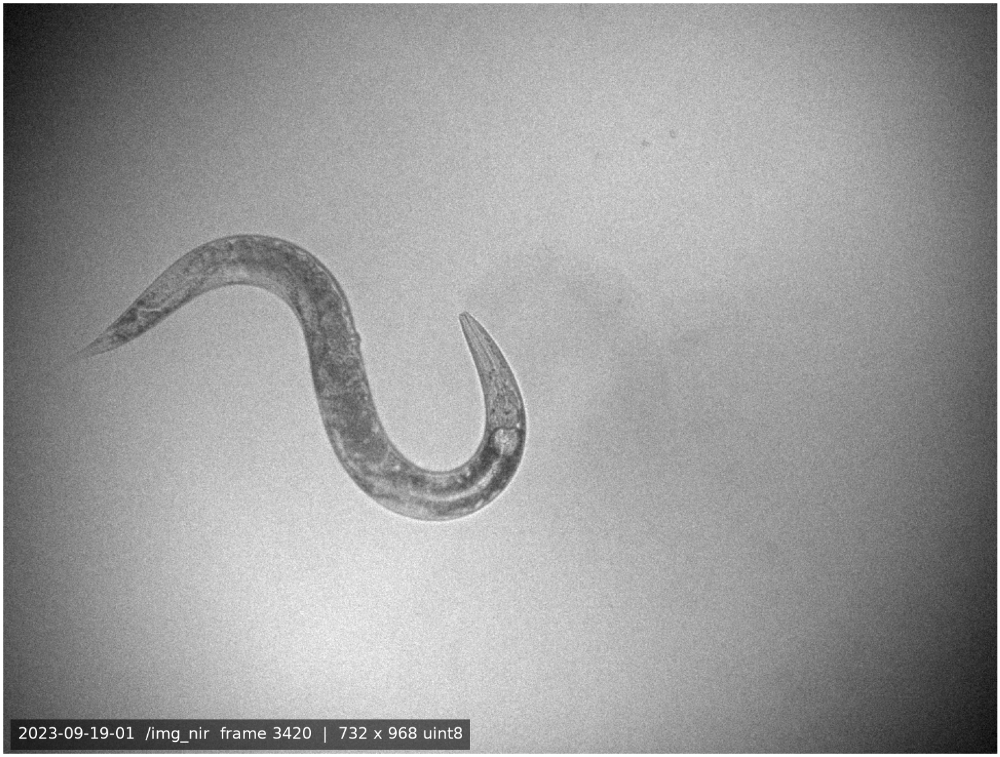
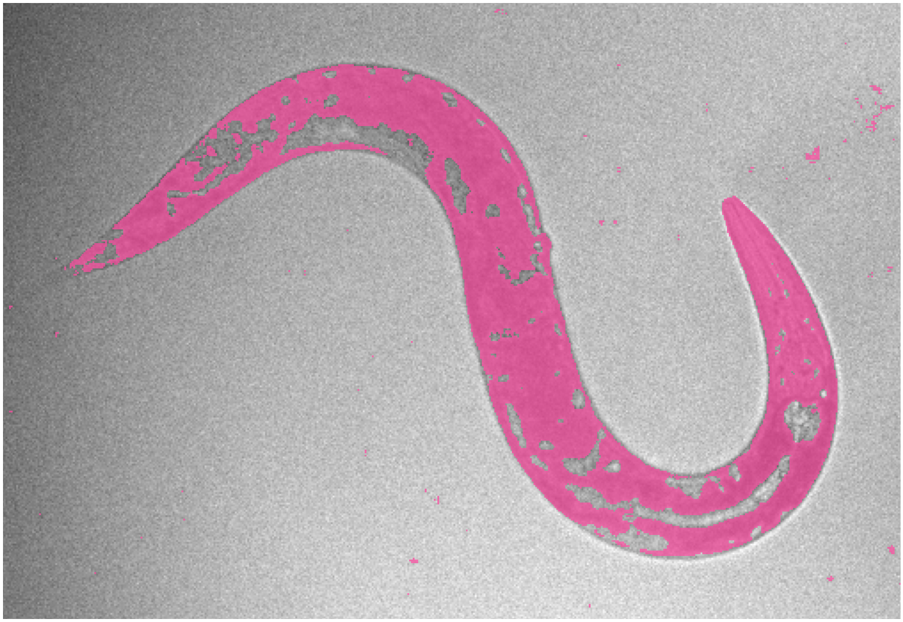
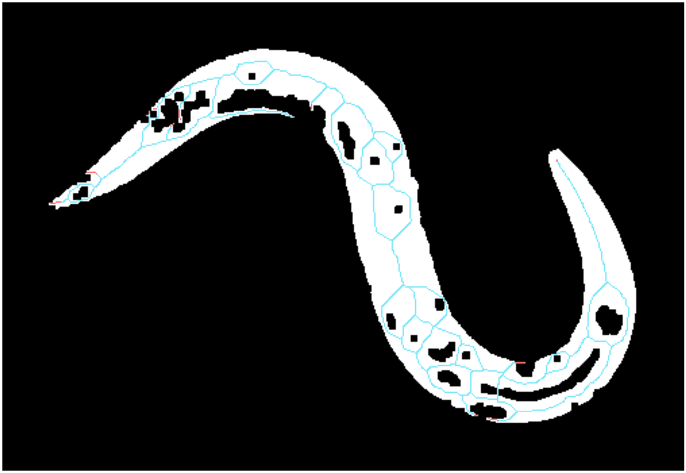
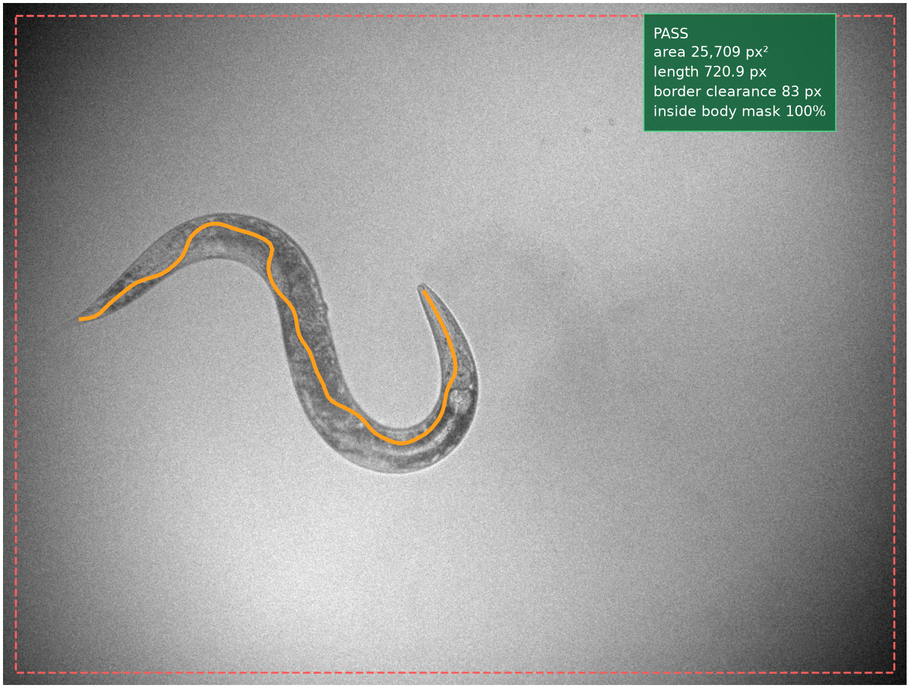
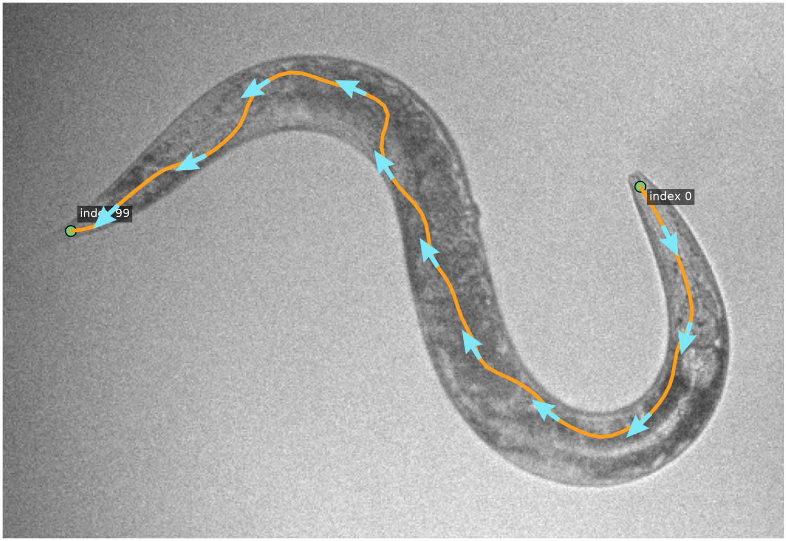

# How the best real-frame baseline finds a worm pose

This explainer follows the **conservative classical centerline extractor**. Its
frozen 30-frame evaluation has the lowest reported error on manually traced real
frames in this repository: **12.12 px median point error** on the complete frames
it accepted. That historical run returned a pose for only **14 of 30 frames**,
so it is a selective baseline—not a reliable all-frame solution. Because the
centerline-darkness gate has now been retired, acceptance coverage must be
remeasured before those historical coverage numbers are used for the revised
extractor. No method in this repository is deployment-authorized.

The whole idea is:

`raw frame → local darkness → mask → skeleton → longest path → 100-point pose → quality check`

## 0. Start with one real video frame

This is frame `3420` from dataset `/img_nir` in
`nir_videos/2023-09-19-01.h5`. It is a `732 × 968` grayscale image. The pixels
shown here are the exact `uint8` frame cached by the repository's proxy HDF5
artifact, together with provenance back to the source video.



## 1. Make the dark worm stand out

Lighting changes across the image, so a single brightness cutoff would be
fragile. The algorithm compares each pixel with its **local background**. A
pixel gets a high score when it is dark relative to its neighborhood.

The wide blur uses radius `31`; a small radius-`2` blur removes fine noise. The
cyan outline marks the later cutoff at score `2.6`.


## 2. Turn the score into candidate worm pixels

Keep pixels with a local-darkness score of at least `2.6`. The magenta region is
the result. It contains the worm, but also many small dark specks.



## 3. Join tiny gaps and keep the main object

A small morphological **closing** joins nearby worm pixels. Then the algorithm
keeps only the largest connected component.

The cyan region is kept. Red regions are discarded. Holes are not filled,
because filling the inside of a tight bend could create a false shortcut.


## 4. Collapse the body into a one-pixel skeleton

Thinning repeatedly removes outer mask pixels while preserving the shape's
connectivity. Eight layers are then peeled from skeleton ends to remove short
spurs.

The cyan line is the remaining skeleton. Red marks the peeled pixels.



## 5. Choose one backbone through the skeleton

Treat the skeleton as a graph. Find its endpoints, then select the longest
connected endpoint-to-endpoint path. Gray branches are ignored; the orange path
becomes the pose backbone.


## 6. Convert the backbone into 100 body positions

Skeleton pixels are unevenly spaced and stair-stepped. The algorithm walks
along the path by arc length, places **100 equally spaced points**, and applies
a light smoothing pass.

This gives a fixed-size, ordered centerline that downstream code can compare
across frames.


## 7. Reject the pose unless it looks trustworthy

The extractor checks the component before returning anything:

- the raw segmentation component must be `2,500–30,000 px²`;
- centerline length must be `250–750 px`;
- the pose must clear the image edge by at least `13 px`;
- at least `95%` of its points must remain inside the segmented body mask;
- skeleton endpoints and branches must stay within conservative limits.

The `30,000 px²` maximum belongs to this raw-component extractor. Later
smooth-body experiments deliberately restore missing body pixels, so their
modeled-body allowance is `2,500–40,000 px²`. A correct completed body is not
rejected merely for being larger than the incomplete raw component.

The darkness score is used to estimate the worm's border. It is not sampled or
scored along the centerline. The centerline is the medial path between the two
sides of that border; the mask check only verifies that smoothing did not move
it outside the modeled body.

This frame passes. The dashed red rectangle shows the allowed border. A frame
that fails any check returns **no accepted pose**.



## 8. Export the pose and its local direction

The final output contains the 100 `(x, y)` points and a tangent angle at each
point. The arrows show a subset of those local directions.

The endpoint appearance heuristic only chooses array order. Here its head/tail
confidence is `0.50`, so `index 0` must **not** be read as a known anatomical
head. The method's quality score is also a ranking score, not a calibrated
probability of correctness.



## What this result means

In the frozen 30-frame evaluation, this conservative method had
better real-frame alignment than the rejected global neural model
(`12.12 px` versus `80.87 px` median point error on complete traces). Its low
coverage is the catch: it accepted only `46.7%` of frames and none of the nine
proxy-difficult examples. It is best understood as a good **easy-frame pose
candidate generator**, not a finished pose estimator.

The later segmentation-and-SMC branch does not replace this conclusion. Its
SMC recovery passed only on renderer-matched synthetic sequences; natural
hard-bout recovery was not established.

## Rebuild the visuals

From the repository root:

```bash
scripts/project_env.sh uv run --no-sync --frozen python \
  scripts/build_pose_estimation_explainer.py
```

The algorithm is implemented in `src/worm_pose_gen/classical.py`. The frozen
comparison inputs remain in
`experiments/scientific_exp_002_primary30_baselines/metrics.json`; the current
interpretation and limitations are consolidated in
[`POSE_ESTIMATION_TO_ENDPOINT_CURVE_EXTENSION.md`](POSE_ESTIMATION_TO_ENDPOINT_CURVE_EXTENSION.md).
