# From classical pose extraction to curvature-aware endpoint extension

This document follows the algorithmic path from the conservative real-frame
baseline in [`POSE_ESTIMATION_EXPLAINER.md`](POSE_ESTIMATION_EXPLAINER.md),
through the narrow exterior-notch repair in
[`BOUNDARY_NOTCH_REPAIR_EXPERIMENT.md`](BOUNDARY_NOTCH_REPAIR_EXPERIMENT.md),
to the completed endpoint continuation in
[`ENDPOINT_CURVE_EXTENSION_EXPERIMENT.md`](ENDPOINT_CURVE_EXTENSION_EXPERIMENT.md).

The complete path is:

`raw NIR frame -> local-darkness mask -> classical skeleton pose -> smooth containing body -> narrow-notch repair -> repaired-body skeleton pose -> curvature-aware endpoint extension`

> **Parameter note (2026-08-26):** an interactively tuned local-darkness
> setting (`61 / 3 / 4.25 / 2.05 / 8`) was briefly promoted, evaluated on the
> 30-frame stress set in Section 8.3, and reverted. The executable defaults
> remain the frozen `31 / 2 / 2.6 / disabled / 2` setting that produced every
> figure and metric below. Connected hysteresis stays available as an opt-in
> `ClassicalConfig` field.

Most of the detailed mechanism audit uses frame `3420` from dataset `/img_nir`
in `nir_videos/2023-09-19-01.h5`. It is one disclosed development frame, not an
independent validation set. The one-annotator centerline is used only after
each geometric method has been fit and gated, and the protected 2025 holdout
remains unopened. None of the methods described here is deployment-authorized.

## 1. The original goal: extract a usable worm pose from a real frame

The starting goal was to convert one grayscale NIR video frame into a fixed,
ordered representation of the worm:

- 100 centerline points `(x, y)` spaced by arc length;
- one local tangent angle per point;
- a quality decision that rejects an untrustworthy extraction instead of
  always returning a pose.

The important geometric idea was that the centerline should be the medial path
between the worm's two detected sides. Image darkness was therefore used to
find candidate body pixels, not as a feature to maximize along the centerline.

### 1.1 What was tried

The broader project tried both learned and classical approaches. The global
neural proposal was rejected: on complete manually traced real frames it had
`80.87 px` median point error. A later segmentation-and-SMC branch recovered
renderer-matched synthetic sequences, but did not establish recovery on hard
natural bouts.

The strongest real-frame baseline was instead a conservative classical
extractor. It tried to solve only frames whose image geometry was sufficiently
clear, accepting low coverage in exchange for more credible poses.

### 1.2 Step 1: score local darkness

A single global intensity threshold would be sensitive to uneven illumination.
The extractor instead compared each pixel with a wide local background:

1. Blur the frame with radius `31 px` to estimate the local background.
2. Apply a small radius-`2 px` blur to suppress fine noise.
3. Give a pixel a high score when it is dark relative to that local background.

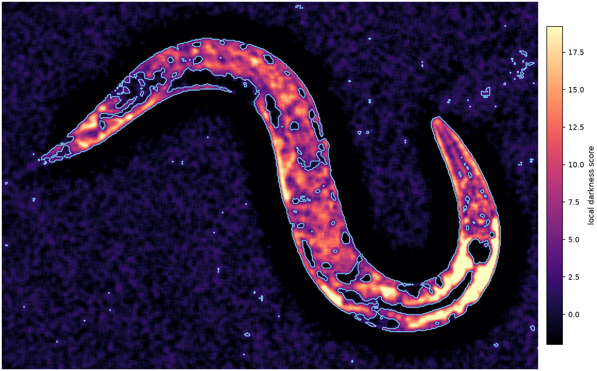

### 1.3 Step 2: make the candidate body mask

Pixels with local-darkness score `z >= 2.6` were retained. A small
morphological closing joined nearby pixels, and only the largest connected
component was kept. This component is called the **Section 3 component** in the
later audits.

Holes were deliberately not filled at this stage. Filling the open center of a
tightly bent worm could connect nearby arms and create a false skeleton
shortcut.

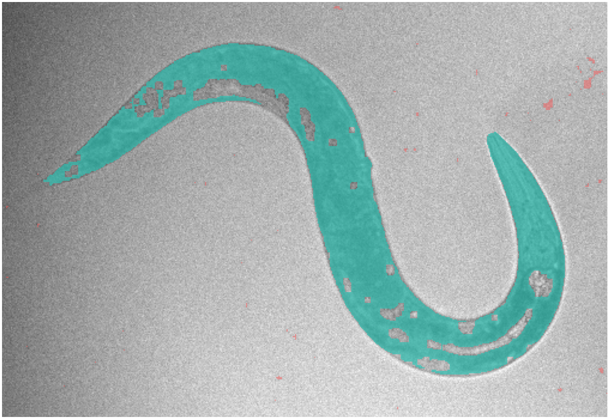

On frame `3420`, the resulting component contains **25,709 pixels**. Those
pixels become the fixed image-derived positives in the later body-completion
experiments. They are preserved as input evidence, not asserted to be a
manually verified worm mask.

### 1.4 Step 3: reduce the body to a graph

The binary body mask was thinned to a one-pixel skeleton while preserving
connectivity. Eight layers were then peeled from terminal skeleton ends to
remove short spurs.

The remaining pixels were treated as an eight-connected graph. The extractor
found the connected endpoint-to-endpoint path with the greatest length and
discarded other branches.


This longest-path rule gave the pipeline one ordered backbone even when the
skeleton contained small competing branches. It did not prove that the chosen
path was the anatomical centerline; it was a geometric selection rule.

### 1.5 Step 4: standardize the pose

Skeleton pixels are unevenly spaced and have raster stair-stepping. The chosen
path was therefore:

1. parameterized by cumulative arc length;
2. sampled at 100 equally spaced stations;
3. lightly smoothed;
4. differentiated locally to obtain tangent directions.

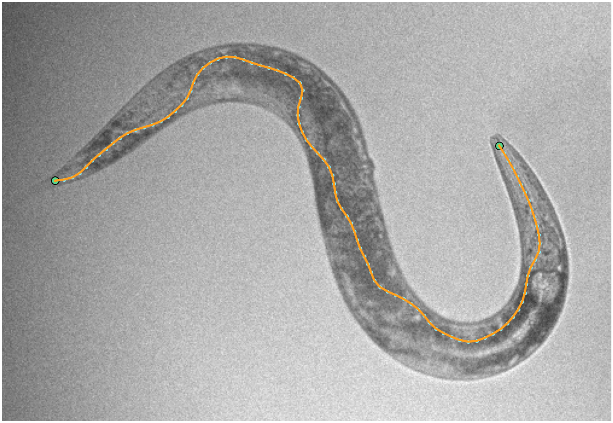

The endpoint-appearance heuristic chose only the order of the returned array.
Its confidence on this frame was `0.50`, so point 0 was not established as the
anatomical head.

### 1.6 Step 5: reject geometrically implausible results

The original extractor accepted a pose only when all of its conservative gates
passed:

- raw component area between `2,500` and `30,000 px^2`;
- centerline length between `250` and `750 px`;
- at least `13 px` clearance from the video-frame edge;
- at least 95% of centerline points inside the segmented body;
- skeleton endpoint and branch counts within their declared limits.

The `30,000 px^2` upper bound applies to the raw segmentation component. Later
experiments intentionally add inferred body pixels, so they use a separate
modeled-body ceiling of `40,000 px^2`.

### 1.7 What worked and what failed

The conservative classical method had the best reported real-frame alignment
among the frozen baselines. Across the complete manually traced frames that it
accepted, its median point error was **12.12 px**, substantially below the
rejected neural model's `80.87 px`.

Its main failure was coverage. In the historical frozen run, it accepted only
**14 of 30 frames (46.7%)** and none of the nine proxy-difficult examples. The
centerline-darkness gate has since been retired, so acceptance coverage must be
remeasured for the revised extractor rather than assumed from that historical
number. Dark gaps and boundary cut-ins could produce missing body regions,
skeleton branches, or ambiguous graph paths. Peeling terminal skeleton pixels
also made the final pose stop short of rounded body tips. Thus the method
worked as an easy-frame pose-candidate generator, not as an all-frame
estimator.

On frame `3420`, the classical pose passed its gate. The later post-fit audit
measured:

| Metric | Classical pose on frame 3420 |
|---|---:|
| Median point error | 16.58 px |
| Mean tangent error | 14.24 deg |
| Mean endpoint error | 10.60 px |

These one-frame measurements, rather than the `12.12 px` accepted-subset
summary, provide the direct baseline for the experiments below.

## 2. Why the next stage modeled a complete smooth body

The classical pipeline made its downstream path depend directly on defects in
the thresholded mask. The next idea was to preserve every Section 3 positive
while placing those pixels inside a smoother, symmetric body model.

The frozen one-pass body completion used by Experiment A was built as follows:

1. Start from all **25,709** Section 3 positives.
2. For initialization only, fill background cavities that cannot reach the
   exterior of the segmented worm.
3. Skeletonize that initialization, select its longest path, and resample it.
4. Represent the path by a smooth latent midline with 16 cubic-spline
   coefficients.
5. Assign every positive pixel to its nearest midline station and compute the
   radius required to contain it.
6. Add a `0.75 px` rasterization margin and propagate radii so they change by no
   more than `1 px` per station, equivalent to at most `2 px` change in full
   width.
7. Keep the maximum full width below `80 px` and render a symmetric tube around
   the latent midline.
8. Thin the completed body, peel skeleton ends, select the longest path, and
   resample it to a new 100-point pose.

This one-pass model contained every original positive and improved the
frame-3420 median point error from `16.58 px` to `9.72 px`, while mean tangent
error fell from `14.24 deg` to `4.63 deg`. Its endpoint error worsened from
`10.60 px` to `13.77 px`, so even the successful smooth-body result already
showed that centerline and endpoint quality could move in opposite directions.

One defect remained in its initialization. Enclosed-hole filling could repair
closed cavities, but it could not repair the long cut-in near the upper bend
because that missing region was connected to the exterior through a narrow
mouth. The initialization consequently still had **11 endpoints** and **9
branch pixels**. Experiment A targeted that specific border-breaching notch.

Here, **border** means the boundary between the segmented worm and its exterior,
not the edge of the video frame.

## 3. Experiment A: repair a narrow exterior notch

The goal of Experiment A was to close a narrow mouth, fill the pocket behind
it, and simplify the initialization topology without closing the legitimate,
broad U-shaped opening between the worm's arms.

### 3.1 A1: sweep candidate mouth-closing radii

Candidate radii from `3 px` through `12 px` were evaluated without using the
manual trace. For each radius, the algorithm:

1. morphologically closed the initialization to bridge narrow mouths;
2. identified background pockets that became enclosed by those bridges;
3. filled the newly enclosed pockets;
4. retained every original Section 3 positive;
5. verified that the broad U-shaped opening still belonged to the exterior.

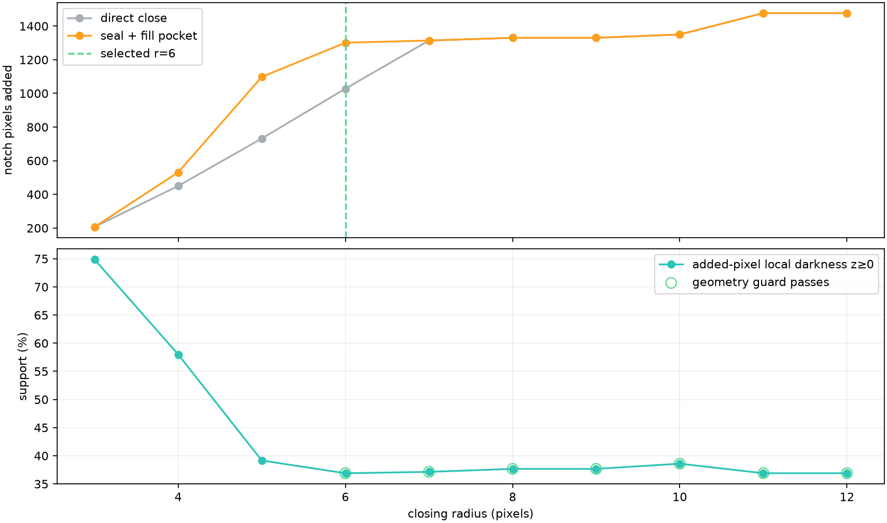

A candidate was allowed to pass only when:

- it added no more than 10% of the original component area;
- at least 99% of the previous exterior background remained exterior;
- the initialization skeleton had exactly two endpoints;
- it had no branches and no cycle.

The smallest candidate satisfying every rule was selected. The first passing
radius was **6 px**.

### 3.2 A2: distinguish the bridge from the filled pocket

At radius `6 px`, the algorithm added two explicitly tracked regions:

- **1,028 bridge pixels** created by sealing narrow mouths;
- **273 pocket pixels** that became isolated and were then filled.

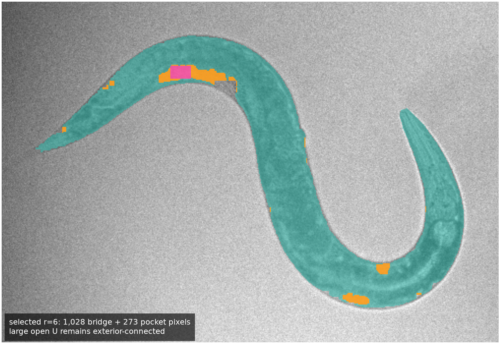

The total repair was **1,301 pixels**, or **5.06%** of the original component.
The broad U stayed open, and **99.81%** of the previous exterior remained
exterior.

The repair was a model-based inference rather than a recovery of thresholded
image pixels. None of the added pixels reached the original `z >= 2.6`
foreground threshold, and only 36.89% had even nonnegative local-darkness
score. The geometry could propose the repair, but the image did not confirm it.

### 3.3 A3: verify that the intended topological defect was removed

The repair changed the initialization skeleton as intended:

| Measure | Enclosed holes only | Seal then fill, r=6 |
|---|---:|---:|
| Skeleton components | 1 | 1 |
| Endpoints | 11 | **2** |
| Branch pixels | 9 | **0** |
| Cycle | no | no |

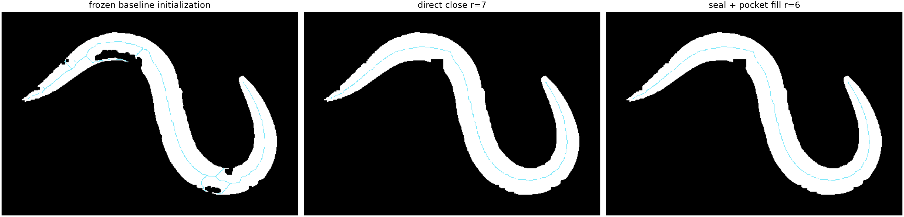

This was Experiment A's clearest success: the exterior notch no longer created
a competing skeleton path.

### 3.4 A4: rebuild the latent midline and containing width

The repaired initialization was then passed through the same smooth-body
procedure:

1. skeletonize the repaired initialization;
2. select its longest endpoint-to-endpoint path;
3. resample the path;
4. project it into the 16-coefficient cubic latent representation;
5. fit a slowly varying width around that midline.

The width fit still targeted **only the original 25,709 Section 3 positives**.
Neither bridge pixels nor pocket pixels were promoted to detections. The same
containment margin, width-slope rule, and `80 px` full-width ceiling remained in
force.

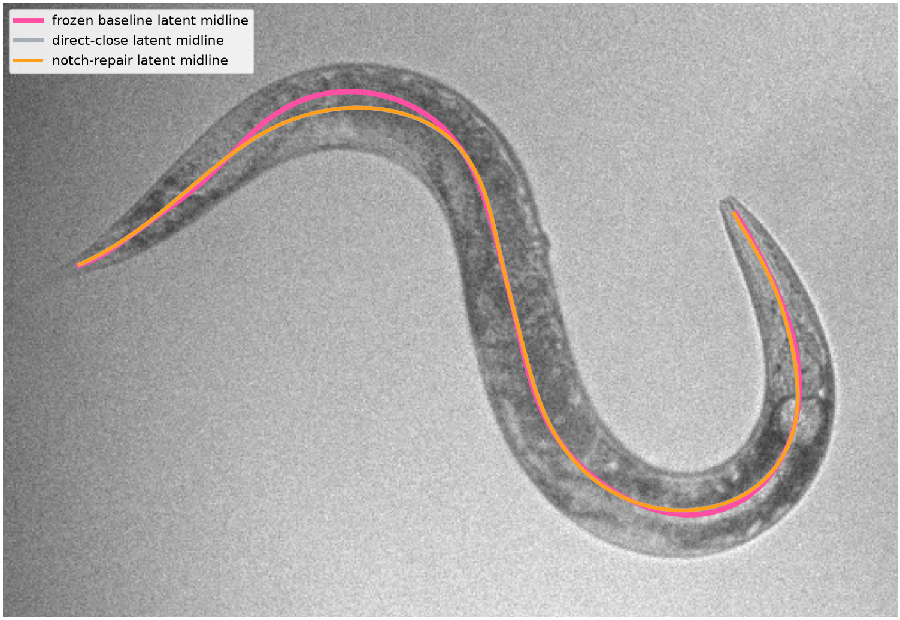

### 3.5 A5: render the repaired body and regenerate the pose

The new latent midline and width profile produced a smaller completed body:

| Measure | Frozen one-pass body | Experiment A body |
|---|---:|---:|
| Modeled area | 35,481 px^2 | **32,639 px^2** |
| Pixels beyond Section 3 | 9,772 | **6,930** |
| Maximum full width | 65.45 px | **57.97 px** |
| Original-positive containment | 100% | **100%** |

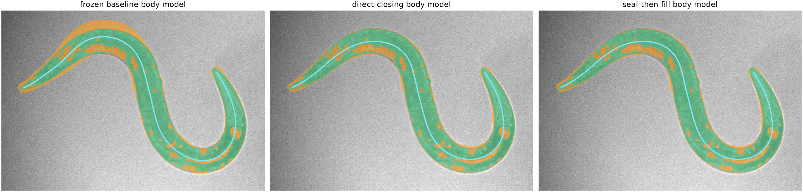

The repaired body was **2,842 pixels smaller** while retaining every original
positive. It passed the revised modeled-body gate because its area remained
below `40,000 px^2`.

Finally, the unchanged downstream steps were rerun: thinning, endpoint peeling,
longest-path selection, and 100-point arc-length resampling. This produced the
**frozen A5 notch-repair pose**.

### 3.6 What Experiment A improved, and what it made worse

The direct comparison with the classical result at the end of the original
pose explainer is:

| Metric on frame 3420 | Original classical pose | Frozen A5 notch-repair pose | Change |
|---|---:|---:|---:|
| Median point error | 16.58 px | **12.19 px** | 4.39 px better |
| Mean tangent error | 14.24 deg | **5.42 deg** | 8.82 deg better |
| Mean endpoint error | **10.60 px** | 20.85 px | 10.25 px worse |

This is an apples-to-apples comparison on frame `3420`; it should not be
confused with the classical method's `12.12 px` multi-frame accepted-subset
summary.

Experiment A fixed the stated topological failure, reduced inferred body area,
retained all image-derived positives, passed the geometric gate, and improved
the full-curve and tangent errors relative to the classical pose. It did not
produce the best available centerline on this frame: the frozen one-pass body
still had lower median point error (`9.72 px`) and lower tangent error
(`4.63 deg`). Most importantly for the next step, A5's endpoint error rose to
`20.85 px`.

The final A5 pose showed why. Thinning finds the interior medial axis of the
completed body, and peeling terminal skeleton pixels removes another short
section at each end. Its two endpoints therefore stopped inside the rounded
caps even though the completed body already extended farther.

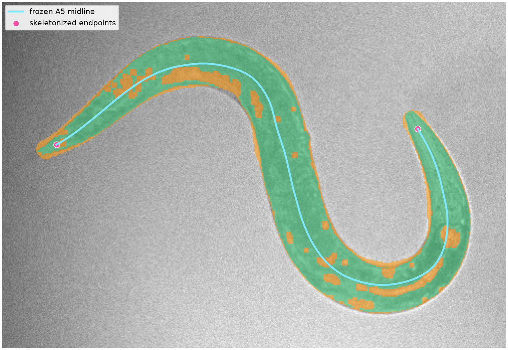

## 4. A6: continue the A5 endpoints through their rounded caps

The endpoint experiment targeted only this terminal retreat. It did not change
the Section 3 positives, refit the latent midline, rerender the body, or enlarge
the mask. Its boundary target was exactly the **32,639-pixel A5 completed-body
mask**: the union of the original Section 3 component and the smooth-body
completion.

The frozen A5 centerline had 100 points and length **692.86 px**. The aim was to
continue the recent trajectory at each end until it first reached that fixed
completed-body boundary, while remaining under the existing `750 px` length
ceiling.

### 4.1 A6.1: fit a local terminal trajectory

Each end was handled independently:

1. Orient the ordered A5 midline so that the end being extended is last.
2. Keep its final seven stations, representing about `42 px` of existing curve.
3. Compute the heading of every segment in that terminal neighborhood.
4. Unwrap the headings across the `-pi/pi` discontinuity.
5. Fit heading as a linear function of local arc length.
6. Use the fitted terminal heading as the outward direction and the fitted
   slope as signed curvature.

The linear heading model defines a local constant-curvature continuation. It is
more stable than copying the direction of one terminal segment, but it remains
local: it does not globally refit the worm.

| End | Context length | Signed curvature | Equivalent radius |
|---|---:|---:|---:|
| Index 0 | 42.05 px | -0.00495 rad/px | 202.21 px |
| Index 99 | 42.06 px | +0.00432 rad/px | 231.37 px |

The nonzero fitted values preserved the shallow turn visible near each end.

### 4.2 A6.2: integrate to the first mask exit

Starting at each A5 endpoint, the algorithm advanced along the fitted circular
arc in `0.25 px` increments:

1. Accept the next point while it remains inside the completed-body mask.
2. Stop at the first foreground-to-background transition.
3. Bisect the final curved step to place the endpoint at the subpixel mask
   interface.
4. Reject the extension if no boundary is reached within `80 px`.

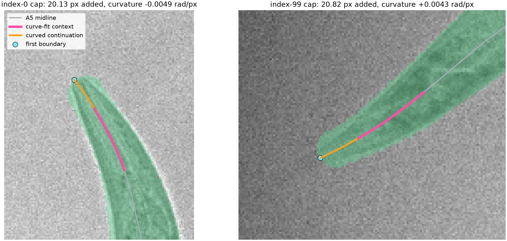

The **first-exit** rule is important in a bent body. It prevents an extension
from leaving one cap, crossing background, and re-entering a nearby arm of the
same mask.

Both ends reached their first boundary. Index 0 gained **20.13 px** and index 99
gained **20.82 px** along their dense continuations.

### 4.3 A6.3: splice the extensions and restore the 100-point contract

The two dense extensions were attached to the otherwise unchanged A5 polyline.
The combined curve was then resampled by arc length back to 100 points so its
output shape remained compatible with the rest of the pipeline.

| Measure | Frozen A5 | Curved endpoint extension |
|---|---:|---:|
| Pose points | 100 | 100 |
| Centerline length | 692.86 px | **731.48 px** |
| Length added after resampling | - | **38.63 px** |
| `250-750 px` length gate | pass | **pass** |
| Completed-body area | 32,639 px^2 | unchanged |
| Maximum full width | 57.97 px | unchanged |
| Original-positive containment | 100% | unchanged |

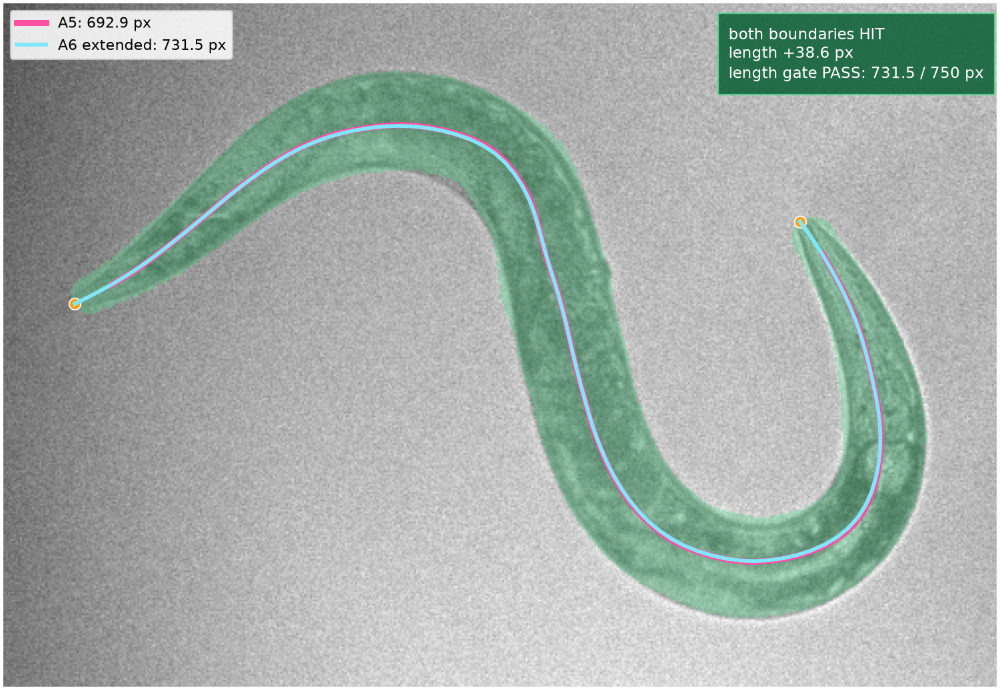

The dense, unresampled splice added `40.95 px`. The final 100-point polyline
records a slightly smaller gain because its straight chords are shorter than
the densely sampled curved path.

## 5. Final result at the end of the endpoint experiment

Only after both endpoint extensions, final resampling, and the geometry gates
were complete was the one-annotator trace loaded for the post-fit audit.

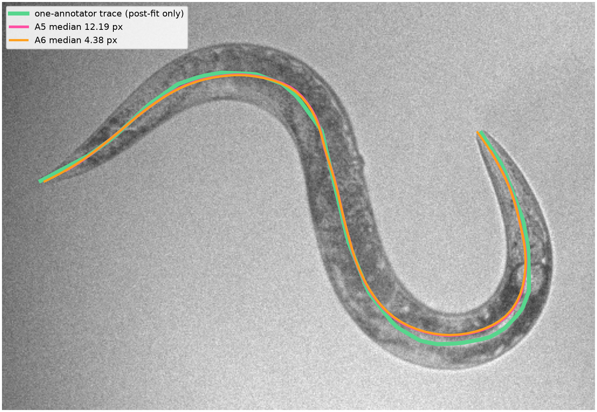

| Pose | Median point error | Mean tangent error | Mean endpoint error | Body-length error |
|---|---:|---:|---:|---:|
| Frozen A5 notch-repair pose | 12.19 px | 5.42 deg | 20.85 px | 59.63 px |
| A6 curvature-aware extension | **4.38 px** | **3.05 deg** | **3.29 px** | **21.00 px** |

Relative to the original classical pose on this same frame, the final A6 pose
reduced median point error from `16.58 px` to `4.38 px`, mean tangent error from
`14.24 deg` to `3.05 deg`, and mean endpoint error from `10.60 px` to `3.29 px`.
The body mask and all of its A5 containment, width, and area measurements stayed
unchanged.

The endpoint step therefore did what it was designed to do on this frame: it
used the recent terminal curve to recover most of the centerline missing inside
the two already-modeled caps. It also repaired the main regression introduced
by Experiment A, turning a `20.85 px` endpoint error into `3.29 px`.

## 6. What the complete progression establishes—and what it does not

The progression demonstrates a coherent sequence of increasingly specific
geometric repairs:

1. **Classical extraction** found a credible pose on an easy real frame, but
   threshold-mask defects and conservative rejection limited coverage.
2. **Smooth-body completion** separated trusted positives from model-supplied
   pixels and converted an incomplete mask into a containing tube.
3. **Experiment A** sealed one narrow exterior notch, simplified the
   initialization from 11 endpoints and 9 branch pixels to one unbranched
   two-endpoint path, and reduced excess modeled area.
4. **A6 endpoint continuation** corrected the terminal retreat caused by
   thinning and endpoint peeling without modifying the completed body.

The result remains a mechanism demonstration on one disclosed development
frame. A topologically simple skeleton is not necessarily an anatomical
midline, and the added body pixels have little direct image support. The
endpoint continuation is geometrically self-consistent with the inferred caps;
if a cap is wrong, its boundary target is wrong. A constant-curvature extension
can also fail when the unseen terminal shape turns sharply, and fixed-count
resampling still shortens curved paths by replacing them with chords.

Before promotion, all rules—including the radius selection, seven-station
terminal context, `0.25 px` integration step, first-exit rule, and `80 px`
maximum extension—must be frozen and run unchanged over all 30 development
annotations. That evaluation must report acceptance coverage, boundary-hit
coverage, length-gate failures, endpoint error, full-curve error, tangent error,
and guarded extension failures. Only then would evaluation on an authorized,
untouched holdout be justified.

## Rebuild the documented progression

From the repository root:

```bash
scripts/project_env.sh uv run --no-sync --frozen python \
  scripts/build_pose_estimation_explainer.py

scripts/project_env.sh uv run --no-sync --frozen python \
  scripts/build_smooth_body_prior_experiment.py

scripts/project_env.sh uv run --no-sync --frozen python \
  scripts/build_boundary_notch_repair_experiment.py

scripts/project_env.sh uv run --no-sync --frozen python \
  scripts/build_endpoint_curve_extension_experiment.py
```

The reusable endpoint implementation is
`extend_centerline_to_mask_boundary` in `src/worm_pose_gen/anchors.py`.
Machine-readable Experiment A and A6 results are stored in the corresponding
`metrics.json` and compressed `experiment_arrays.npz` files under
`docs/boundary_notch_repair_experiment/` and
`docs/endpoint_curve_extension_experiment/`.

## 7. Thirty-frame run on readable archive recordings

The intended final check was the frozen A1--A6 pipeline on all 30 primary
development annotations, including annotation indices 2 and 22. That exact
accuracy audit could not be completed from the mounted data: the raw HDF5
recordings referenced by the annotation manifest were structurally corrupted,
and only 9 of the 30 exact frames were present in the provenance-preserving
proxy cache. Substituting a different frame underneath an existing manual
trace would create invalid error measurements, so no point, tangent, endpoint,
or body-length accuracy is claimed here.

To still test the frozen algorithm beyond its single development frame, three
readable, format-compatible HDF5 recordings were selected from
`/store1/shared/all_data_raw/prj_aversion`. Each file was opened read-only and
accepted only after successful reads near its beginning, middle, and end. Ten
uniformly spaced frames per recording produced a deterministic 30-frame
operational stress set:

| Recording | File size | Image dataset | Selected frames | Final outputs |
|---|---:|---|---:|---:|
| `2024-01-31-02.h5` | 14.68 GB | `img_nir`, 20,481 x 732 x 968, `uint8` | 10 | 3 |
| `2023-08-22-01.h5` | 14.58 GB | `img_nir`, 20,341 x 732 x 968, `uint8` | 10 | 3 |
| `2023-06-23-01.h5` | 14.74 GB | `img_nir`, 20,562 x 732 x 968, `uint8` | 10 | 5 |

The order in this replacement batch is positions 0--9 from the first file,
10--19 from the second, and 20--29 from the third. Positions 2 and 22 below
therefore identify stress-test positions, not the original annotation indices.
The protected 2025 holdout was not opened.

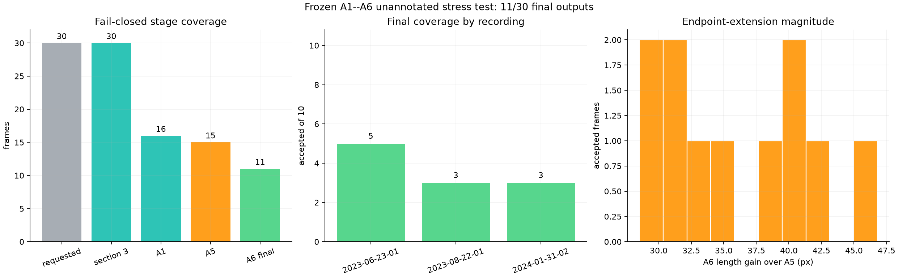

| Stage or outcome | Frames | Fraction of 30 |
|---|---:|---:|
| Section 3 component available | 30 | 100.0% |
| A1 geometry-only repair selected | 16 | 53.3% |
| A5 modeled-body gate passed | 15 | 50.0% |
| A6 extension and final length gate passed | **11** | **36.7%** |
| Rejected at A1 geometry selection | 14 | 46.7% |
| Rejected at A5 modeled-body gate | 1 | 3.3% |
| Rejected at A6 length gate | 4 | 13.3% |

Among the 16 frames that found an A1 candidate, the selected closing radii
were 3 px for 2 frames, 4 px for 2, 5 px for 1, 6 px for 7, 7 px for 2, and
8 px for 2. All 11 final outputs reached the modeled-body boundary at both
ends; otherwise the endpoint integrator would have failed closed. Their A6
resampled length gain over A5 had a median of `35.05 px`, mean of `36.26 px`,
and 95th percentile of `44.49 px`. Median centerline length increased from
`620.49 px` at A5 to `658.83 px` at A6.

### Positions 2 and 22

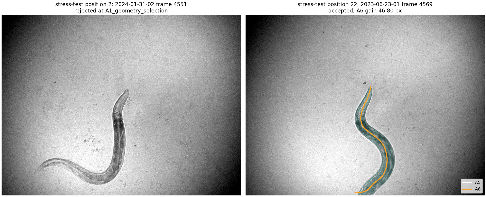

- **Position 2** is frame 4,551 of `2024-01-31-02.h5`. It was rejected at A1.
  Every candidate radius from 3 through 12 px retained branches and failed the
  exactly-two-endpoints requirement. The rejection is a correct fail-closed
  result even though the animal is visually prominent.
- **Position 22** is frame 4,569 of `2023-06-23-01.h5`. It passed with a 3 px
  A1 repair that added 248 pixels (`1.16%` of the original component), retained
  `99.96%` of exterior background, and produced one path with two endpoints,
  no branch pixels, and no cycle. A6 increased its centerline from `497.27 px`
  to `544.06 px`, a `46.80 px` gain, and the final length stayed inside the
  allowed 250--750 px interval.

### Per-frame visual audit

Every replacement frame also has an individual diagnostic sheet beginning
with the raw NIR image and continuing through every stage that actually ran.
The 14 A1 failures stop at the repair-radius topology sweep, the single A5
failure includes its rejected modeled body, the four A6 length failures include
their rejected extended curves, and the 11 successes end with the accepted A6
pose.

[`FRAME_STEPS.md`](final_algorithm_unannotated30/FRAME_STEPS.md) indexes all 30
visuals in batch order, including positions 2 and 22. Each sheet shows the
local-darkness score, threshold mask, Section 3 component, A1 decision, the A2
repair audit (either the accepted repair or the final rejected candidate), and—if
reached—the A3 skeleton, A4 latent fit, A5 body, and A6 extension.

This replacement run answers an operational question: whether the frozen
geometry executes, rejects unsafe cases, and produces bounded endpoint
extensions on other readable raw recordings. It does **not** answer the
anatomical-accuracy question posed by the 30 primary annotations. The 21
uncached source frames are permanently lost with their corrupted recordings,
so that annotation-matched audit is retired rather than pending.
`scripts/evaluate_final_geometry_primary30.py` remains only because the
unannotated evaluators import its per-frame fitting code.

Rebuild this annotation-free stress test from the repository root with:

```bash
scripts/project_env.sh uv run --no-sync --frozen python \
  scripts/evaluate_final_geometry_unannotated30.py --workers 3
```

The complete per-frame outcomes and input provenance are in
`docs/final_algorithm_unannotated30/metrics.json`; accepted A5 and A6 curves
are in `docs/final_algorithm_unannotated30/predictions.npz`.

## 8. Follow-on runs on the same 30 frames (2026-08-26)

Three further runs reused the Section 7 recordings, frame positions, and
A1--A6 gates. All three are annotation-free operational comparisons. Samples
9, 19, and 29 are known empty frames and are hard-rejected in the two
boundary-handling runs, so the eligible worm-bearing set is 27 frames and the
frozen baseline is **11 of 27** accepted on that basis.

Two of the runs address a structural gap in Sections 1--7: the classical
stage treated the camera border like any other mask boundary, and the
extractor rejected a frame whenever the component touched the border. Because
the animal often leaves the field of view, that gate alone removes a large
fraction of frames. Both runs also estimate one flat field per recording from a
high temporal quantile of many frames, spatially smoothed, and divide it out
before scoring local darkness, which removes vignetting that the local
background blur handles poorly near the corners.

### 8.1 Edge-aware run: flat field plus field-of-view completion

`scripts/evaluate_edge_aware_geometry_unannotated30.py` classifies boundary
contact from the pre-morphology threshold mask (zero-padded closing would
otherwise pull a genuine contact inward), and, when a boundary contact is
found, continues the fitted curve outside the camera by a fixed-length
constant-curvature extrapolation. The target length is the longest frozen
accepted A6 pose in the same recording below 750 px, which is a lower-bound
proxy, not measured anatomy. The reusable code is
`src/worm_pose_gen/flat_field.py` and `src/worm_pose_gen/fov_completion.py`.

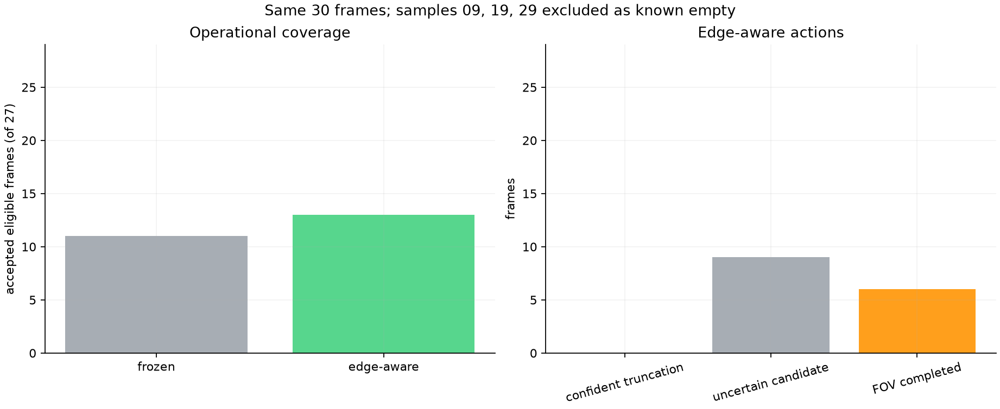

| Outcome | Frozen baseline | Edge-aware |
|---|---:|---:|
| Accepted, eligible frames | 11 of 27 | 13 of 27 |
| Fully in-view success | 11 | 7 |
| Success with uncertain FOV completion | 0 | 6 |
| Boundary-uncertain frames | 0 | 18 |
| Rejected at A1 geometry selection | 11 | 11 |
| Rejected at A5 modeled-body gate | 1 | 2 |
| Rejected at A6 length gate | 4 | 1 |

Coverage rose by two frames, but 6 of the 13 accepted poses now contain
extrapolated off-camera anatomy that no pixel supports. The completed lengths
cluster at the per-recording prior (median `733 px`) by construction. A1
rejections are unchanged, so flat-fielding did not reduce the dominant branch
failure. The per-frame comparison sheets are indexed in
[`final_algorithm_edge_aware_unannotated30/FRAME_STEPS.md`](final_algorithm_edge_aware_unannotated30/FRAME_STEPS.md).

### 8.2 Edge-censored run: flat field plus visible-only repair

`scripts/evaluate_edge_censored_geometry_unannotated30.py` keeps the flat field
and boundary classification but never generates points outside the camera.
Skeleton stations within roughly one worm radius of a boundary contact are
dropped as unreliable, a smooth curve is fit through the remaining interior
core, and the fit is continued only to the pixel-center camera rectangle at a
crossing measured from the raw mask. The reusable code is
`src/worm_pose_gen/edge_censored.py`.

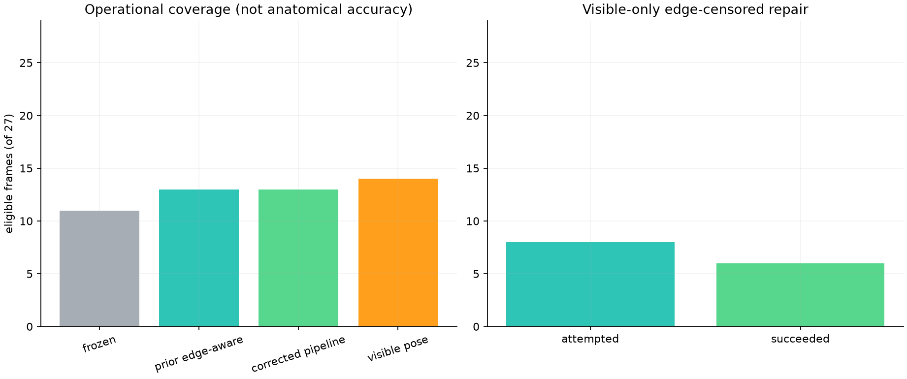

| Outcome | Frames |
|---|---:|
| Eligible worm frames | 27 |
| Pipeline accepted through A6 | 13 |
| Final visible pose available | **14** |
| Fully visible, no censoring needed | 6 |
| Visible edge-censored pose | 6 |
| Edge-censored repair attempted / succeeded | 8 / 6 |
| Boundary-uncertain frames | 18 |
| Rejected at A1 geometry selection | 11 |

This is the more defensible boundary treatment: it matches the edge-aware
coverage without asserting hidden anatomy, and a censored endpoint is reported
exactly on the camera rectangle so downstream consumers can see that the body
continues off-frame. A repaired visible curve is still an initialization
result. Operational success near the border does not establish anatomical
correctness there, and the 18 boundary-uncertain frames show that the raw
threshold mask frequently touches the border even when the closed component
does not. Sheets are indexed in
[`final_algorithm_edge_censored_unannotated30/FRAME_STEPS.md`](final_algorithm_edge_censored_unannotated30/FRAME_STEPS.md).

### 8.3 Interactively tuned local-darkness setting: evaluated and reverted

A browser tuner (`python -m worm_pose_gen.heuristic_tuner`) was added so the
local background radius, denoise radius, seed cutoff, optional connected
hysteresis cutoff, and closing radius can be adjusted against the cached proxy
frames while watching the resulting component. The segmentation stage was
refactored into `segment_dark_ridge`, which exposes each intermediate mask and
supports the optional hysteresis threshold. A setting that looked clean in the
tuner (`61 px / 3 px / z >= 4.25 / connected z >= 2.05 / 8 px`) was promoted
to the code defaults and rerun through the unchanged A1--A6 gates.

| Stage or outcome | Frozen setting | Tuned setting |
|---|---:|---:|
| Section 3 component available | 30 | 30 |
| A1 geometry-only repair selected | 16 | 4 |
| A5 modeled-body gate passed | 15 | 3 |
| A6 extension and length gate passed | **11** | **3** |
| Rejected at A1 geometry selection | 14 | 26 |

Acceptance fell from 11 to 3 of 30, with 26 A1 rejections. The wider
background radius and higher seed cutoff, chosen for their appearance on the
proxy frames, produce components on the archive recordings that the radius
sweep cannot reduce to a single two-endpoint path. The setting was therefore
reverted; `ClassicalConfig` defaults remain `31 / 2 / 2.6 / disabled / 2`, and
connected hysteresis stays an opt-in field. The rejected run is retained under
[`final_algorithm_tuned_local_darkness_unannotated30/`](final_algorithm_tuned_local_darkness_unannotated30/FRAME_STEPS.md)
as evidence that tuner appearance on proxy frames does not predict stress-run
coverage. Any future segmentation change must be judged on the 30-frame run,
not on the tuner view.

### 8.4 What Section 8 changes about the evidence boundary

- The annotation-matched primary-30 audit is retired permanently, so no
  further anatomical-accuracy number can come from the existing manual traces
  beyond the single Section 5 frame.
- The dominant failure across all four runs is A1 geometry selection, at 11 of
  27 eligible frames regardless of flat-fielding or boundary treatment. That is
  a skeleton-topology failure of the mask-then-thin approach, not a threshold
  problem, and it is the main motivation for replacing skeleton extraction with
  a fitted body model scored against the mask.
- Boundary contact should be modeled as censoring, as in 8.2, rather than as a
  rejection or as an inferred off-camera curve.
