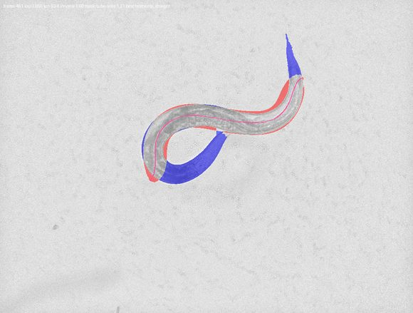
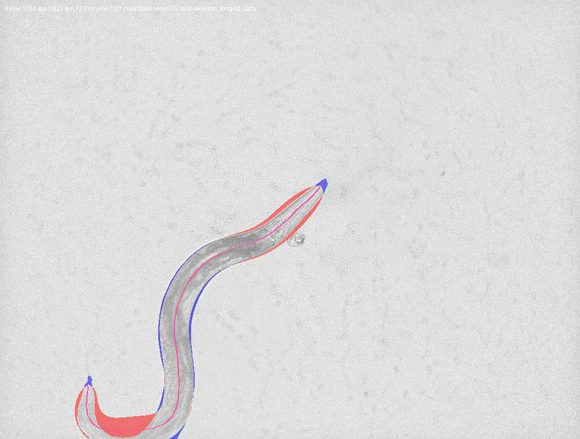
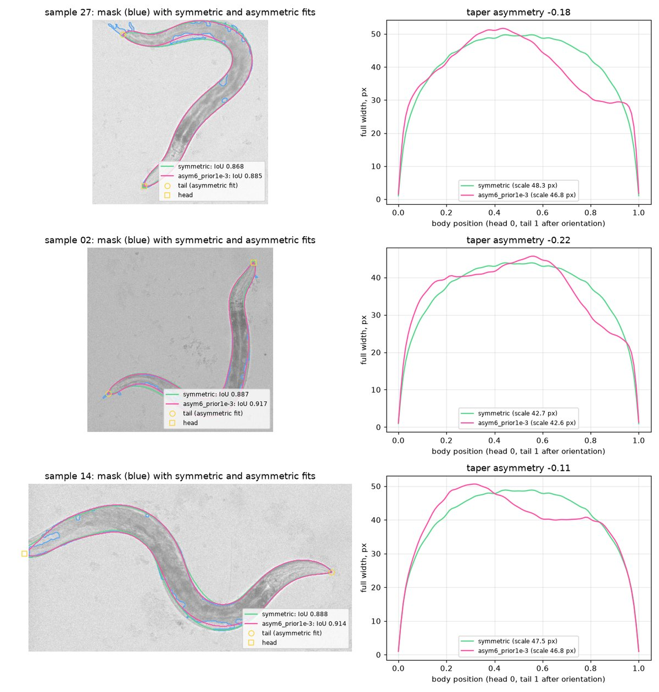
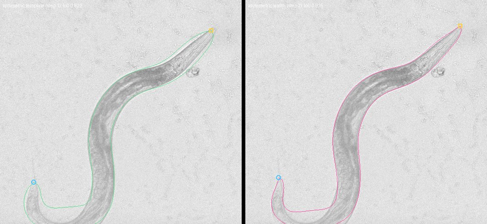

# Pose pipeline plan: from per-frame mask fits to whole recordings

Written 2026-09-03. This document records the plan for turning the mask
fitter of [`MASK_FIT_EXPERIMENT.md`](MASK_FIT_EXPERIMENT.md) and the learned
segmenter of [`SEGMENTATION_LABELING.md`](SEGMENTATION_LABELING.md) into a
pipeline that labels whole recordings, including frames where the body leaves
the field of view or crosses itself. Each step ends with a measurement; the
"Status" section at the bottom is updated as steps land.

## 1. Starting point

What exists on 2026-09-03:

- **Segmenter.** ResNet-18 U-Net, promoted checkpoint
  `checkpoints/segmenter/best.ckpt`, median IoU 0.972 val / 0.974 test,
  calibrated (background p ~ 0.004). `scripts/segment_video.py` runs it over
  a recording, fills narrow holes, keeps the largest component, and writes a
  video.
- **Fitter.** `src/worm_pose_gen/mask_fit.py` renders a soft tube from a
  20-value latent (16 tangent-angle B-spline coefficients, rotation, length,
  centroid) times one width scale over a fixed symmetric width template, and
  minimizes soft Dice against the mask. Rendering is censored outside the
  camera. Five starts per frame, four coarse-to-fine stages, 550 Adam steps.
- **Costs measured before this plan** (RTX 6000 Ada, 732 x 968 frames):

  | Stage | Cost |
  |---|---:|
  | Segmenter network | 34 ms / frame |
  | Segment + cleanup + video encode | 223 ms / frame |
  | Mask fit, five starts, 550 steps | 19 s / frame |

  A 20 fps hour is 72k frames. The fitter needs roughly a hundredfold
  speedup before any temporal scheme is worth designing.

What is missing: asymmetric width (the dominant residual on the 30-frame set),
a per-recording notion of body size (length is held by hard bounds), any
recording-level driver, any handling of coils or self-contact, and any use of
neighboring frames.

## 2. Principles

1. **Generative fit against the mask stays the core.** The render is a union
   over segments, so a self-intersecting centerline renders correctly. The
   difficulty with coils is ambiguity of the observation, not the model.
2. **Priors replace bounds.** Body size varies between recordings and is
   nearly constant within one. Learn it once per recording, then use it as a
   Gaussian prior per frame.
3. **Throughput comes from batching, not from a serial chain.** Any temporal
   scheme must keep the GPU busy with many frames at once.
4. **Temporal reasoning where it is needed.** Unambiguous frames are fit
   independently. Neighbors are consulted to resolve discrete ambiguities
   (head/tail, which local optimum) and to bridge coils.
5. **Every step is judged on a fixed evaluation set** and logged with a
   timestamp. The 30-frame stress set remains the regression guard; a
   sequence set with coils and field-of-view exits is added in step 4.

## 3. Steps

### Step 1. Recording-level batched pipeline (throughput baseline)

Build the harness every later step runs in.

- A script (`scripts/fit_recording.py`) reads a recording in slabs, flat-fields,
  segments, cleans (narrow-hole fill, largest component), and fits every frame
  in GPU batches. Output per frame: latent, width scale and profile,
  centerline, body length, in-view fraction, final energy and IoU, mask
  statistics, and timing. One JSON summary plus one NPZ of arrays.
- Make the fitter batch over frames as well as starts. Frames have different
  crop windows; pad crops to the batch maximum and treat pixels outside the
  camera as censored (excluded from the energy), pixels inside the camera but
  outside a frame's own window as ordinary background.
- Reduce per-frame work: fewer starts, fewer steps, finest stage at
  downsample 2 where full resolution is not needed, and render only where it
  matters (a band around the observed mask and the current tube) once
  profiling shows rendering dominates.
- Replace the pure-Python connected-components pass if it dominates cleanup.
- Measure ms/frame for each stage and record it in this document. Verify on
  the 30-frame set that the faster fitter does not lose IoU.

**Result (2026-09-04).** Landed as `src/worm_pose_gen/batch_fit.py`,
`src/worm_pose_gen/connected_components.py`, and `scripts/fit_recording.py`;
raw numbers are under `pose_pipeline_step1/`.

Where the time went. Profiling the reference fitter on segmenter masks put
nearly all of its 12--14 s in the two full-resolution stages (about 35 ms per
Adam step for four starts; the renderer is memory-bound in eager PyTorch), and
60--90 ms per frame in the pure-Python connected-components pass. The matmul
reformulation of the renderer was slower and less accurate; `torch.compile`
of the existing renderer was 3.7x faster and used a third of the memory, and
is what the batched fitter uses (`compile_renderer=True`, eager fallback).
Connected components are now labeled by run-length union-find: exact against
the BFS reference on every test mask, 2--6 ms per frame.

Speed/accuracy on 62 segmenter masks spread over `2024-05-28-02`
(`variant_sweep_62_segmenter_masks.json`): the full-resolution stage adds
0.002 median IoU for 2.5x the cost, and the three moment-based starts almost
never win (skeleton start on 253 of 256 frames in a first run), so the
defaults became crop padding 32, downsample-4 then downsample-2 stages, and
two starts (skeleton and straight moments).

Convergence on the 30-frame stress set (`schedule_sweep_unannotated30.json`).
Given the reference schedule (four stages, 550 steps, all starts, padding 64)
the batched fitter reproduces the stored `fit_mask` result exactly (median
IoU delta 0.000, 20 frames at IoU >= 0.9) at 4.9 s/frame instead of 12--19 s.
Shorter schedules are optimizer-limited, not resolution-limited: extending the
skeleton start or raising the length rate did not help, more steps did.

| Preset | Schedule | s/frame (2 starts) | Median IoU deficit vs reference |
|---|---|---:|---:|
| `fast` (default) | 4x: 60 steps, 2x: 100 steps, rate 0.6 | 0.25 | -0.008 |
| `balanced` | 4x: 100 steps, 2x: 200 steps, rate 0.6 | 0.46 | -0.006 |
| (probe) | 4x: 100 steps, 2x: 600 steps | 1.26 | -0.004 |
| `reference` | reference schedule, all starts | 4.9 | 0.000 |

Use `reference` when judging model changes on the 30-frame set; use `fast`
for recordings. The temporal warm starts of step 5 should remove most of the
remaining deficit, since a start near the optimum needs few steps.

One minute of `2024-05-28-02` (1200 frames, `fast`, RTX 6000 Ada,
`summary_2024-05-28-02_f000000-001199.json`):

| Stage | ms/frame |
|---|---:|
| Read + flat field | 5 |
| Segmenter network | 21 |
| Mask cleanup (hole fill, largest component) | 19 |
| Starts (8 worker processes) | 16 |
| Fit | 174 |
| Overlay video | 10 |
| **Total** | **244** |

All 1200 frames fit; median IoU 0.892, 99.8% at or above 0.8. Two findings
feed the later steps. The fitted length sat at the 750 px upper bound on 251
frames and 589 frames report an in-view fraction below 1, so on this long
worm the bound, not the mask, decides the length (step 3). The two worst
frames (450--451, IoU 0.67) are a cold-start failure on a fully visible
S-shaped body: the tube settled on the midbody and missed both ends, with the
mask area exceeding the tube area by 21%; that ratio is a cheap failure
signal for step 4, and neighboring frames would have supplied a good start
(step 5). Frame 1052 shows the symmetric width template overshooting the
tail (step 2).

Blue is mask not covered by the tube, red is tube outside the mask.

At 244 ms/frame an hour of 20 fps video takes about 4.9 hours. The
remaining fit cost is dominated by the downsample-2 render over the whole
crop; a banded render (pixels near the mask or the current tube only) and
warm starts are the next levers, in that order.

### Step 2. Asymmetric width

- Multiply the template by a smooth correction in log space: about six cubic
  B-spline coefficients over body position, with a Gaussian prior toward
  zero. This lets the head taper stay short and the tail taper grow long.
- Asymmetry gives the model a head and a tail, so every start is tried in
  both orientations. The extra starts double the batch but yield head/tail
  labels.
- Judge on the 30-frame set. The lowest-scoring worm frames (samples 27, 2,
  14) are the ones the fixed template hurts most.

**Result (2026-09-04).** Landed in `mask_fit._MaskFitState` (shared by the
single-frame and batched fitters), with `orient_tail_last`,
`reverse_initialization`, `reverse_result`, and
`scripts/evaluate_width_model_unannotated30.py`; raw numbers are under
`pose_pipeline_step2/`.

Model. Full width along the body is `scale x template x exp(c)`, where `c` is
a mean-centered clamped cubic B-spline over body position with
`width_coefficients` coefficients (default 6, learning rate 0.01) and a
Gaussian prior `width_shape_prior x |coefficients|^2` (default 1e-3). Zero
coefficients restore the symmetric model exactly. The correction adds one
`[rows, 6] x [6, 100]` product per step, so the fit cost is unchanged.

Orientation, a change to the plan. Under a zero-centered prior a reversed
start is the exact mirror image of the forward one (the bases are
mirror-symmetric, verified to 1e-13), so trying both orientations cannot
change the energy and was dropped for this step. Instead each fit is
oriented after the fact: `taper_asymmetry` is the mean log width over the
last 30% of the body minus the first 30%, and the thinner end is placed
last as the tail. Trying both orientations returns in step 3, where an
asymmetric per-recording prior makes the two starts different.

30-frame stress set, reference schedule, all starts
(`width_model_sweep.json`; the symmetric row reproduces the stored
reference within compile noise, one frame -0.017):

| Width model | Median IoU | Median delta | Frames better by 0.01 / worse | Frames at IoU >= 0.9 |
|---|---:|---:|---:|---:|
| symmetric template | 0.911 | 0.000 | 0 / 1 | 20 |
| 6 coefficients, prior 0 | 0.927 | +0.018 | 20 / 0 | 26 |
| 6 coefficients, prior 1e-3 (default) | 0.926 | +0.017 | 20 / 0 | 26 |
| 6 coefficients, prior 1e-2 | 0.924 | +0.013 | 19 / 0 | 26 |
| 8 coefficients, prior 1e-3 | 0.932 | +0.022 | 24 / 0 | 26 |
| 10 coefficients, prior 1e-3 | 0.936 | +0.024 | 26 / 0 | 26 |
| 12 coefficients, prior 1e-3 | 0.940 | +0.028 | 27 / 0 | 26 |

Every asymmetric variant improves every frame. The prior weight 1e-2 costs
IoU and halves the taper signal; 0 and 1e-3 are equivalent, and 1e-3 is kept
so the correction has a defined value where the mask says nothing. The
worst frames of the reference run (27, 2, 14) gain 0.017, 0.030, and 0.026,
and their fitted profiles show a short head taper and a tail taper that
begins around 60% of the body.

One minute of `2024-05-28-02` (1200 frames, `fast` preset, segmenter masks;
`recording_comparison_*.json`, `recording_coefficient_comparison_*.json`,
`orientation_analysis_*.json`). Flips are orientation changes between
consecutive frames; a frame's label is *wrong* when it disagrees with the
orientation propagated geometrically along the whole track.

| Width model | Median IoU | P10 IoU | Frames at IoU >= 0.9 | Fit ms/frame | Flips | Wrong labels among frames with abs. asymmetry >= 0.1 |
|---|---:|---:|---:|---:|---:|---:|
| symmetric (step 1) | 0.892 | 0.847 | 28.7% | 174 | | |
| 6 coefficients (default) | 0.975 | 0.950 | 99.8% | 182 | 50 | 19 / 844 |
| 8 coefficients | 0.977 | 0.959 | 99.8% | 175 | 66 | 25 / 854 |
| 12 coefficients | 0.978 | 0.961 | 99.8% | 178 | 62 | 24 / 849 |

With six coefficients 1199 of 1200 frames improve by more than 0.01 and none
worsen; the median frame moves from 0.892 to 0.975. More coefficients add
0.002--0.004 on these masks while orientation gets slightly noisier, and a
low-dimensional correction is easier to learn per recording in step 3, so 6
stays the default (`--width-coefficients` changes it).

Head (square) and tail (circle) labels. The taper asymmetry is a graded
confidence: the 19 wrong labels among the 844 frames with absolute
asymmetry >= 0.1 all lie in two stretches, the cold-start failure around
frames 434--451 and frames 1047--1052; above 0.15 there are 5 wrong in 799
frames, above 0.3 none in 641. The remaining 356 frames are ambiguous
(absolute asymmetry below 0.1), and only 15 of them have the body leaving
the view, so ambiguity comes from the mask, not the field of view; their
labels are coin flips and account for 49 of the 50 flips. Step 6 should use
the asymmetry as a soft orientation observation, not a hard label.

Two inputs to step 3. The median log correction on this recording is +0.07
to +0.15 over the front 60% of the body and -0.12, -0.29, -0.43 over the
last three deciles; that profile is the natural center of the per-recording
width prior. The number of frames at the 750 px length bound rose from 251
to 372, because a thinner tail lets the tube extend further, so the length
prior is more urgent, not less. Frames 450--451 are unchanged at IoU 0.67:
a start problem, for steps 4 and 5.

### Step 3. Per-recording priors

- Bootstrap pass: fit a spread sample of frames, keep those fully in view with
  a clean fit, take robust medians of length and of the width correction.
- Per-frame fit: Gaussian priors on log-length and on the width coefficients,
  centered on the recording values. Remove the fixed length and width bounds.
- Field-of-view exits follow: an end that is in view is pinned by the
  background beyond its tip; an end past the camera edge has no gradient, so
  the prior length is spent there. Report the in-view fraction with every
  pose.
- Test on the corner frames from the flat-field vignette scan of
  `2024-01-31-02` (frame 136 is the reference clipped-tail case).

### Step 4. Ambiguity score and a sequence evaluation set

- Per-frame signals: mask area versus the area the prior length and width
  predict (self-overlap produces a deficit); energy gap between the best two
  distinct optima; holes in the unfilled mask; fit IoU; in-view fraction.
- Hand-pick about five clips (a few hundred frames each) containing coils,
  self-contact, and field-of-view exits. Store frame ranges, not copies.
  Evaluate on them alongside the 30-frame set from this step on.

### Step 5. Temporal propagation without a serial chain

- Split a recording into chunks of about 64 frames. Fit each chunk's first
  frame from multi-start in one large batch. Propagate within all chunks in
  lockstep, so step k of every chunk is one GPU batch. Run forward and
  backward from chunk ends. Wall-clock is sequential only over chunk length.
- Whether propagation is needed on unambiguous frames is decided by the
  step 1 measurements: if independent fits are fast and consistent, use
  propagation only across ambiguous stretches.

### Step 6. Hypothesis linking across ambiguous stretches

- Keep the top few distinct local optima per ambiguous frame instead of one.
- Viterbi over the recording: nodes are per-frame hypotheses, node cost is
  fit energy, edge cost is pose change between neighbors plus an
  orientation-flip penalty. The minimum-cost path resolves each ambiguous
  stretch from the unambiguous frames on both sides and fixes head/tail
  orientation across the track.

## 4. Further ideas (after step 6)

- **Intensity for overlaps.** Where the body crosses itself the NIR image is
  darker. A segmenter head predicting an overlap class or per-pixel body
  coordinate would make coils nearly unambiguous; it can be self-trained from
  confident fits on unambiguous frames.
- **Head from motion.** Direction of travel and the higher oscillation
  amplitude of the head end are strong cues; add them to the linking cost.
- **Hole filling versus coil evidence.** The fill closes any enclosed
  background narrower than 17 px. A tight omega turn produces exactly that
  hole. Keep the fill for the fitting target, but record unfilled holes as an
  ambiguity cue.
- **Split bodies.** Largest-component selection drops a tail separated by a
  mask gap. Log pixels outside the largest component per frame and consider
  keeping fragments along the fitted body's extrapolation.

## 5. Dropped or changed

- The width template measured from the 11 frozen A6 poses of the old skeleton
  pipeline and the frozen-pipeline start have no place in a recording-level
  pipeline. Width shape is learned per recording (step 3). Skeleton and
  moment starts stay.
- Sequential per-frame propagation as the primary temporal mechanism is
  replaced by chunked lockstep propagation and hypothesis linking.
- Full sequential Monte Carlo (the old `smc.py`) is not resurrected; K-best
  hypotheses plus Viterbi give the same benefit with deterministic output.
- Hard length and width bounds are replaced by per-recording priors.
- Trying every start in both orientations, planned for step 2, was dropped
  there: under a zero-centered width prior the reversed start is an exact
  mirror image with the same energy. Orientation is decided after the fit
  from the taper asymmetry; both orientations return in step 3, where the
  per-recording width prior is asymmetric.

## 6. Status

| Step | State | Notes |
|---|---|---|
| 1 | done (2026-09-04) | `scripts/fit_recording.py`; 244 ms/frame end to end, fit 174 ms; `fast` preset is -0.008 IoU vs the reference on the 30-frame set, `reference` preset exact |
| 2 | done (2026-09-04) | log-space B-spline width correction (6 coefficients, prior 1e-3); +0.017 median IoU on the 30-frame set, 0.892 -> 0.975 on one minute of `2024-05-28-02`; tail placed last from the taper asymmetry |
| 3 | not started | |
| 4 | not started | |
| 5 | not started | |
| 6 | not started | |
