# Pose pipeline plan: from per-frame mask fits to whole recordings

Written 2026-09-03. This document records the plan for turning the mask
fitter of [`MASK_FIT_EXPERIMENT.md`](MASK_FIT_EXPERIMENT.md) and the learned
segmenter of [`SEGMENTATION_LABELING.md`](SEGMENTATION_LABELING.md) into a
pipeline that labels whole recordings, including frames where the body leaves
the field of view or crosses itself. Each step ends with a measurement; the
"Status" section at the bottom is updated as steps land.

## 1. Starting point

What exists on 2026-09-03:

- **Segmenter.** ResNet-18 U-Net, promoted checkpoint
  `checkpoints/segmenter/best.ckpt`, median IoU 0.972 val / 0.974 test,
  calibrated (background p ~ 0.004). `scripts/segment_video.py` runs it over
  a recording, fills narrow holes, keeps the largest component, and writes a
  video.
- **Fitter.** `src/worm_pose_gen/mask_fit.py` renders a soft tube from a
  20-value latent (16 tangent-angle B-spline coefficients, rotation, length,
  centroid) times one width scale over a fixed symmetric width template, and
  minimizes soft Dice against the mask. Rendering is censored outside the
  camera. Five starts per frame, four coarse-to-fine stages, 550 Adam steps.
- **Costs measured before this plan** (RTX 6000 Ada, 732 x 968 frames):

  | Stage | Cost |
  |---|---:|
  | Segmenter network | 34 ms / frame |
  | Segment + cleanup + video encode | 223 ms / frame |
  | Mask fit, five starts, 550 steps | 19 s / frame |

  A 20 fps hour is 72k frames. The fitter needs roughly a hundredfold
  speedup before any temporal scheme is worth designing.

What is missing: asymmetric width (the dominant residual on the 30-frame set),
a per-recording notion of body size (length is held by hard bounds), any
recording-level driver, any handling of coils or self-contact, and any use of
neighboring frames.

## 2. Principles

1. **Generative fit against the mask stays the core.** The render is a union
   over segments, so a self-intersecting centerline renders correctly. The
   difficulty with coils is ambiguity of the observation, not the model.
2. **Priors replace bounds.** Body size varies between recordings and is
   nearly constant within one. Learn it once per recording, then use it as a
   Gaussian prior per frame.
3. **Throughput comes from batching, not from a serial chain.** Any temporal
   scheme must keep the GPU busy with many frames at once.
4. **Temporal reasoning where it is needed.** Unambiguous frames are fit
   independently. Neighbors are consulted to resolve discrete ambiguities
   (head/tail, which local optimum) and to bridge coils.
5. **Every step is judged on a fixed evaluation set** and logged with a
   timestamp. The 30-frame stress set remains the regression guard; a
   sequence set with coils and field-of-view exits is added in step 4.

## 3. Steps

### Step 1. Recording-level batched pipeline (throughput baseline)

Build the harness every later step runs in.

- A script (`scripts/fit_recording.py`) reads a recording in slabs, flat-fields,
  segments, cleans (narrow-hole fill, largest component), and fits every frame
  in GPU batches. Output per frame: latent, width scale and profile,
  centerline, body length, in-view fraction, final energy and IoU, mask
  statistics, and timing. One JSON summary plus one NPZ of arrays.
- Make the fitter batch over frames as well as starts. Frames have different
  crop windows; pad crops to the batch maximum and treat pixels outside the
  camera as censored (excluded from the energy), pixels inside the camera but
  outside a frame's own window as ordinary background.
- Reduce per-frame work: fewer starts, fewer steps, finest stage at
  downsample 2 where full resolution is not needed, and render only where it
  matters (a band around the observed mask and the current tube) once
  profiling shows rendering dominates.
- Replace the pure-Python connected-components pass if it dominates cleanup.
- Measure ms/frame for each stage and record it in this document. Verify on
  the 30-frame set that the faster fitter does not lose IoU.

**Result (2026-09-04).** Landed as `src/worm_pose_gen/batch_fit.py`,
`src/worm_pose_gen/connected_components.py`, and `scripts/fit_recording.py`;
raw numbers are under `pose_pipeline_step1/`.

Where the time went. Profiling the reference fitter on segmenter masks put
nearly all of its 12--14 s in the two full-resolution stages (about 35 ms per
Adam step for four starts; the renderer is memory-bound in eager PyTorch), and
60--90 ms per frame in the pure-Python connected-components pass. The matmul
reformulation of the renderer was slower and less accurate; `torch.compile`
of the existing renderer was 3.7x faster and used a third of the memory, and
is what the batched fitter uses (`compile_renderer=True`, eager fallback).
Connected components are now labeled by run-length union-find: exact against
the BFS reference on every test mask, 2--6 ms per frame.

Speed/accuracy on 62 segmenter masks spread over `2024-05-28-02`
(`variant_sweep_62_segmenter_masks.json`): the full-resolution stage adds
0.002 median IoU for 2.5x the cost, and the three moment-based starts almost
never win (skeleton start on 253 of 256 frames in a first run), so the
defaults became crop padding 32, downsample-4 then downsample-2 stages, and
two starts (skeleton and straight moments).

Convergence on the 30-frame stress set (`schedule_sweep_unannotated30.json`).
Given the reference schedule (four stages, 550 steps, all starts, padding 64)
the batched fitter reproduces the stored `fit_mask` result exactly (median
IoU delta 0.000, 20 frames at IoU >= 0.9) at 4.9 s/frame instead of 12--19 s.
Shorter schedules are optimizer-limited, not resolution-limited: extending the
skeleton start or raising the length rate did not help, more steps did.

| Preset | Schedule | s/frame (2 starts) | Median IoU deficit vs reference |
|---|---|---:|---:|
| `fast` (default) | 4x: 60 steps, 2x: 100 steps, rate 0.6 | 0.25 | -0.008 |
| `balanced` | 4x: 100 steps, 2x: 200 steps, rate 0.6 | 0.46 | -0.006 |
| (probe) | 4x: 100 steps, 2x: 600 steps | 1.26 | -0.004 |
| `reference` | reference schedule, all starts | 4.9 | 0.000 |

Use `reference` when judging model changes on the 30-frame set; use `fast`
for recordings. The temporal warm starts of step 5 should remove most of the
remaining deficit, since a start near the optimum needs few steps.

One minute of `2024-05-28-02` (1200 frames, `fast`, RTX 6000 Ada,
`summary_2024-05-28-02_f000000-001199.json`):

| Stage | ms/frame |
|---|---:|
| Read + flat field | 5 |
| Segmenter network | 21 |
| Mask cleanup (hole fill, largest component) | 19 |
| Starts (8 worker processes) | 16 |
| Fit | 174 |
| Overlay video | 10 |
| **Total** | **244** |

All 1200 frames fit; median IoU 0.892, 99.8% at or above 0.8. Two findings
feed the later steps. The fitted length sat at the 750 px upper bound on 251
frames and 589 frames report an in-view fraction below 1, so on this long
worm the bound, not the mask, decides the length (step 3). The two worst
frames (450--451, IoU 0.67) are a cold-start failure on a fully visible
S-shaped body: the tube settled on the midbody and missed both ends, with the
mask area exceeding the tube area by 21%; that ratio is a cheap failure
signal for step 4, and neighboring frames would have supplied a good start
(step 5). Frame 1052 shows the symmetric width template overshooting the
tail (step 2).

Blue is mask not covered by the tube, red is tube outside the mask.

At 244 ms/frame an hour of 20 fps video takes about 4.9 hours. The
remaining fit cost is dominated by the downsample-2 render over the whole
crop; a banded render (pixels near the mask or the current tube only) and
warm starts are the next levers, in that order.

### Step 2. Asymmetric width

- Multiply the template by a smooth correction in log space: about six cubic
  B-spline coefficients over body position, with a Gaussian prior toward
  zero. This lets the head taper stay short and the tail taper grow long.
- Asymmetry gives the model a head and a tail, so every start is tried in
  both orientations. The extra starts double the batch but yield head/tail
  labels.
- Judge on the 30-frame set. The lowest-scoring worm frames (samples 27, 2,
  14) are the ones the fixed template hurts most.

**Result (2026-09-04).** Landed in `mask_fit._MaskFitState` (shared by the
single-frame and batched fitters), with `orient_tail_last`,
`reverse_initialization`, `reverse_result`, and
`scripts/evaluate_width_model_unannotated30.py`; raw numbers are under
`pose_pipeline_step2/`.

Model. Full width along the body is `scale x template x exp(c)`, where `c` is
a mean-centered clamped cubic B-spline over body position with
`width_coefficients` coefficients (default 6, learning rate 0.01) and a
Gaussian prior `width_shape_prior x |coefficients|^2` (default 1e-3). Zero
coefficients restore the symmetric model exactly. The correction adds one
`[rows, 6] x [6, 100]` product per step, so the fit cost is unchanged.

Orientation, a change to the plan. Under a zero-centered prior a reversed
start is the exact mirror image of the forward one (the bases are
mirror-symmetric, verified to 1e-13), so trying both orientations cannot
change the energy and was dropped for this step. Instead each fit is
oriented after the fact: `taper_asymmetry` is the mean log width over the
last 30% of the body minus the first 30%, and the thinner end is placed
last as the tail. Trying both orientations returns in step 3, where an
asymmetric per-recording prior makes the two starts different.

30-frame stress set, reference schedule, all starts
(`width_model_sweep.json`; the symmetric row reproduces the stored
reference within compile noise, one frame -0.017):

| Width model | Median IoU | Median delta | Frames better by 0.01 / worse | Frames at IoU >= 0.9 |
|---|---:|---:|---:|---:|
| symmetric template | 0.911 | 0.000 | 0 / 1 | 20 |
| 6 coefficients, prior 0 | 0.927 | +0.018 | 20 / 0 | 26 |
| 6 coefficients, prior 1e-3 (default) | 0.926 | +0.017 | 20 / 0 | 26 |
| 6 coefficients, prior 1e-2 | 0.924 | +0.013 | 19 / 0 | 26 |
| 8 coefficients, prior 1e-3 | 0.932 | +0.022 | 24 / 0 | 26 |
| 10 coefficients, prior 1e-3 | 0.936 | +0.024 | 26 / 0 | 26 |
| 12 coefficients, prior 1e-3 | 0.940 | +0.028 | 27 / 0 | 26 |

Every asymmetric variant improves every frame. The prior weight 1e-2 costs
IoU and halves the taper signal; 0 and 1e-3 are equivalent, and 1e-3 is kept
so the correction has a defined value where the mask says nothing. The
worst frames of the reference run (27, 2, 14) gain 0.017, 0.030, and 0.026,
and their fitted profiles show a short head taper and a tail taper that
begins around 60% of the body.

One minute of `2024-05-28-02` (1200 frames, `fast` preset, segmenter masks;
`recording_comparison_*.json`, `recording_coefficient_comparison_*.json`,
`orientation_analysis_*.json`). Flips are orientation changes between
consecutive frames; a frame's label is *wrong* when it disagrees with the
orientation propagated geometrically along the whole track.

| Width model | Median IoU | P10 IoU | Frames at IoU >= 0.9 | Fit ms/frame | Flips | Wrong labels among frames with abs. asymmetry >= 0.1 |
|---|---:|---:|---:|---:|---:|---:|
| symmetric (step 1) | 0.892 | 0.847 | 28.7% | 174 | | |
| 6 coefficients (default) | 0.975 | 0.950 | 99.8% | 182 | 50 | 19 / 844 |
| 8 coefficients | 0.977 | 0.959 | 99.8% | 175 | 66 | 25 / 854 |
| 12 coefficients | 0.978 | 0.961 | 99.8% | 178 | 62 | 24 / 849 |

With six coefficients 1199 of 1200 frames improve by more than 0.01 and none
worsen; the median frame moves from 0.892 to 0.975. More coefficients add
0.002--0.004 on these masks while orientation gets slightly noisier, and a
low-dimensional correction is easier to learn per recording in step 3, so 6
stays the default (`--width-coefficients` changes it).

Visual comparison. Every run directory under
`/temp_data4/alex/external_artifacts/poses/` (the step 1 run and the
`asym6`, `asym8`, `asym12` runs) has an `overlay.mp4` and residual images
`frame_<index>_iou<value>.png` for its worst frames plus frames 71, 131,
352, 451, 1010, 1021, and 1052; blue is mask the tube misses, red is tube
outside the mask. `scripts/render_pose_run.py` writes these for any stored
run without refitting, and `scripts/compare_pose_runs.py` lays several runs
side by side on the same segmented frame. The strips below are symmetric,
6, 8, and 12 coefficients from left to right
(`pose_pipeline_step2/residual_frame_*.jpg`, six frames).

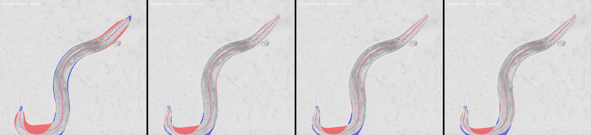

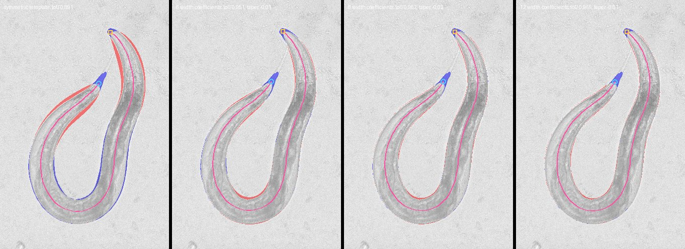

The strips show what the numbers do not: the asymmetric width clears the red
band along the tail everywhere, but a red patch at the tight bend of frame
1052 survives every variant, because the 16-coefficient centerline cannot
turn that sharply. That residual belongs to the centerline model, not the
width, and is a candidate for more shape coefficients once the priors of
step 3 are in place.

Head (square) and tail (circle) labels. The taper asymmetry is a graded
confidence: the 19 wrong labels among the 844 frames with absolute
asymmetry >= 0.1 all lie in two stretches, the cold-start failure around
frames 434--451 and frames 1047--1052; above 0.15 there are 5 wrong in 799
frames, above 0.3 none in 641. The remaining 356 frames are ambiguous
(absolute asymmetry below 0.1), and only 15 of them have the body leaving
the view, so ambiguity comes from the mask, not the field of view; their
labels are coin flips and account for 49 of the 50 flips. Step 6 should use
the asymmetry as a soft orientation observation, not a hard label.

Two inputs to step 3. The median log correction on this recording is +0.07
to +0.15 over the front 60% of the body and -0.12, -0.29, -0.43 over the
last three deciles; that profile is the natural center of the per-recording
width prior. The number of frames at the 750 px length bound rose from 251
to 372, because a thinner tail lets the tube extend further, so the length
prior is more urgent, not less. Frames 450--451 are unchanged at IoU 0.67:
a start problem, for steps 4 and 5.

**Correction (2026-09-04, found in step 3).** The in-view fraction used
above counts centerline points inside the image, and a body cut off by the
camera edge keeps every point inside the image, so the 608 frames it
flagged undercount the clipped frames: 872 of the 1200 have the mask on the
border. That changes two readings. The frames "at the length bound" were
mostly clipped bodies whose visible part was shorter than 750 px, not
whole worms held back by the bound (the whole worms of this minute fit at
765--790 px, and the bound was binding on those). And the strong taper
values came from clipped frames: the cut end is as wide as the body and the
visible tip is thin, so the tip reads as the tail whatever it is. Whole
worms in this minute have absolute taper asymmetry of 0.05--0.13. The
label-consistency table above therefore measures consistency along the
track, not anatomical head/tail identification, which on this recording
the width alone does not provide.

### Step 3. Per-recording priors

- Bootstrap pass: fit a spread sample of frames, keep those fully in view with
  a clean fit, take robust medians of length and of the width correction.
- Per-frame fit: Gaussian priors on log-length and on the width coefficients,
  centered on the recording values. Remove the fixed length and width bounds.
- Field-of-view exits follow: an end that is in view is pinned by the
  background beyond its tip; an end past the camera edge has no gradient, so
  the prior length is spent there. Report the in-view fraction with every
  pose.
- Test on the corner frames from the flat-field vignette scan of
  `2024-01-31-02` (frame 136 is the reference clipped-tail case).

**Result (2026-09-04).** Landed as `src/worm_pose_gen/recording_prior.py`,
the size priors and censored escape penalty in `mask_fit._MaskFitState`,
`extend_start_to_length` and `orientation_pair` in `mask_fit.py`, the
bootstrap in `scripts/fit_recording.py`, and
`scripts/evaluate_recording_prior_unannotated30.py`; raw numbers, priors,
and residual strips are under `pose_pipeline_step3/`.

What a recording prior is. A spread sample of frames (64, enlarged up to
4x until 12 whole worms are found) is segmented and fit with the bounds
opened to 100--3000 px. Whole means the mask is clear of the image border;
the in-view count cannot tell a cut body from a whole one (see the step 2
correction). Fits with IoU >= 0.85 and mask area within 15% of tube area
are oriented tail last and reduced to robust medians of log length, log
width scale, and the six correction coefficients, with a 5% floor on the
log sigmas. `RecordingPrior.apply` removes the hard bounds and adds
Gaussian penalties `prior_weight x (deviation / sigma)^2` on log length and
log width (`prior_weight` 0.0025: two sigmas cost 0.01 dice) and centers the
width correction on the recording's profile with weight 0.01. Priors are
cached per recording under `/temp_data4/alex/external_artifacts/recording_priors/`.

Four things had to change for a body that leaves the camera to be fit at
the prior length. (1) The crop-escape penalty applied to every centerline
point, including censored points past the camera edge, so any off-camera
continuation was punished; it now applies to in-camera points only. (2)
The winner among starts was chosen on the overlap term alone; it is now
chosen on the total energy, so priors can decide. (3) A skeleton start is
as long as the visible body, and even 550 steps could not grow it off
camera through the coupled length/centroid/shape parameters; a start whose
end lies near the mask's border pixels is now lengthened to the prior
length through the point where the mask meets the border and straight on.
(4) Whole-worm sigmas: a 3% floor cost 0.012 IoU on whole worms of
`2024-01-31-02`, 5% costs 0.003.

Orientation. Under an asymmetric prior every frame is started forward and
reversed (`orientation_pair`, replacing the moments start at no extra
cost) and the energy gap between the two orientations is stored. On these
recordings the whole-worm profile asymmetry is weak, so the gap is tiny
(median 0.0004 on the minute below; 1181 of 1200 frames below 0.002) and
the orientation it picks is close to arbitrary. Head/tail labels need the
motion and linking cues of step 6.

30-frame stress set, reference schedule, all starts plus the reversed
skeleton (`prior_sweep.json`; priors from 48 classically segmented frames
per recording, 10--12 whole worms each):

| Model | Median IoU | Frames at IoU >= 0.9 | Frames at the 750 px bound | Median length p10/p50/p90 |
|---|---:|---:|---:|---|
| hard bounds (step 2) | 0.926 | 26 | 7 | 546 / 699 / 751 |
| recording prior | 0.917 | 25 | 0 | 630 / 717 / 775 |

The prior costs 0.009 median IoU here. Eight frames are extended off camera.
The largest loss (sample 6, -0.05) is a fully visible mask 493 px long in a
recording whose worm is 702 px: a coil or a body partly missing from the
mask, where the length prior fights the mask. That deficit between mask
length and prior length is the ambiguity signal step 4 wanted.

One minute of `2024-05-28-02` (1200 frames, `fast` preset,
`recording_comparison_*.json`, `summary_*_prior.json`). The bootstrap
found 16 whole worms among 416 fits (442 frames sampled, 373 s once per
recording): length 778 px, width 43.6 px.

| Model | Median IoU | P10 IoU | Frames at IoU >= 0.9 | Length p10/p50/p90 | Frames beyond the prior | Frames with body off camera | Fit ms/frame |
|---|---:|---:|---:|---|---:|---:|---:|
| hard bounds (step 2) | 0.975 | 0.950 | 99.8% | 515 / 641 / 751 | 372 at the bound | 608 (in-view count) | 182 |
| recording prior | 0.968 | 0.955 | 99.5% | 771 / 791 / 800 | 6 beyond two sigma | 872 (mask on border) | 172 |

The median frame loses 0.004 IoU and the tenth percentile gains 0.005: the
visible part of a clipped body is fit about as well as before while the
pose now carries the whole worm, with the in-view fraction (median 0.78,
tenth percentile 0.61) saying how much was seen. Frames 0, 345, and 690,
whose visible parts are 519--581 px, are fit at 788--804 px with 62--72%
in view and IoU 0.969--0.972 (was 0.974--0.976). Frames 450--451 stay at
IoU 0.62--0.65: the prior cannot pull a tube out of the midbody optimum
because growing it pushes the ends through the mask's neighborhood, a start
problem as predicted. Frame 1053, where the tail exits through a wide blob
at the border, loses 0.06: the extra length wiggles inside the image
instead of leaving it. Orientation flips between consecutive frames rose
from 50 to 189, consistent with the gap being uninformative here.

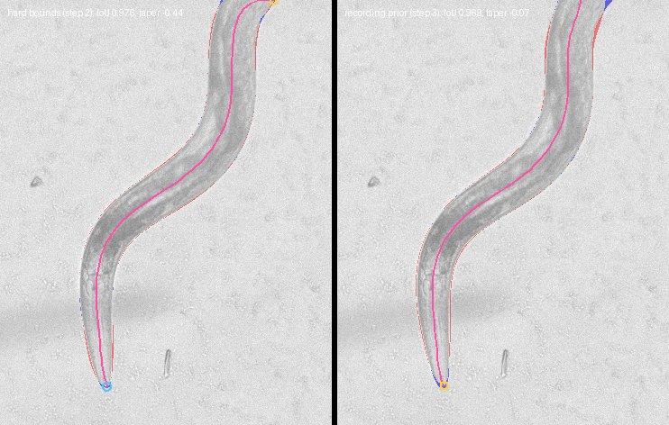

400 frames of `2024-01-31-02`, the corner-frame recording
(`corner_comparison_*.json`, `corner_residual_frame_*.jpg`). Prior 730 px,
width 40.9 px from 21 whole worms (190 frames sampled, 148 s).

| Frames | Median IoU, bounds | Median IoU, prior | Notes |
|---|---:|---:|---|
| all 400 | 0.971 | 0.963 | 6 frames beyond two sigma of the prior |
| 178 whole | 0.970 | 0.965 | |
| 222 with the mask on the border | 0.972 | 0.961 | median in-view fraction 0.89 under the prior |

Frame 136, the reference clipped-tail case, goes from 691 px fully in view
to 749 px with 89% in view at IoU 0.960 (was 0.973); the tube leaves the
image where the body does.

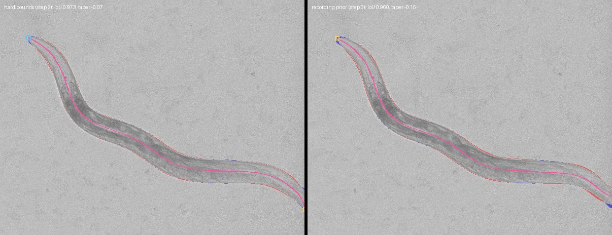

Judgment. The prior does what it was for: lengths are anchored to the
recording, bodies leaving the camera are completed off camera with a
censored extension, and the hard bounds are gone. It costs 0.004--0.01
median IoU on the visible mask, most of it on clipped frames whose visible
part must now share the spline and the profile with an unseen part, and
more on coils, where it fights the mask. Two cheap ambiguity signals fall
out: the mask-length deficit against the prior length and the mask/tube
area ratio. Both go into step 4.

### Step 4. Ambiguity score and a sequence evaluation set

- Per-frame signals: mask area versus the area the prior length and width
  predict (self-overlap produces a deficit); energy gap between the best two
  distinct optima; holes in the unfilled mask; fit IoU; in-view fraction.
- Hand-pick about five clips (a few hundred frames each) containing coils,
  self-contact, and field-of-view exits. Store frame ranges, not copies.
  Evaluate on them alongside the 30-frame set from this step on.

**Result (2026-09-04).** Landed as `src/worm_pose_gen/ambiguity.py` (signals,
flags, score, summary), computed by `scripts/fit_recording.py` for every run
(`ambiguity_score`, `flag_*`, `area_ratio`, `self_contact_px`,
`pose_jump_px`, `length_deviation` in `poses.npz`; an `ambiguity` block in
`summary.json`; flags in the residual captions), `scripts/ambiguity_report.py`
for stored runs, `scripts/find_sequence_clips.py` to propose clips, the
manifest `docs/sequence_eval_set.json`, and `scripts/evaluate_sequence_set.py`
to fit and score it. Raw numbers are under `pose_pipeline_step4/`.

Signals. Eight flags, each cheap and from stored arrays:

| Flag | Fires when | Meaning |
|---|---|---|
| `low_iou` | overlap < 0.9 | the fit disagrees with the mask |
| `area_deficit` | mask area / visible tube area < 0.9 | the tube overlaps itself: coil or self-contact hides body |
| `area_excess` | ratio > 1.1 | the tube misses body: the midbody optimum of a cold start |
| `self_contact` | closest approach of body points 15 or more apart < 0.8 width | the fitted body touches itself |
| `holes` | more than 200 filled hole pixels | enclosed background: a tight turn or coil |
| `fragments` | more than 500 mask pixels outside the largest component | a dropped tail, a tail re-entering the camera, or debris |
| `length_deviation` | fitted length more than two sigma from the prior | the mask and the recording disagree on length |
| `pose_jump` | visible centerline moved more than one width since the previous frame | a change of answer, not of pose |

The tube area and the jump use only the part of the body inside the camera;
with the whole tube the area ratio flagged every body completed off camera
by step 3 (746 of the minute's 1200 frames instead of 4). The score is the
number of flags.

Sequence evaluation set (`docs/sequence_eval_set.json`, frame ranges only).
`find_sequence_clips.py` scans a recording at a stride of ten with the
segmenter alone and flags samples with a short skeleton for a whole worm
(a coil), filled holes, fragments, or a mask on the border; four recordings
took about 18 minutes each and yielded 8--14 candidate windows apiece
(`pose_pipeline_step4/clip_candidates/`, with a montage per recording).
Seven clips of 300 frames were picked from them: two tight spirals
(`spiral_0131`, `spiral_0528`), a closed loop (`loop_0131`), an omega turn
and a held coil (`omega_0822`, `coil_0822`), a body at the border shedding
mask pieces (`edge_0528`), and a clipped worm whose tail comes back into
view as a separate mask component (`tail_reentry_0623`; first read as a
second animal, but these recordings hold one worm). Between 52% and 84% of the sampled
frames in these recordings have the mask on the border, so camera exits
are in every clip.

Results with the step 3 pipeline (`fast` preset, bootstrapped priors,
`sequence_eval.json`; each clip's run directory holds video and residual
images of its most ambiguous frames):

| Clip | Median IoU | P10 IoU | Frames < 0.9 | Score >= 1 | Score >= 2 | Median IoU at score 0 | Median IoU at score >= 2 |
|---|---:|---:|---:|---:|---:|---:|---:|
| `spiral_0131` | 0.508 | 0.275 | 163 | 169 | 166 | 0.973 | 0.30--0.47 |
| `loop_0131` | 0.966 | 0.569 | 55 | 93 | 57 | 0.972 | 0.37--0.63 |
| `omega_0822` | 0.966 | 0.394 | 60 | 69 | 60 | 0.968 | 0.39--0.49 |
| `coil_0822` | 0.949 | 0.378 | 140 | 148 | 139 | 0.969 | 0.28--0.42 |
| `spiral_0528` | 0.955 | 0.282 | 137 | 144 | 138 | 0.969 | 0.28--0.49 |
| `edge_0528` | 0.957 | 0.862 | 46 | 162 | 44 | 0.963 | 0.86 |
| `tail_reentry_0623` | 0.970 | 0.958 | 10 | 39 | 6 | 0.970 | 0.68--0.86 |

Over the 2100 clip frames, 611 have IoU below 0.9. A score of at least 2
marks 610 frames, of which 594 are among those (precision 0.974, recall
0.972); a score of at least 1 catches all 611 and adds 213 frames that fit
well, most of them `fragments` on `edge_0528`, where the extra component is a
mask artifact, not a fit problem. On ordinary footage (the minute of
`2024-05-28-02` and 400 frames of `2024-01-31-02`, 1600 frames) a score of
at least 2 marks 19 frames, 16 of the 22 with IoU below 0.9, and a score of
at least 1 catches all 22 while adding 36. In every clip the frames with
score 0 fit at median IoU 0.963--0.973. Score 2 is the working threshold for
"ambiguous"; score 1 is a watch list.

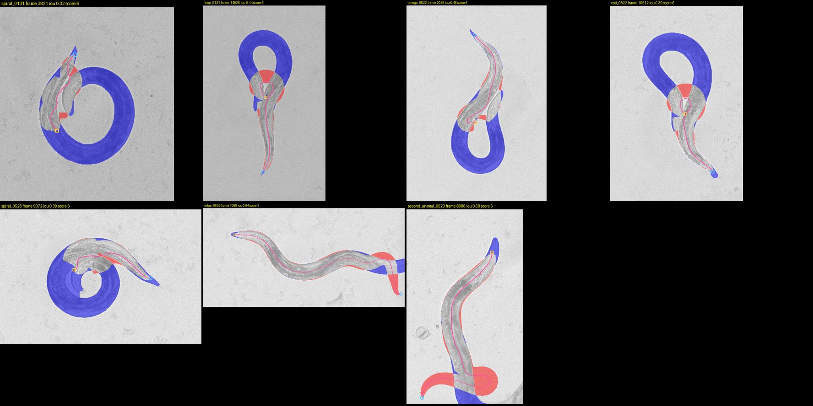

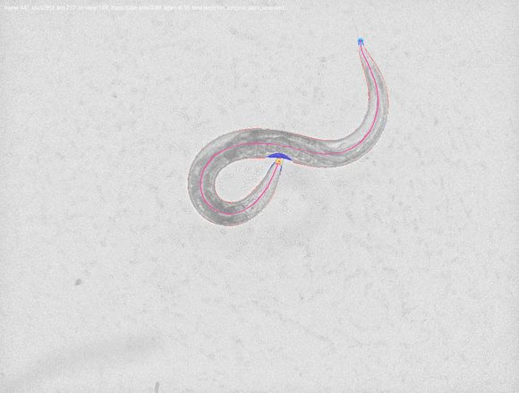

What the failures are. On coils and spirals the single-frame fitter fails
outright, not marginally: a closed ring has no skeleton endpoints, so the
start falls back to a straight moment axis that no schedule can wind into a
spiral, and the tube ends up as a short squiggle inside the ring
(`area_excess` 2.7, `length_deviation`, `holes`, `self_contact` all fire).
These are the frames steps 5 and 6 must carry through from the unambiguous
frames on either side; 131--231 frames of every coil clip are unambiguous
and fit at 0.97. The `pose_jump` flag also finds flicker between two
solutions at a camera exit (frames 591--613 of the minute) and the
`self_contact` flag fires on frames 445--449 of the minute, the omega turn
that precedes the cold-start failure of frames 450--451 (IoU 0.96 there).

### Step 5. Temporal propagation without a serial chain

- Split a recording into chunks of about 64 frames. Fit each chunk's first
  frame from multi-start in one large batch. Propagate within all chunks in
  lockstep, so step k of every chunk is one GPU batch. Run forward and
  backward from chunk ends. Wall-clock is sequential only over chunk length.
- Whether propagation is needed on unambiguous frames is decided by the
  step 1 measurements: if independent fits are fast and consistent, use
  propagation only across ambiguous stretches.

**Result (2026-09-04).** Landed as `src/worm_pose_gen/propagation.py`, run by
`scripts/fit_recording.py` after the independent fits (`--no-propagate`
skips it); raw numbers are under `pose_pipeline_step5/`, and
`pose_pipeline_step4/sequence_eval.json` now holds the propagated results
with the step 4 independent results kept as
`sequence_eval_step4_independent.json`.

The decision the step left open is settled by step 4: independent fits are
fast and consistent wherever the frame is unambiguous (median IoU 0.97 at
score 0 in every clip), and the failures are the coils and self-contact
where the mask-built start is wrong. So propagation runs only across
ambiguous stretches. A stretch is the frames with ambiguity score >= 2,
padded by two frames on each side and merged across gaps of up to three.
From the last good frame before a stretch the pose is carried forward
through it, and from the first good frame after it backward, each frame
fit from its neighbour's pose (latent, width scale, width correction) with
the `fast` stages at 70% of the steps; all chains of a recording advance
together, one lockstep batch per step, so wall-clock is sequential only
over the longest stretch. Per frame the lowest total energy (overlap plus
priors, measured on the same raster) wins among independent, forward and
backward; `source` in `poses.npz` records which, and `iou_independent` and
`score_independent` keep the single-frame answer for comparison.

Two things mattered in getting there. A propagated chain must use the same
stages as the independent fits, or its energy is measured on a different
raster and cannot be compared. And the chain must be able to keep up with
the change between two frames of a forming coil: a 20/40-step warm schedule
fell behind and lost to the poor independent fit on energy; 70% of the
`fast` steps (42 and 70) does not.

Sequence evaluation set (`sequence_eval_propagated.json`, step 4 numbers in
the first columns):

| Clip | Median IoU, independent | Median IoU, propagated | Frames < 0.9, independent | Frames < 0.9, propagated | Frames replaced (forward / backward) | Stretch median IoU |
|---|---:|---:|---:|---:|---:|---|
| `spiral_0131` | 0.508 | 0.952 | 163 | 53 | 166 (78 / 88) | 0.32 -> 0.93 |
| `loop_0131` | 0.966 | 0.967 | 55 | 0 | 63 (19 / 44) | 0.58 -> 0.95 |
| `omega_0822` | 0.966 | 0.966 | 60 | 0 | 63 (48 / 15) | 0.39 -> 0.94 |
| `coil_0822` | 0.949 | 0.960 | 140 | 3 | 147 (11 / 136) | 0.42 -> 0.95 |
| `spiral_0528` | 0.955 | 0.964 | 137 | 0 | 138 (36 / 102) | 0.33 -> 0.96 |
| `edge_0528` | 0.957 | 0.959 | 46 | 2 | 62 (33 / 29) | 0.92 -> 0.94 |
| `tail_reentry_0623` | 0.970 | 0.970 | 10 | 4 | 18 (13 / 5) | 0.91 -> 0.97 |

Over the 2100 clip frames the frames below IoU 0.9 fall from 611 to 62, 53
of them on the hard spiral where the propagated tube winds through the ring
at 0.85--0.93 rather than failing (frame 3777 below: 0.16 -> 0.92). 657
frames were replaced. Propagation took 359 s over the seven clips, most of
it on the two spirals, whose single stretches of 170--180 frames give
lockstep batches of only two rows; on a whole recording with many stretches
the batches are larger and the cost amortizes. The ambiguity score after
propagation stays at 2 or more on 435 frames: on a well-fit coil the
`self_contact`, `holes` and `area_deficit` flags still fire, because they
describe the pose, not the failure. From this step on, score >= 2 means
"this pose is a coil or contact and came from its neighbours" rather than
"this fit failed"; `iou` and `source` say which.

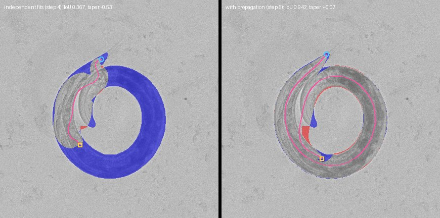

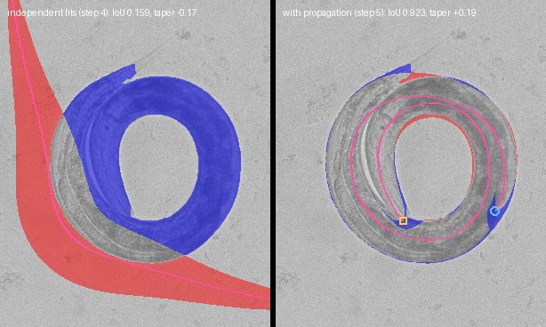

One minute of `2024-05-28-02` (`summary_*_propagated.json`): six stretches,
39 frames, 27 replaced, 12 s (10 ms per frame of the minute). Frames
450--451, the cold-start failure carried since step 1, go from IoU
0.62--0.65 to 0.951 by the forward chain; the six frames below 0.9 and the
nine with score >= 2 both go to zero; median IoU is unchanged at 0.969.
Frame 1053 (the wide exit) keeps its independent fit at 0.904, since no
chain beat it on energy.

Remaining limits. Inside a coil the head/tail assignment and the exact
winding are whatever the chain carried in, and forward and backward chains
can disagree; the energy picks one per frame with no smoothness across
frames. That, and orientation in general, is step 6. The hard spiral's 53
remaining frames are the tightest turns, where the 16-coefficient centerline
and the width prior both strain.

**Correction (2026-09-04).** The overlay videos of the step 5 runs were
written during the independent pass, before propagation replaced frames, so
they did not match the residual images and arrays. The video is now
rendered after propagation from the final arrays, by the same function the
re-render script uses (`pose_run.write_overlay_video`), and the clip and
minute videos were re-rendered. Captions now name the source (forward or
backward) and the ambiguity score.

### Step 5b. Tuning on the sequence set

Added 2026-09-04 after reviewing the step 5 videos: the clips are much
improved and many frames are still off. Before step 6, a tuning pass judged
on the sequence set (`scripts/evaluate_sequence_set.py`) alongside the
30-frame set. Candidate items, to be chosen and ordered by eye from the
videos:

- **Tail re-entry.** The `tail_reentry_0623` clip (first read as a second
  animal; these recordings hold one worm) shows the worm clipped by the
  camera with its tail coming back into view as a separate mask component,
  which the largest-component rule drops and the `fragments` flag reports.
  Keep mask components that lie along the fitted body's off-camera
  continuation, or fit against every component within reach of the tube,
  and count them toward the visible fraction.
- **Coil interiors.** 53 frames of `spiral_0131` stay below IoU 0.9 at the
  tightest turns. Try more shape coefficients inside stretches, a looser
  length prior when the tube self-overlaps (the winding tube wants more
  length than the prior allows), and the hole-fill radius against coil
  evidence.
- **Chain disagreement.** Forward and backward chains disagree inside long
  stretches and the energy picks per frame. Pick per stretch, or add a
  smoothness term over consecutive frames, so a stretch is one consistent
  track; carry orientation with it.
- **Ambiguity after propagation.** Separate the flags that describe a coil
  (`self_contact`, `holes`, `area_deficit`) from those that describe a
  failure (`low_iou`, `area_excess`, `pose_jump`, `length_deviation`), so
  the score means one thing.
- **Propagation cost.** A single long stretch gives two-row lockstep
  batches; consider splitting long stretches at their least ambiguous frames
  or running clips of one recording together.
- **Review loop.** Frames marked by eye from the videos become named
  examples in the manifest, rendered as before/after strips by
  `scripts/compare_pose_runs.py` on every run. Since 2026-09-07 the
  browser viewer (`python -m worm_pose_gen.pose_viewer`, see the README)
  does the marking: it scrubs a stored run with every pipeline layer
  composited on the frame, the per-frame statistics and flags, the width
  and curvature profiles, synced time series, and appends review notes to
  `docs/pose_review/notes.json`. Runs fit from that date on also store the
  independent pose (`centerline_xy_independent`, `width_profile_independent`,
  `body_length_independent` in `poses.npz`) so the viewer can show what
  propagation replaced.

**Findings (2026-09-04, from the video review; assets under
`pose_pipeline_step5b/`).** Two failure modes were investigated before
choosing the tuning items.

*Spirals: the tube grows longer than the worm.* On the 177 stretch frames of
`spiral_0131` the propagated tube is 787 px at the median and 835 px at the
90th percentile against a 730 px worm (65 frames beyond the prior's two
sigma), and the extra length winds around the ring, which moves the fitted
end away from the visible tip. Two causes were checked
(`spiral_diag_frame_*.jpg`): the segmenter itself merges adjacent turns
(its probability map is a solid ring with the gap between turns visible only
near the inner tail), and the narrow-hole fill then closes what remains
(220--720 px per frame). Four variants of the clip:

| Variant | Stretch median IoU | Frames < 0.9 | Stretch length p50 / p90 | Frames beyond prior + 2 sigma |
|---|---:|---:|---|---:|
| baseline: fill radius 8, length sigma 5% | 0.927 | 53 | 787 / 835 | 67 |
| no hole fill | 0.920 | 52 | 783 / 819 | 39 |
| length sigma 2% | 0.947 | 1 | 740 / 742 | 0 |
| no hole fill, length sigma 2% | 0.930 | 17 | 742 / 747 | 0 |

Tightening the length prior is what works: with sigma 2% the tube stays at
the worm's length, the ends sit at the visible tips, and 52 of the 53
failures disappear (`sigma_frame_*.jpg`). Removing the hole fill on its own
changes little, because the segmenter has already merged the turns; the
mask needs the segmenter to see the gaps, which is a targeted labeling round
on coil and intersection frames (the clip candidates give the frames), after
which the hole fill and largest-component rules can be re-evaluated on the
set. The 5% sigma came from whole worms, whose fitted length varies with
posture; a coil needs the tighter value. The natural place is the
propagation chain, whose pose already has the right length: tighten the
prior inside `warm_schedule` and leave the independent fits at 5%.

*Camera edge: the tube stays inside instead of leaving.* On the minute of
`2024-05-28-02`, 21 frames have the mask on the border while every
centerline point stays inside the image (`edge_inside_frame_*.jpg`): the
tube stops at or bends back from the edge, mostly in the frames where the
body first reaches it (162--164, 192--194) and on propagated frame 64,
whose tail folds sharply near the edge. In these frames the start extension
did not fire (the mask touches the border only slightly, so the skeleton end
is far from the border pixels), and the length prior at 5% accepts a 746 px
tube. The temporal signature is an in-view fraction that returns to 1.0
between two clipped frames (7 such dips on the minute). Planned fix: store
whether the mask reaches the border per frame, flag `edge_inside` (mask on
the border, tube fully inside) as an ambiguity signal so propagation covers
these frames, and in the chain extend a warm start off camera through the
border contact when the mask reaches the border and the start does not.
Temporal smoothness of the in-view fraction can follow if the chain alone
leaves flicker; the `edge_0528` clip, with 22 in-view jumps in 300 frames,
is the test.

**Result (2026-09-04).** Both fixes are in; numbers in
`pose_pipeline_step5b/sequence_eval_tuned.json` and
`minute_comparison_*.json`, strips as `*_before_after_frame_*.jpg`.

*Spiral over-length.* The propagation chain's length prior is centred on the
anchor frame's own fitted length (the last good frame before or after the
stretch) with a 2% log-sigma, instead of the recording prior at 5%. The
anchor matters as much as the sigma: the fitted length of a whole worm
drifts by several percent over a recording (715--790 px within one minute
of `2024-05-28-02`), and a tight prior on the recording value dragged the
whole worms of `edge_0528` off their length (2 -> 12 failures), while 3% let
a forward chain drift to 750 px inside the spiral. Chains are batched by
anchor-length bucket. Candidates are compared under the fit's own prior
(`comparable_energy`), so the tighter chain prior shapes the optimization
but not the choice between independent and propagated.

*Camera edge.* `mask_on_border` is stored per frame and `edge_inside`
(mask on the border, tube fully inside) is the ninth ambiguity flag, so such
frames enter propagation; in a chain, when the mask reaches the border and
the carried start does not leave the image, `redirect_start_through_exit`
adds a second start whose end runs through the border contact and off
camera, and the energy chooses.

| Clip | Frames < 0.9, independent (step 4) | Step 5 | Step 5b | Median IoU, step 5b | P10 IoU, step 5 -> 5b | Stretch length p50 / p90 |
|---|---:|---:|---:|---:|---|---|
| `spiral_0131` | 163 | 53 | 1 | 0.955 | 0.882 -> 0.932 | 737 / 746 (worm 730) |
| `loop_0131` | 55 | 0 | 0 | 0.969 | 0.929 -> 0.941 | 723 / 729 |
| `omega_0822` | 60 | 0 | 0 | 0.966 | 0.935 -> 0.947 | 776 / 782 |
| `coil_0822` | 140 | 3 | 0 | 0.956 | 0.924 -> 0.928 | 785 / 788 |
| `spiral_0528` | 137 | 0 | 0 | 0.970 | 0.953 -> 0.959 | 780 / 781 |
| `edge_0528` | 46 | 2 | 5 | 0.959 | 0.920 -> 0.924 | 752 / 778 |
| `tail_reentry_0623` | 10 | 4 | 5 | 0.970 | 0.960 -> 0.960 | 778 / 785 |

Over the 2100 clip frames the frames below IoU 0.9 go 611 -> 62 -> 11. The
spiral's tube now holds the worm's length (median 737 px against 787
before) and its ends sit on the visible tips (`spiral_0131_before_after_*`).
On the minute of `2024-05-28-02` nothing regresses (median 0.9686 either
way, frames 450--451 at 0.95, frame 1053 0.904 -> 0.920) and propagation
costs 19 ms per frame.

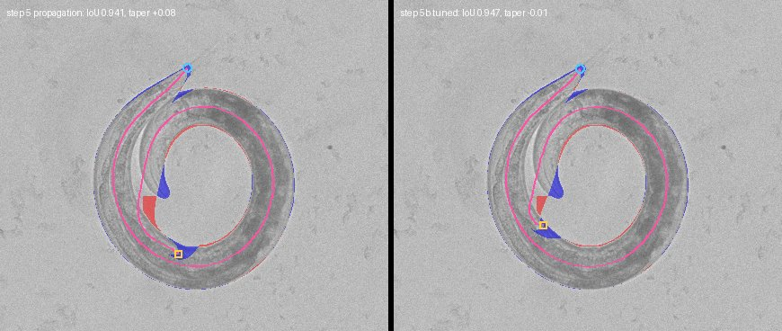

What the edge fix does and does not do. The redirected start wins on 12 of
the 85 replaced frames of `edge_0528` and on the loop clip, but the small
change in that clip's failure count (2 -> 5 -> 9 across variants, out of
300) is noise around the mask's own instability at the border, and on the
minute the 60 frames where the tube stops inside while the mask touches the
border are unchanged (163 and 193 among them): when the mask ends at the
edge, a tube that stops there fits the visible pixels exactly as well as one
that leaves, so energy has nothing to choose with. A tie-break accepting a
leaving candidate within 0.005 of the independent energy was tried and
switched off: it did nothing on 163 and 193 and accepted a lower-overlap
candidate on frame 64. The remaining answer is a temporal smoothness term on
the pose (or on the in-view fraction) inside stretches, which is step 6's
linking. The `edge_inside` flag stays as the marker of these frames.

*Labeling round 2.* The segmenter is the root of the spiral problem (it
merges adjacent turns before any hole fill runs), and the tail re-entry clip
shows the largest-component rule dropping body. `docs/labeling_round_2/
manifest.json` queues 393 frames over 13 recordings from the clip-candidate
scans (coils and holes first, then border and ordinary frames), with five
new training recordings, two validation-only animals (`2023-09-07-13`,
`2024-02-01-07`) and three test-only animals (`2024-05-28-02`,
`2023-10-26-01`, `2024-06-18-12`); `worm_pose_gen.label_app --queue` walks
it and pledges each recording's split. Three recordings of the archive need
an HDF5 filter plugin that is not installed (`2023-06-30-01`,
`2023-08-15-01`, `2023-12-11-06`) and were left out; the scan and the
flat-field estimate now skip unreadable frames.

### Step 5c. Segmenter round 2 and raw masks (2026-09-05)

Alex labeled the first 65 frames of the round-2 manifest, the 91 bootstrap
labels were retired, and `r2-hand165` was trained from scratch on the 165
hand labels (`SEGMENTATION_LABELING.md`, "Round 2 result": median IoU
0.978 validation / 0.981 test, worst non-empty validation frame 0.880 ->
0.910, promoted on validation loss 0.182 vs 0.217). The pose pipeline was
then run with the new model and, as Alex proposed, without the hole fill and
the largest-component rule (`fit_recording.py --raw-mask`; the ambiguity
statistics behind the `holes` and `fragments` flags are still computed, so
the flags keep their meaning). Results are in `pose_pipeline_step5c/`
(`sequence_eval_r2_clean.json`, `sequence_eval_r2_raw.json`, before/after
strips `minute_*_before_after_frame_*.jpg`), the minute videos in the run
directories listed below.

**What the labels say about the holes.** Of the 26 labeled round-2 frames
picked for coils or short skeletons, 13 have a gap between adjacent turns
that the 8-pixel hole fill would close (200--390 px), and the new model
reproduces those gaps within a few dozen pixels on nearly every one. The
`holes` flag on coil frames therefore marks real background, and filling it
had been adding 200--700 px of false body exactly where the tube model is
least constrained. The segmenter did not get *better* at gaps from the 65
frames (the spiral clip has 95 frames with a fillable gap under either
model), but it was already drawing them.

**Sequence set** (IoU is tube against the mask each run was fit to, so the
raw-mask rows are scored against a stricter mask; length is the fitted body
length, p50/p90; "holes" and "fragments" count frames with more than 200
fillable pixels or more than 500 pixels outside the largest component):

| Clip | Pipeline | Median IoU | P10 | Frames < 0.9 | Length px | Holes | Fragments | Replaced |
|---|---|---:|---:|---:|---|---:|---:|---:|
| `spiral_0131` | step 5b (`r1-hand100`, cleaned) | 0.955 | 0.932 | 1 | 735 / 744 | 99 | 0 | 167 |
| | `r2-hand165`, cleaned | 0.957 | 0.934 | 0 | 729 / 740 | 95 | 0 | 162 |
| | `r2-hand165`, raw | 0.960 | 0.915 | 14 | 729 / 742 | 95 | 0 | 165 |
| `loop_0131` | step 5b | 0.969 | 0.941 | 0 | 725 / 747 | 33 | 13 | 85 |
| | `r2`, cleaned | 0.967 | 0.927 | 0 | 728 / 746 | 36 | 16 | 64 |
| | `r2`, raw | 0.967 | 0.931 | 0 | 727 / 739 | 36 | 16 | 80 |
| `omega_0822` | step 5b | 0.966 | 0.947 | 0 | 788 / 808 | 46 | 6 | 63 |
| | `r2`, cleaned | 0.965 | 0.950 | 0 | 783 / 807 | 48 | 6 | 63 |
| | `r2`, raw | 0.965 | 0.931 | 1 | 786 / 808 | 48 | 6 | 69 |
| `coil_0822` | step 5b | 0.956 | 0.928 | 0 | 784 / 797 | 78 | 0 | 149 |
| | `r2`, cleaned | 0.965 | 0.947 | 0 | 778 / 796 | 85 | 0 | 141 |
| | `r2`, raw | 0.966 | 0.957 | 0 | 777 / 798 | 85 | 0 | 143 |
| `spiral_0528` | step 5b | 0.970 | 0.959 | 0 | 779 / 786 | 133 | 0 | 138 |
| | `r2`, cleaned | 0.954 | 0.940 | 0 | 783 / 787 | 138 | 0 | 143 |
| | `r2`, raw | 0.962 | 0.932 | 0 | 775 / 787 | 138 | 0 | 151 |
| `edge_0528` | step 5b | 0.959 | 0.924 | 5 | 758 / 788 | 0 | 107 | 86 |
| | `r2`, cleaned | 0.961 | 0.930 | 7 | 760 / 785 | 0 | 0 | 80 |
| | `r2`, raw | 0.960 | 0.931 | 8 | 760 / 785 | 0 | 0 | 84 |
| `tail_reentry_0623` | step 5b | 0.970 | 0.960 | 5 | 774 / 780 | 2 | 29 | 14 |
| | `r2`, cleaned | 0.968 | 0.959 | 5 | 774 / 780 | 0 | 28 | 14 |
| | `r2`, raw | 0.967 | 0.953 | 6 | 776 / 783 | 0 | 28 | 19 |

Over the 2100 clip frames the count below IoU 0.9 is 11 (step 5b), 12
(`r2`, cleaned), 29 (`r2`, raw). Three things stand out. The new segmenter
removes the debris fragments at the camera edge outright (`edge_0528`: 107
frames with more than 500 stray pixels -> 0, frames with several components
249 -> 10), which is what made the largest-component rule necessary; with
`r2-hand165` the rule drops nothing on six of the seven clips and only the
tail re-entry component on the seventh, where keeping it changes no frame's
outcome (5 -> 6 below 0.9, all in the same stretch 8981--8986). The fitted length on the spiral
holds at the worm's 730 px under every variant now, so the over-length
failure of step 5 does not return. And the 14 low-IoU frames of the raw
spiral are the consecutive frames 3753--3766 at the coil's tightest, where the tube crosses the real gap the mask
now shows: the tube model is being scored against evidence it used not to
see, and the residual there is a pose error, not a mask error
(`minute_spiral_0131_before_after_frame_03762.jpg`).

**Minute videos.** Five minutes were fit twice, once with the step 5b
pipeline (`r1-hand100`, hole fill, largest component) and once with
`r2-hand165` on raw masks; both videos of each pair are in the run
directories, and the frames where the two poses disagree most are in
`minute_*_before_after_frame_*.jpg`. "Disagree" is the mean distance between
the two centerlines, orientation-agnostic.

| Minute | Recording, frames | Why | Frames < 0.9, step 5b -> `r2` raw | Frames > 20 px apart | Fragments > 500 px, step 5b -> `r2` raw |
|---|---|---|---:|---:|---:|
| `spiral_0131` | `2024-01-31-02` 3300--4499 | tight spiral | 1 -> 14 | 55 | 0 -> 0 |
| `coil_0822` | `2023-08-22-01` 10000--11199 | five-second coil | 1 -> 3 | 122 | 6 -> 11 |
| `edge_0528` | `2024-05-28-02` 6400--7599 | body at the border, debris | 10 -> 6 | 145 | 128 -> 2 |
| `coil_0201` | `2024-02-01-07` 17500--18699 (validation-only animal, unseen in training) | coil held for seconds | 31 -> 6 | 175 | 0 -> 1 |
| `edge_0618` | `2024-06-18-12` 9500--10699 (test-only animal, unseen in training) | body at the border, a dark streak across the plate | 63 -> 444 | 452 | 203 -> 332 |

Videos: `<run>/overlay.mp4` for each pair, gathered as
`/temp_data4/alex/external_artifacts/poses/videos_step5c/<minute>_<r1clean|r2raw>.mp4`.

The two held-out animals split the verdict. On `2024-02-01-07` the raw
pipeline is better through the coil (31 -> 6 frames below 0.9; the cleaned
pipeline fills the gap between turns on 216 of 1200 frames and its tube
follows the fill). On `2024-06-18-12` the raw pipeline fails for a third of
the minute: that plate has a long dark streak, and `r2-hand165` paints it as
worm (a second component of 12--19 thousand pixels on 400 frames, where
`r1-hand100` painted a few hundred), so without the largest-component rule
the tube runs along the streak (`minute_edge_0618_before_after_frame_09817.jpg`).
The rule was the only thing hiding that segmentation error, and the model has
never seen a labeled frame of this animal or this artefact: the manifest's
37 frames of `2024-06-18-12` are unlabeled. The elongated dark shape is
exactly what the network was taught to call worm, so this is a training-data
gap, not a threshold to tune.

Where the two pipelines disagree it is, in order of frequency: head/tail
orientation on a body cut by the camera edge (both tubes equal, markers
swapped), the raw-mask fit stopping short of the border with a squished body
(`edge_0528` frames 6577 and 6939, `coil_0822` frame 11161: independent fits
with length 705--726 px against a 780 px prior and an ambiguity score of 1,
so propagation never reached them), and the tube crossing a gap inside a
coil. The first and second are step 6's problem (orientation and in-view
smoothness across frames); none is caused by the raw mask itself.

**Decision.** Keep `r2-hand165` promoted. Raw masks are the right evidence
inside coils, but the largest-component rule still protects the fit from
segmentation errors on unseen plates, so the pipeline's default stays on
cleaned masks; `--no-fill-holes` alone is the natural next default once the
tube model can use a gap (step 6, or a self-overlap-aware renderer), and
`--raw-mask` is the switch for experiments. The next labeling work is the
remaining 328 manifest frames, the held-out animals first, `2024-06-18-12`
first of all.

### Step 6. Autoregressive proposals and hypothesis linking across ambiguous stretches

**Plan (drafted 2026-09-07, revised the same day after Alex's answers).**
Alex's priorities for the step: the body leaving the camera and tight
coils or self-contacts are the frames to perfect; head identity only has to
be consistent along a track, not right in the absolute (the tracking
microscope keeps the head near the centre of the view, which also gives a
cheap absolute cue when one is wanted). His observation from the viewer:
at self-contacts and tight coils the fitted length and the pose jump from
one frame to the next. Steps 1--5c leave a pipeline that fits nearly every
frame of the sequence set to the mask (12 of 2100 frames below IoU 0.9) but
answers every frame on its own; where the mask does not decide, the answer
is whatever the energy preferred on that frame.

**What the stored runs say about the jumps.** On the five minute runs of
step 5c, counting consecutive frames whose fitted length changes by more
than 3% of the prior and frames whose pose jump exceeds a body width, and
placing each against the propagation stretches (inside, within two frames
of a boundary, or outside) and against the frame's source:

| Minute (pipeline) | Length jumps > 3%: total / inside / boundary / outside | of which independent fits | Pose jumps > width: total / inside / boundary / outside | of which propagated |
|---|---|---:|---|---:|
| `spiral_0131` (r2 raw) | 3 / 2 / 1 / 0 | 2 | 3 / 3 / 0 / 0 | 3 |
| `coil_0822` (r2 raw) | 25 / 3 / 6 / 16 | 22 | 1 / 1 / 0 / 0 | 1 |
| `edge_0528` (r1 clean) | 104 / 29 / 20 / 55 | 77 | 12 / 11 / 1 / 0 | 8 |
| `coil_0201` (r2 raw, held out) | 44 / 13 / 7 / 24 | 32 | 12 / 10 / 1 / 1 | 11 |
| `edge_0618` (r2 raw, held out) | 54 / 28 / 3 / 23 | 40 | 38 / 37 / 1 / 0 | 28 |

Two different mechanisms. The *length* jumps are mostly independent fits,
many of them outside any stretch: a frame fit alone has nothing but the
recording prior at 5% (about 37 px) to hold its length, and where the body
is clipped by the camera or folded the visible pixels constrain the length
weakly, so it wanders by 20--40 px between neighbours. The *pose* jumps are
almost all inside stretches and mostly on propagated frames: each frame
picks independently among its forward, backward and independent candidates
on energy, so where the chains disagree the choice flips between them
(step 5's "chain disagreement"). At the spiral's stretch entry (frame 3697)
the two combine: an independent fit at score 1 wins the frame with a length
of 740 px between neighbours at 720, and the chains start from it.

A third fact matters for the design: the chain today is zeroth order. A
stretch frame is warm-started from a copy of the neighbour's pose
(`warm_initialization`), and nothing in the energy prefers a pose near
that start; the length prior centred on the anchor (step 5b) is the only
temporal term. So the answer to Alex's question is yes: an autoregressive
proposal, and a prior that holds the fit near it, are both missing and
both cheap.

The step keeps the principles: independent fits where the frame is
unambiguous, batching on the GPU, and discrete choices resolved by dynamic
programming rather than a serial refit of the whole recording. Four parts,
each measured on its own, in priority order.

**6a. Autoregressive proposals and a temporal prior in the chains.**
Replace the zeroth-order warm start by a first-order prediction: with the
chain's poses at the previous two frames, predict the next latent as
`x_t + a (x_t - x_{t-1})` on the shape coefficients, the unwrapped
rotation and the centroid (the centroid term is the velocity Alex asks
for), with the length held at the chain's running value and the width
scale and shape copied; damping `a` about 0.6 at 20 fps, tuned on the set
(a body wave moves the coefficients smoothly; `a = 0` is today's chain).
Both the prediction and the plain copy are offered as starts, so a
prediction that overshoots at a sharp reversal costs nothing. Add a
temporal prior to the chain's energy: a Gaussian on the mean distance
between the fit's in-view centerline points and the predicted pose, with a
sigma of about half a width and a weight on the scale of `prior_weight`,
so the mask still wins where it is clear and the prediction decides where
it is not; the candidates keep being compared under the fit's own prior
(`comparable_energy`), so the temporal term shapes the chain and not the
choice against the independent fit. This is the first thing to try on
`coil_0201` and `edge_0618`, where the pose jumps are, and on the raw
spiral's frames 3753--3766, where the tube crosses the gap between turns
that a continuous pose would not.

At the camera edge the same prediction is what resolves the stop-or-leave
tie of step 5b: the predicted pose continues the body's motion off camera,
the temporal prior makes the continuation cheaper than the fold, and the
in-view count follows the prediction instead of flickering (60 frames on
the `2024-05-28-02` minute, 22 in-view jumps on `edge_0528`).

**6b. A track prior on length, and stretches seeded by jumps.** The length
jumps outside stretches need two things. First, a per-frame *track* length
prior: after the independent pass, take the median fitted length over
score-0 frames in a sliding window of about five seconds, and refit (one
batched pass, the `fast` stages at 70%) every frame whose length departs
from the track by more than 2% with the prior recentred on the track value
at 2% sigma; the recording prior at 5% stays for the first pass, since the
track has to be measured before it can be used. Second, seed stretches by
the jumps themselves: a frame whose length changes by more than 3% or
whose pose jump exceeds a width, or whose in-view count changes while the
mask stays on the border, enters a stretch even at ambiguity score 1, so
the chains of 6a reach the squished edge fits of step 5c (`edge_0528`
6577 and 6939, `coil_0822` 11161) and the spiral's frame 3697. Whether to
propagate through *every* frame in chunks of 64 in lockstep, as step 5
first proposed, is measured as a variant (`--propagate-all`) on the
sequence set: it answers whether the remaining jumps outside stretches are
worth the cost, at the price of lockstep batches of one row per chunk.

**6c. Per-stretch selection by Viterbi over the candidates.** Instead of
the lowest energy per frame, choose one candidate per frame along the
stretch by dynamic programming over {independent, forward, backward, and
their exact mirrors}: node cost is the comparable energy over a
temperature, edge cost is the oriented pose distance between consecutive
choices in widths (in-view points only) plus a term for the change in
in-view count. The unambiguous frames on both sides anchor the path, so a
stretch becomes one continuous track and forward and backward chains no
longer alternate. The mirrors in the candidate set make orientation
consistency a by-product of the same path: a flip costs half a body length
of pose distance, so it is never chosen unless the poses demand it. Outside
stretches only the mirror choice remains, and the same two-state Viterbi
over the whole run gives one orientation per contiguous segment; the
absolute label per segment is the end that sits nearer the image centre
on average (the tracking microscope's cue), with the segment's motion
direction as the fallback. Two parameters (temperature, distance weight)
are tuned so that frames below IoU 0.9 do not rise (12 today) while pose
jumps, flips and in-view jumps fall. Cost is negligible (a few candidates
per frame). The candidates are stored in `poses.npz` (`hypotheses_latent`
[n, K, 20], `hypotheses_width`, `hypotheses_width_shape`,
`hypotheses_energy`, `hypotheses_source`, and the chosen index) and the
viewer gets a "hypotheses" layer drawing all of them with their energies,
which is the tool for judging what the path had to choose between.

**6d. Truth, and the raw-mask default.** IoU cannot see continuity or
orientation, so the step is judged by the counts above (length jumps, pose
jumps, in-view jumps, flips) with frames below IoU 0.9 as the guard, on
the sequence set (`pose_pipeline_step5c/sequence_eval_r2_clean.json` is
the baseline) and the five minutes. A small head truth set through the
viewer's notes (a "head at square / circle" tag on about 40 frames where
the head is unmistakable) reports head consistency per segment; it is not
a target of the step. Once the tube follows continuity through a coil,
re-run the set without the hole fill (`--no-fill-holes`, keeping the
largest-component rule that guards unseen plates) and flip the default if
the raw spiral's 14 failures go and nothing else regresses.

**Order.** 6a and 6b on the sequence set and the two held-out minutes
first, since they attack the jumps Alex sees directly; 6c once the
candidates are stored; 6d closes. Numbers per run: frames below IoU 0.9,
length jumps > 3%, pose jumps > width, in-view jumps, orientation flips,
frames where the path overrode the lowest energy (and their IoU), seconds.
Intensity cues for overlaps and a body-coordinate segmenter head stay in
section 4; they become worthwhile only where continuity cannot decide (a
coil held for seconds with no unambiguous frame nearby, as in `coil_0201`).

**Result of 6a (2026-09-08).** Landed in `propagation.py` (`predict_latent`,
`pose_distance_px`, `continuity_summary`) and `batch_fit.fit_masks`
(`references` per frame and the `temporal_prior_weight` /
`temporal_prior_sigma_px` fields of `MaskFitConfig`), run by
`fit_recording.py --prediction-damping 0.6 --temporal-prior-weight 0.01
--temporal-prior-sigma 0.5`. Inside a chain each frame now offers the
copied pose and the first-order prediction as starts and is pulled toward
the prediction; every chain candidate is stored with its prediction, energy,
overlap and winning start (`chain_*` and `prediction_distance_px` in
`poses.npz`), and the viewer draws the forward and backward candidates and
the chosen chain's prediction and lists them in the statistics panel. Each
run's summary carries a `continuity` block (length jumps over 3%, pose
jumps over a width, in-view changes, distance to prediction).

The weight was swept on the three minutes (baseline = damping 0 and weight
0, the step 5c chain; masks as in step 5c, the spiral raw):

| Minute | Variant | Median IoU | P10 | Frames < 0.9 | Pose jumps > width | Length jumps > 3% | Stretch median IoU | Predicted start won / offered |
|---|---|---:|---:|---:|---:|---:|---:|---|
| `spiral_0131` raw | baseline | 0.969 | 0.947 | 14 | 2 | 2 | 0.941 | |
| | prediction only | 0.969 | 0.939 | 11 | 1 | 2 | 0.937 | 232 / 428 |
| | weight 0.0025 | 0.969 | 0.941 | 24 | 0 | 2 | 0.939 | 239 / 411 |
| | **weight 0.01** | 0.969 | 0.951 | **0** | 0 | 1 | 0.952 | 245 / 413 |
| | weight 0.025 | 0.969 | 0.954 | 2 | 0 | 1 | 0.955 | 221 / 393 |
| `coil_0201` (held out) | baseline | 0.959 | 0.937 | 0 | 3 | 28 | 0.943 | |
| | prediction only | 0.959 | 0.938 | 27 | 3 | 34 | 0.945 | 345 / 718 |
| | weight 0.0025 | 0.960 | 0.939 | 0 | 3 | 31 | 0.945 | 321 / 694 |
| | **weight 0.01** | 0.960 | 0.939 | **0** | 3 | 30 | 0.947 | 360 / 682 |
| | weight 0.025 | 0.960 | 0.939 | 23 | 10 | 29 | 0.945 | 375 / 666 |
| `edge_0618` (held out) | baseline | 0.970 | 0.589 | 134 | 26 | 45 | 0.563 | |
| | prediction only | 0.970 | 0.599 | 135 | 19 | 49 | 0.552 | 268 / 437 |
| | weight 0.0025 | 0.970 | 0.599 | 136 | 22 | 50 | 0.527 | 282 / 436 |
| | **weight 0.01** | 0.970 | 0.599 | 134 | 23 | 47 | 0.557 | 291 / 436 |
| | weight 0.025 | 0.969 | 0.600 | 134 | 20 | 44 | 0.568 | 306 / 436 |

Three findings.

*The prediction and the prior work where they were aimed.* On the raw
spiral the 14 frames where the tube crossed the real gap between turns
(3753--3766) are fixed by every variant that offers the prediction, and
with the prior at 0.01 nothing is lost elsewhere: 0 frames below 0.9, p10
0.947 -> 0.951, stretch median 0.941 -> 0.952, no pose jump. Frame 3760
below: the 6a tube follows the inner turn where the step 5c chain cut across
the gap (baseline pose dotted orange).

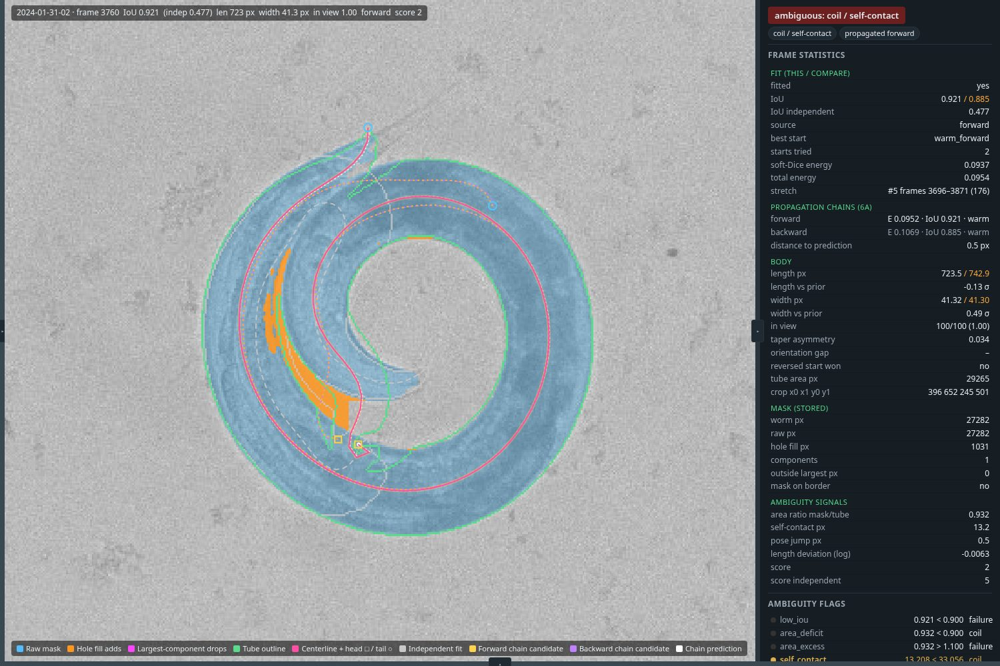

*A single chain state is fragile.* The coil minute's first stretch is 237
frames long. On frames 17960--17994 its forward chain sits at IoU 0.89 in
every variant and only the backward chain, arriving from the anchor at
frame 18004, reaches 0.94; in two of the four variants (prediction only,
weight 0.025) the backward chain also lands on the 0.88 configuration, and
27 or 23 frames fall below 0.9 where the baseline has none. Nothing in
those variants is wrong per frame; the chain simply carried a different
local optimum in, and every later frame inherits it. The same happened on
the spiral at weight 0.0025: the chain that fixed the tight turns carried a
fold forward and lost frames 3790--3815 at 0.89--0.90 (frame 3800 below, the
prediction 17 px from the fit). This is the case for keeping several
hypotheses per frame and choosing a path per stretch (6b/6c), rather than
for tuning the prior further.

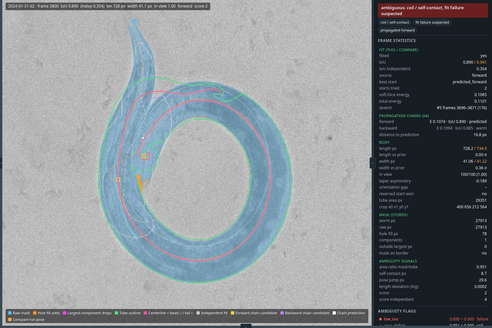

*A strong prior is sticky.* At weight 0.025 a 20 px correction costs 0.025
in energy, more than the mask can pay back, so on the coil's long stretch
both chains stay within 1--3 px of their predictions while the overlap
slides from 0.90 to 0.87 (frames 17968--17990) and the forward and backward
chains alternate frame by frame (pose jumps 3 -> 10). At 0.0025 the prior
is inert (a 2-sigma deviation costs 0.01, typical deviations are 2--8 px).
0.01 is the default.

The length jumps outside stretches, as predicted, do not move (they are
6b's track prior), and `edge_0618`'s 134 failures are the dark streak on the
plate segmented as worm on independent frames, which no chain reaches. The
predicted start wins 55--65% of the chain frames it is offered on.
Propagation costs 10--20% more (one extra start per chain frame).

Sequence set with the new defaults (`pose_pipeline_step6/sequence_eval_6a.json`
against the step 5c cleaned baseline; same masks, priors and preset):

| Clip | Median IoU 5c -> 6a | P10 5c -> 6a | Frames < 0.9 5c -> 6a | Pose jumps > width 5c -> 6a | Stretch median IoU 5c -> 6a | Predicted starts won / offered |
|---|---|---|---:|---:|---|---:|
| `spiral_0131` | 0.957 -> 0.958 | 0.934 -> 0.938 | 0 -> 0 | 0 -> 0 | 0.951 -> 0.951 | 160 / 315 |
| `loop_0131` | 0.967 -> 0.967 | 0.927 -> 0.927 | 0 -> 0 | 0 -> 0 | 0.947 -> 0.948 | 108 / 168 |
| `omega_0822` | 0.965 -> 0.965 | 0.950 -> 0.948 | 0 -> 0 | 0 -> 0 | 0.950 -> 0.949 | 72 / 128 |
| `coil_0822` | 0.965 -> 0.965 | 0.947 -> 0.957 | 0 -> 0 | 0 -> 0 | 0.963 -> 0.963 | 148 / 240 |
| `spiral_0528` | 0.954 -> 0.965 | 0.940 -> 0.946 | 0 -> 0 | 0 -> 0 | 0.947 -> 0.963 | 133 / 266 |
| `edge_0528` | 0.961 -> 0.961 | 0.930 -> 0.934 | 7 -> 3 | 8 -> 4 | 0.945 -> 0.946 | 149 / 234 |
| `tail_reentry_0623` | 0.968 -> 0.968 | 0.959 -> 0.959 | 5 -> 5 | 1 -> 0 | 0.960 -> 0.960 | 30 / 54 |

Over the 2100 clip frames the count below IoU 0.9 goes 12 -> 8, nothing
regresses beyond noise, `spiral_0528` gains 0.011 of median overlap in its
stretch, and the propagation time is unchanged within 10%. Next is 6b/6c:
keep the candidates the chains now store, add their mirrors and the
independent fit, and choose one path per stretch.

**Result of 6c (2026-09-08).** Alex's decisions for the step: the second
pass refits the frames, the app will launch fits (next), and the API must
mirror the app for pipelines. Landed in `propagation.py`: each direction of
a stretch keeps up to three distinct chain states (`beam`; states ranked by
the fit's full energy, temporal prior included, distinct at a quarter width);
the stored independent pose of every stretch frame is refit under the chain
schedule with the stretch anchors' length prior (`refit_independent`); and
`select_path` chooses one candidate per frame along the stretch by dynamic
programming over all candidates and their exact mirrors, anchored on the
fitted frames outside the stretch: node cost is the comparable energy over
a temperature of 0.01, edge cost the squared oriented pose distance in
widths plus 2 times the change of the in-view fraction plus the squared
log length change in units of 2%. `slow_schedule` runs a preset's steps on
the fit's rasters for the refit (`--propagate-preset`). Every candidate is
stored with the path's choice (`hypotheses_*`, `path_*`, `prediction_xy` in
`poses.npz`); the viewer draws the hypotheses by source with the chosen one
wide under the centerline, lists them ranked by energy with the chosen,
mirrored and override marks, tags a frame where the path overrode the
lowest energy, and reports the path's counts in the run summary.

Three things were learned on the way, each from the viewer's hypotheses
table on the frames that regressed:

*Beam states must be ranked by the full energy.* The first version ranked
a chain's states by the mask energy alone and the forward chain of the raw
spiral fell from a median overlap of 0.941 to 0.916 inside its stretch: the
state consistent with the chain's own motion lost to a state the mask
liked marginally better, and every later frame inherited the drift. Ranking
by the energy the fit minimized (temporal prior included) restored it.

*The slower refit schedule hurt.* With the `balanced` steps (100 and 200
against 42 and 70) the chains wandered further from their predictions
under the same prior: raw spiral 4 frames below 0.9 against 0, `edge_0618`
3 pose jumps against 1, at twice the time. The refit pass keeps the fast
schedule; `--propagate-preset balanced` stays as an option.

*Switching to a refit independent pose stepped the length* (raw spiral: 6
length jumps in the stretches against 1) until the refit took the stretch
anchors' length prior and the path cost gained the length term; both
minutes then have no length jump inside a stretch.

Final configuration against the step 6a runs (same masks and priors; the
edge minute's 135 failures are the plate streak on independent frames,
untouched by any stretch):

| Minute | Pipeline | Frames < 0.9 | Pose jumps > width | Length jumps > 3% (in stretches) | In-view changes | Orientation flips | Stretch median IoU | Propagation s |
|---|---|---:|---:|---:|---:|---:|---:|---:|
| `spiral_0131` raw | 6a | 0 | 0 | 1 (1) | 7 | 2 | 0.952 | 193 |
| | **6c** | 0 | 0 | 0 (0) | 5 | 2 | 0.955 | 206 |
| `coil_0201` (held out) | 6a | 0 | 3 | 30 (7) | 27 | 102 | 0.947 | 270 |
| | **6c** | 0 | 3 | 23 (0) | 25 | 97 | 0.946 | 300 |
| `edge_0618` (held out) | 6a | 134 | 23 | 47 (22) | 36 | 96 | 0.557 | 206 |
| | **6c** | 135 | 1 | 25 (0) | 26 | 68 | 0.550 | 291 |

The 22 pose jumps removed on `edge_0618` were all switches between the
forward, backward and independent candidates; the path replaces them by
one track per stretch, mirroring 34 frames to keep the anchors'
orientation and overriding the lowest-energy candidate on 36. The coil
minute's three remaining jumps (about 50 px each) are inside its long coil
stretches, where the path still switches from the forward to the backward
chain: the two chains hold different windings there and the energy gain
outweighed a jump of one width at the current temperature and distance
weight (0.01 and 1). Whether to trade a little overlap for continuity there
is a tuning question for the review loop. Length jumps outside stretches
are the clipped bodies of 6b.

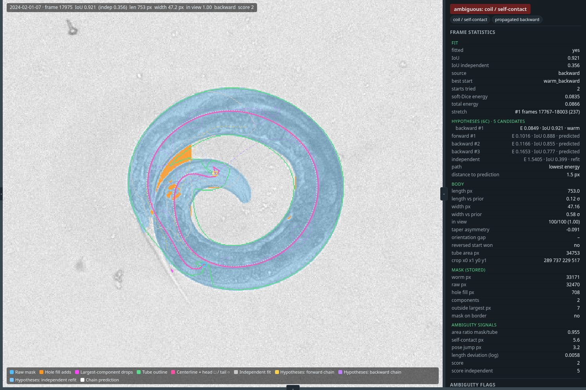

Sequence set (`pose_pipeline_step6/sequence_eval_6c.json` against
`sequence_eval_6a.json`):

| Clip | Median IoU 6a -> 6c | P10 6a -> 6c | Frames < 0.9 6a -> 6c | Pose jumps > width 6a -> 6c | Stretch median IoU 6a -> 6c | Propagation s 6a -> 6c |
|---|---|---|---:|---:|---|---|
| `spiral_0131` | 0.958 -> 0.958 | 0.938 -> 0.937 | 0 -> 0 | 0 -> 0 | 0.951 -> 0.951 | 173 -> 178 |
| `loop_0131` | 0.967 -> 0.966 | 0.927 -> 0.929 | 0 -> 0 | 0 -> 0 | 0.948 -> 0.948 | 51 -> 63 |
| `omega_0822` | 0.965 -> 0.965 | 0.948 -> 0.948 | 0 -> 0 | 0 -> 0 | 0.949 -> 0.949 | 60 -> 69 |
| `coil_0822` | 0.965 -> 0.965 | 0.957 -> 0.956 | 0 -> 0 | 0 -> 0 | 0.963 -> 0.963 | 134 -> 149 |
| `spiral_0528` | 0.965 -> 0.970 | 0.946 -> 0.950 | 0 -> 0 | 0 -> 0 | 0.963 -> 0.970 | 134 -> 144 |
| `edge_0528` | 0.961 -> 0.960 | 0.934 -> 0.932 | 3 -> 5 | 4 -> 0 | 0.946 -> 0.947 | 63 -> 107 |
| `tail_reentry_0623` | 0.968 -> 0.968 | 0.959 -> 0.959 | 5 -> 2 | 0 -> 0 | 0.960 -> 0.957 | 21 -> 29 |

Over the 2100 clip frames the count below IoU 0.9 goes 8 -> 7 and the four
pose jumps of `edge_0528` go to zero; the propagation pass costs 5--70%
more (the beam multiplies the chain rows). The path's remaining cost is a
few seconds per run. What 6c does not touch: frames outside stretches
(length jumps at the camera edge, the score-1 edge fits; 6b) and the
`2024-06-18-12` streak (labels).

## 4. Further ideas (after step 6)

- **Intensity for overlaps.** Where the body crosses itself the NIR image is
  darker. A segmenter head predicting an overlap class or per-pixel body
  coordinate would make coils nearly unambiguous; it can be self-trained from
  confident fits on unambiguous frames.
- **Head from motion.** Direction of travel and the higher oscillation
  amplitude of the head end are strong cues; add them to the linking cost.
- **Hole filling versus coil evidence.** The fill closes any enclosed
  background narrower than 17 px. A tight omega turn produces exactly that
  hole. Keep the fill for the fitting target, but record unfilled holes as an
  ambiguity cue.
- **Split bodies.** Largest-component selection drops a tail separated by a
  mask gap. Log pixels outside the largest component per frame and consider
  keeping fragments along the fitted body's extrapolation.

## 5. Dropped or changed

- The width template measured from the 11 frozen A6 poses of the old skeleton
  pipeline and the frozen-pipeline start have no place in a recording-level
  pipeline. Width shape is learned per recording (step 3). Skeleton and
  moment starts stay.
- Sequential per-frame propagation as the primary temporal mechanism is
  replaced by chunked lockstep propagation and hypothesis linking.
- Full sequential Monte Carlo (the old `smc.py`) is not resurrected; K-best
  hypotheses plus Viterbi give the same benefit with deterministic output.
- Hard length and width bounds are replaced by per-recording priors.
- Trying every start in both orientations, planned for step 2, was dropped
  there: under a zero-centered width prior the reversed start is an exact
  mirror image with the same energy. Orientation is decided after the fit
  from the taper asymmetry; both orientations return in step 3, where the
  per-recording width prior is asymmetric.
- The in-view fraction (centerline points inside the image) does not detect
  a body cut off by the camera edge; the mask reaching the border does. The
  bootstrap of step 3 selects whole worms by the latter, and the step 2
  orientation confidence is reinterpreted accordingly.
- Head/tail from width alone is not available on these recordings: whole
  worms show absolute taper asymmetry of about 0.1 and the orientation
  energy gap under the recording prior is below 0.002 on nearly every frame.
  Orientation is left to the motion and linking cues of step 6.

## 6. Status

| Step | State | Notes |
|---|---|---|
| 1 | done (2026-09-04) | `scripts/fit_recording.py`; 244 ms/frame end to end, fit 174 ms; `fast` preset is -0.008 IoU vs the reference on the 30-frame set, `reference` preset exact |
| 2 | done (2026-09-04) | log-space B-spline width correction (6 coefficients, prior 1e-3); +0.017 median IoU on the 30-frame set, 0.892 -> 0.975 on one minute of `2024-05-28-02`; tail placed last from the taper asymmetry |
| 3 | done (2026-09-04) | bootstrapped per-recording priors replace the bounds; clipped bodies are completed off camera (in-view fraction reported); -0.009 median IoU on the 30-frame set, -0.004 on one minute of `2024-05-28-02`; orientation gap uninformative on these recordings |
| 4 | done (2026-09-04) | eight-flag ambiguity score stored per frame; seven-clip sequence set (`docs/sequence_eval_set.json`); score >= 2 finds frames below IoU 0.9 with precision 0.97 and recall 0.97 on the set; coils and spirals fail outright and are the target of steps 5--6 |
| 5 | done (2026-09-04) | lockstep forward/backward propagation across ambiguous stretches, warm-started from good neighbours, lowest total energy wins; clip frames below IoU 0.9 fall 611 -> 62; minute frames 450--451 fixed at 10 ms/frame; videos now rendered from the final arrays |
| 5b | done (2026-09-04) | anchor-centred 2% chain length prior and off-camera redirect: clip frames below IoU 0.9 fall 62 -> 11; `edge_inside` flag stored; edge frames whose tube stops inside are left to step 6's smoothness; labeling round 2 queued (393 frames, 13 recordings, held-out animals) |
| 5c | done (2026-09-05) | labeling round 2 (65 frames), bootstrap labels retired, `r2-hand165` promoted (val 0.978 / test 0.981); `--raw-mask` option; edge fragments gone with the new model, coil gaps are real background; raw masks off by default until step 6 |
| viewer | done (2026-09-07) | `worm_pose_gen.pose_viewer`: browser diagnostic for stored runs (layers, statistics, flags, classification, width/curvature profiles, time series, compare run, review notes) |
| 6a | done (2026-09-08) | first-order autoregressive starts and a temporal prior (weight 0.01, sigma half a width) inside propagation chains; chain candidates and predictions stored and drawn by the viewer; raw spiral 14 -> 0 frames below 0.9, held-out minutes unchanged; single-state chains shown fragile, motivating 6b/6c |
| 6c | done (2026-09-08) | beam of three chain states per direction, independent refit under the chain schedule, one path per stretch by dynamic programming over candidates and mirrors; edge minute pose jumps 23 -> 1, flips 96 -> 68, in-stretch length jumps 0 on every run; sequence set 8 -> 7 below 0.9, edge clip jumps 4 -> 0; the balanced refit schedule was worse and is not the default |
| 6b, 6d | planned (2026-09-07) | track length prior and jump-seeded stretches (the remaining length jumps at the camera edge and the coil minute's boundary jumps); jump/flip counts as the measure, head truth set, raw-mask default |
