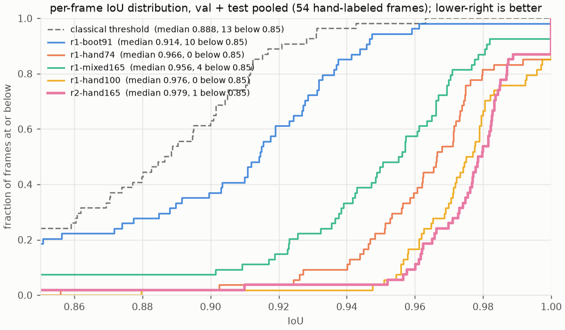

# Learned segmentation: bootstrap, label, fine-tune, repeat

The mask fit in [`MASK_FIT_EXPERIMENT.md`](MASK_FIT_EXPERIMENT.md) made the
segmentation mask the only evidence for the pose, so mask defects (clipped
thin tails, debris fused to the body, interior texture) now show up directly
as pose errors. This document describes the loop that replaces the
local-darkness threshold with a small fine-tuned network, and the tooling
that keeps labeling throughput high.

The loop is:

`bootstrap labels from the pipeline -> train -> label with the network proposing -> retrain from the last checkpoint -> ...`

Everything lives in this repository. Labels live on flv-c4's local disk.
Checkpoints live in a git-ignored local directory.

## 1. Model

`src/worm_pose_gen/segmenter.py` defines a U-Net whose encoder is
torchvision's ImageNet-pretrained ResNet-18 with the stem collapsed to one
input channel (the RGB stem weights are summed). Skip connections at strides
2 through 32 plus the raw input give full-resolution logits, which thin tails
need. It has `14.3M` parameters and processes one `732 x 968` frame in a few
milliseconds on the project GPU.

`SegmentationModule` is the Lightning wrapper: masked binary cross-entropy
plus soft Dice, IoU/Dice/precision/recall logged over valid pixels, AdamW
with the encoder at a quarter of the decoder's learning rate, and cosine
decay. `predict_probability(frame)` returns a `[H,W]` worm probability map
for any grayscale frame. `load_segmenter(path)` loads a checkpoint for
inference without touching the pretrained-weight download.

Labels use three values: `0` background, `1` worm, `255` ignore. Ignored
pixels contribute to neither the loss nor the metrics, which is what lets
bootstrapped labels be honest about what they do not know.

## 2. Dataset store

`src/worm_pose_gen/segmentation_dataset.py` keeps one `.npz` per labeled
frame under the dataset root (default
`/temp_data4/alex/external_artifacts/datasets/worm_pose_gen/segmentation_v1`
on flv-c4's local ZFS pool) holding the flat-fielded frame the network sees,
the raw frame, and the label. `index.json` records recording, frame index,
split, label source, revision, save time, and label statistics for every
sample, and is rewritten atomically.

A sample's split is assigned when it is first saved, to whichever of train,
validation, and test is furthest below its `80 / 10 / 10` target, so the
proportions hold for a small set. The assignment is pledged in
`splits.json` next to the index, and that file is append-only: re-saving a
refined label bumps the revision and keeps the split, deleting a sample
keeps its pledge, and labeling the same frame again later gets the pledged
split back. A frame that has ever been validation or test therefore never
enters the training set. New pledges are balanced against every pledge ever
made, not just the samples present. All frames come from the same
recordings, so the test split measures generalization across frames, not
across recordings; a held-out recording is the stronger test when more
recordings become readable.

`SegmentationDataModule` serves training crops (`512 px`, half of them
centered on the worm) with flips, right-angle rotations, brightness and
contrast jitter, and noise, and serves validation and test frames whole.

## 3. Bootstrap labels

```bash
scripts/project_env.sh uv run --no-sync --frozen python \
  scripts/bootstrap_segmentation_labels.py --frames-per-recording 40
```

For uniformly spaced frames of each readable recording, the script
flat-fields the frame, runs the frozen local-darkness threshold, keeps the
largest component, fills narrow holes, and then marks as **ignore** every
pixel the evidence disagrees about: a two-pixel band around the boundary and
every pixel where the raw threshold and the cleaned component differ. That
removes exactly the debris and thin-end pixels the threshold gets wrong.
Frames with no plausible component (the empty ones) are skipped.
`--with-mask-fit` additionally ignores where the rendered tube from the mask
fit disagrees with the component, at about `20 s` per frame.

The first bootstrap wrote 114 samples from the three Section 7 recordings
(91 / 12 / 11), with a median `3.1%` of pixels ignored and 6 empty frames
skipped, in about `0.3 s` per frame.

## 4. Train and evaluate

Training and evaluation now read the library's datasets and benchmarks
(docs/APP_SIMPLIFICATION.md, sections 1 and 4); this store was migrated into
the lab dataset `nir-labels`:

```bash
scripts/project_env.sh uv run --no-sync --frozen python scripts/train.py \
  --setup lab:nir-flv --dataset lab:nir-labels --start-from lab:nir-hand284
scripts/project_env.sh uv run --no-sync --frozen python scripts/evaluate_model.py --model lab:nir-hand284
```

The stopping rule below is unchanged: a run ends when the validation loss
(masked BCE plus soft Dice) has not improved for `--patience` epochs (5 for
the segmenter), the learning rate halves whenever the loss stalls for
`--plateau-patience` epochs, and the model is the checkpoint with the lowest
validation loss, not the thresholded IoU: IoU saturates within ten epochs
while the loss keeps falling, and runs selected on IoU produced models whose
background probability sat near `0.3`. Promotion, `best.ckpt`,
`promotions.jsonl`, the `--train-labels` filter and the
`evaluations/history.jsonl` sessions are gone: a model becomes a setup's
default with **Use as default** (with a reason), and each evaluation is
stored with its model per benchmark. The comparisons below were made with
the old scripts.

### Three-way comparison (September 3, 2026)

Three models were trained from ImageNet weights with identical settings
(seed 0, 40 epochs maximum, patience 12) on different training labels, and
every checkpoint was evaluated against the 21 validation and 20 test labels,
all hand-refined. Two frames in each split are empty. Median IoU over the
split, with the lowest IoU over non-empty frames in brackets; "beats" counts
frames where the network's IoU exceeds the classical threshold's.

| Training labels | Checkpoint | Epoch | Val IoU | Test IoU | Beats classical (val, test) | False-positive px on empty frames (median) |
|---|---|---:|---:|---:|---|---:|
| bootstrap only (91) | best | 7 | 0.918 [0.70] | 0.913 [0.77] | 11/21, 13/20 | 1977 |
| bootstrap only (91) | last | 20 | 0.807 [0.71] | 0.830 [0.76] | 7/21, 6/20 | 3115 |
| hand only (74) | best | 8 | 0.960 [0.86] | 0.967 [0.87] | 18/21, 19/20 | 0 |
| hand only (74) | last | 21 | 0.967 [0.86] | 0.974 [0.86] | 18/21, 18/20 | 538 |
| all (165) | best | 24 | 0.951 [0.90] | 0.953 [0.87] | 20/21, 17/20 | 0 |
| all (165) | last | 37 | 0.950 [0.88] | 0.958 [0.87] | 18/21, 18/20 | 2179 |
| classical threshold | | | 0.901 | 0.883 | | 1163 |

Three things follow. Bootstrap labels hurt: the bootstrap-only model barely
beats the threshold it was distilled from, and keeps getting worse after its
best epoch. Hand labels alone give the highest medians with a fifth fewer
training frames, and mixing the bootstrap labels in costs about one IoU
point at the median while making the worst non-empty frame slightly better.
Early stopping matters: every final-epoch checkpoint paints hundreds to
thousands of pixels on empty frames that its best checkpoint leaves clean,
so `best.ckpt` is the one to use. The hand-only best checkpoint was
promoted to `checkpoints/segmenter/best.ckpt` for the app.

The bootstrap training labels are now the weakest data in the store, and
either revising them in the app or training with `--train-labels manual` is
the better use of them.

## 5. Label with the app

Labels are painted in **Paint**, a screen of the pose app that works on the
segmentation store directly, without a workspace:

```bash
scripts/project_env.sh uv run --no-sync python -m worm_pose_gen.app \
  --corpus-root /temp_data4/alex/external_artifacts/datasets/worm_pose_gen/segmentation_v1 \
  --dataset-root /temp_data4/alex/external_artifacts/datasets/worm_pose_gen/segmentation_v1
```

Then open `http://127.0.0.1:8768` and choose **Paint**. The screen first
lists the label groups to work from:

- **Labeling manifests**: `docs/labeling_round_2/manifest.json`,
  `docs/labeling_round_3_contact/manifest.json` and any other
  `docs/labeling_*/manifest.json`, plus a path field. A manifest names its
  recordings with split pledges and lists frames with the reasons they were
  picked.
- **Recording sections**: a stretch of a recording to relabel (first, last,
  step). In a workspace, select a poorly segmented range in Inspect and press
  **Label range in Paint**; the section keeps the recording, dataset and range,
  not the workspace, and stays listed across restarts.
- **Saved labels**: one label or the filtered list from **Labels**, or a
  sample from **Body fields**, with a button back.

Opening a group shows its first unlabeled entry with its position, progress,
reasons and split pledge. The editor starts from the saved label if there is
one, else empty; proposals fill it.

| Keys | Action |
|---|---|
| `W` `C` `T` `V` | Preview the network, classical, threshold or saved proposal |
| `A` | Apply the preview with the Combine setting (Shift-, Alt- or Ctrl-click Apply to union, intersect or subtract) |
| `H` `L` `D` `R` `U` | Fill holes, keep the largest component, grow, shrink, tube fit |
| `B` `E` `I` | Worm, background and ignore brushes; `-` `=` change size |
| `Z` | Undo |
| `S` | Save the label |
| `Enter` | Save and open the next unlabeled entry |
| `N` `P` | Next and previous entry in the group |
| `F` `O` `0` | Raw/flat-fielded view, overlay opacity, fit view |
| Wheel; right, middle or `Shift` drag | Zoom; pan |

Each save writes the sample with the manifest's split pledge (a section or
saved label keeps the store's balanced assignment or an existing pledge),
archives a revision, and records `label_source` `manual:corpus`. A frame with
no worm can be saved as all background, which teaches the network that debris
is not worm.

The older standalone labeler, `python -m worm_pose_gen.label_app`, is still in
the repository with its network-uncertain next-frame mode; Paint has no
uncertainty-driven selection yet.

## 6. Run on an unseen recording

```bash
scripts/project_env.sh uv run --no-sync --frozen python scripts/segment_video.py \
  --recording /store1/shared/all_data_raw/prj_aversion/2024-05-28/2024-05-28-02.h5 \
  --start 0 --frames 1200
```

`scripts/segment_video.py` reads a stretch of a recording in slabs,
flat-fields it with the cached per-recording correction, runs the promoted
checkpoint in batches (`--batch-size 16`, about `27 ms` per frame on the
project GPU including padding to full resolution), thresholds at `0.5`,
fills narrow holes and keeps the largest component (`--raw-mask` skips
that), and writes an MP4 under `checkpoints/segmenter/videos/` with the
mask filled in magenta and outlined in green, plus a JSON file of per-frame
worm pixels, raw component counts, pixels dropped by the component
selection, and pixels added by hole filling. `--scale 0.5` halves the
output for sharing; `--show-uncertain` tints the `0.2` to `0.8` probability
band yellow.

The first minute of `2024-05-28-02`, a session four months after the newest
labeled recording, segmented cleanly with the hand-only model: every frame
had a worm, the median mask was `28k` pixels, and `211` of `1200` frames had
small extra components (median `0`, at most `3.6k` pixels outside the
largest) from debris. The same run exposed a calibration problem: that
checkpoint, chosen by validation IoU at epoch 8, put background probability
near `0.34`, so `96%` of pixels fell in the uncertain band, while the
all-labels checkpoint trained to epoch 24 put background near `0.09`. IoU at
threshold `0.5` was unaffected, but the app's network-uncertain frame
selection had been close to random and the probability map was useless as
a soft target.

Selecting and stopping on validation loss fixed it. The hand-label run
under that rule with a cosine schedule (`hand_labels_loss`, best at epoch
52 of 60, loss still falling at the cap) reached median IoU `0.973` on 25
validation and `0.975` on 23 test labels against `0.960` / `0.967` for the
IoU-selected model, and put background at `0.10` on the unseen recording.
The run under the plateau schedule with patience 5 (`hand_labels_plateau`,
100 hand labels, best at epoch 99 of 105) took the validation loss from
`0.751` to `0.236` at the same median IoU (`0.972` / `0.974`, worst
non-empty test frame `0.956`), was promoted on that loss, and on the unseen
recording puts background at `0.004` and worm at `0.999`, with `0.07%` of
pixels in the uncertain band and the same masks.

## 7. The loop

1. Bootstrap, train, evaluate. The first model learns the threshold's
   behavior with its systematic errors masked out.
2. Label in network-uncertain mode. Correct thin tails, cut fused debris,
   paint ignore over anything ambiguous. Save.
3. Retrain, evaluate, plot, and restart the app; the new model is promoted
   to the app automatically when its validation loss beats the previous one.
4. Once the hand-refined validation IoU is high and stable, feed the
   network's probability map to the mask fit as its soft target and return
   to evaluating pose estimation.

## What is not established

- The held-out labels are hand-refined by one person; there is no second
  annotator, so inter-annotator agreement is unknown and the IoU ceiling a
  human would reach is not measured.
- Self-overlap and coils produce a merged mask however good the segmenter
  is; resolving them is the pose model's job.
- The three recordings share a rig and a year. A recording from another
  setup should be labeled before the network is trusted on it.

## Targeted labeling round (round 2, 2026-09-04)

The pose pipeline's remaining failures are coils and camera exits, and both
trace back to the mask: the segmenter merges adjacent body turns into one
solid ring (the gap between turns survives only near the tail), and at the
camera edge the body's returning tail becomes a separate component. Round 2
targets exactly those frames, across more animals, with some animals held
out of training entirely.

1. **Candidate scan.** `scripts/find_sequence_clips.py --recording <h5>
   --stride 20` runs the segmenter over a recording and flags samples with a
   short skeleton for a whole worm (a coil), filled holes, fragments, or a
   mask on the image border, grouped into windows with a montage per
   recording under `docs/pose_pipeline_step4/clip_candidates/`. Frames whose
   HDF5 chunks need a compression plugin that is not installed are skipped
   and counted.
2. **Manifest.** `scripts/build_labeling_manifest.py` turns the scans into
   `docs/labeling_round_2/manifest.json`: per recording, the peak, first and
   last frame of each candidate window (coils and holes first, up to 30),
   six border-touching samples, and six ordinary frames spread over the
   recording; frames already in the store are skipped. Each recording
   carries a split policy: `auto` keeps the store's balanced per-frame
   assignment, `train`, `val` or `test` pledge every new label of that
   recording to one split, so an animal can be unique to validation or test.
3. **Labeling.** `python -m worm_pose_gen.label_app --queue
   docs/labeling_round_2/manifest.json` opens the manifest's recordings,
   selects the "Queue (manifest)" next mode, and walks the queued frames in
   order, skipping labeled ones; the frame info shows the queue position,
   the reasons the frame was picked, and the split its label will get. Saves
   pledge the recording's split (`SegmentationStore.save(..., split=...)`).
   Progress is in `/api/queue` and in the status line after each save.
4. **Retrain and re-evaluate.** After the round, retrain and re-evaluate;
   then re-evaluate hole filling and the largest-component rule on the
   sequence set (`scripts/evaluate_sequence_set.py`), since a segmenter that
   resolves the gap between turns may no longer need the fill, and the tail
   re-entry clip needs the fragments kept.

Recordings and split policy of round 2 are listed in the manifest summary;
the animals of `2024-05-28-02` (the pose pipeline's main test recording),
`2023-10-26-01` and `2024-06-18-12` are test-only, `2023-09-07-13` and
`2024-02-01-07` validation-only, and the rest join training alongside the
three recordings of round 1.

### Round 2 result (2026-09-05): `r2-hand165`

Alex labeled the first 65 frames of the manifest (all 24 queued frames of
`2023-06-23-01`, all 21 of `2023-06-29-12`, and 20 of 29 of
`2023-07-14-08`; 41 of them coil, hole, or fragment windows, 8 border
frames, 16 ordinary). The 91 bootstrap labels were then retired with
`scripts/retire_bootstrap_labels.py`, which copies their `.npz` files and
index rows to `<dataset root>/retired/<time>_bootstrap_classical/` and
deletes them from the store (split pledges stay), leaving 165 train, 28
validation, and 26 test labels, all hand-refined; the two new recordings are
training-only, so validation and test still cover the three round-1 animals.

`r2-hand165` was trained from ImageNet weights on the 165 hand labels with
the plateau schedule (best epoch 70 of 76, validation loss `0.182` against
`0.217` for `r1-hand100` on the same 28 labels) and promoted. Every
checkpoint was re-evaluated on the current labels in one session:

| Model | Train labels | Val median IoU | Val worst non-empty | Val frames < 0.95 (of 24) | Test median | Test worst | Test frames < 0.95 (of 22) | False-positive px on the 8 empty frames |
|---|---|---:|---:|---:|---:|---:|---:|---:|
| `r1-boot91` | 91 bootstrap | 0.916 | 0.796 | 24 | 0.913 | 0.856 | 20 | 13746 |
| `r1-hand74` | 74 hand | 0.966 | 0.856 | 7 | 0.971 | 0.924 | 5 | 0 |
| `r1-mixed165` | 74 hand + 91 bootstrap | 0.950 | 0.901 | 13 | 0.962 | 0.932 | 8 | 3617 |
| `r1-hand100` | 100 hand | 0.976 | 0.880 | 2 | 0.976 | 0.956 | 0 | 0 |
| `r2-hand165` | 165 hand | 0.978 | 0.910 | 1 | 0.981 | 0.952 | 0 | 212 |
| classical threshold | | 0.895 | | | 0.880 | | | 20662 |

The gain is at the low end: the worst validation frame goes from `0.880` to
`0.910`, one validation frame instead of two is below `0.95`, and
`model_delta.png` shows 15 validation and 14 test frames better against 7
and 6 worse, none by more than `0.015`. The one regression is an empty
validation frame (`2023-06-23-01` frame 20033) on which the new model
paints 212 pixels where the classical threshold paints 4089; an empty
frame scores 0 as soon as anything is painted, which is why the mean IoU
of the new model is lower while its median, loss, and every non-empty
frame are better. The remaining 328 manifest frames, including every frame
of the held-out animals, are still to be labeled, so the test split does
not yet measure a new animal.

The seven figures of this session are copied to
`pose_pipeline_step5c/segmenter_plots/`. The pose pipeline's view of the
new model, including a held-out plate on which it paints a dark streak as
worm, is in `POSE_PIPELINE_PLAN.md`, step 5c.


