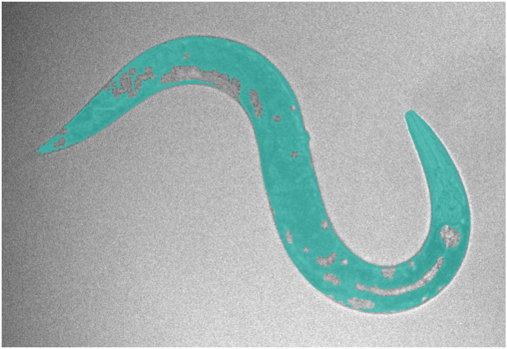
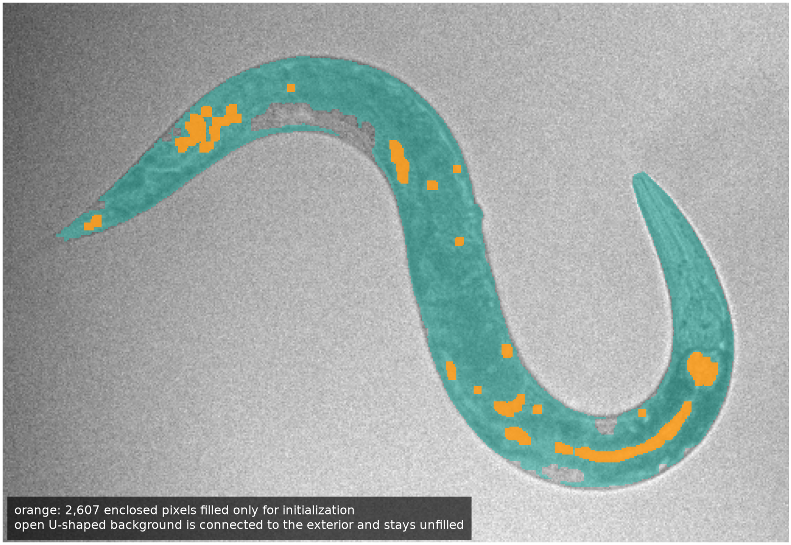
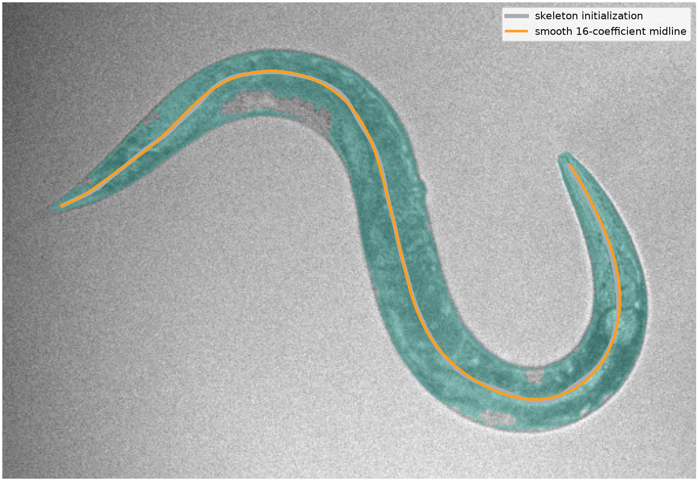
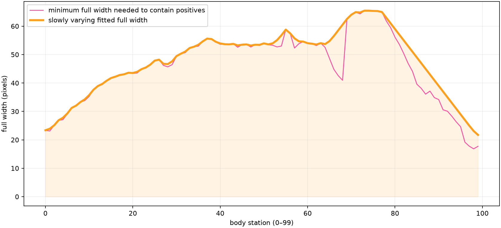
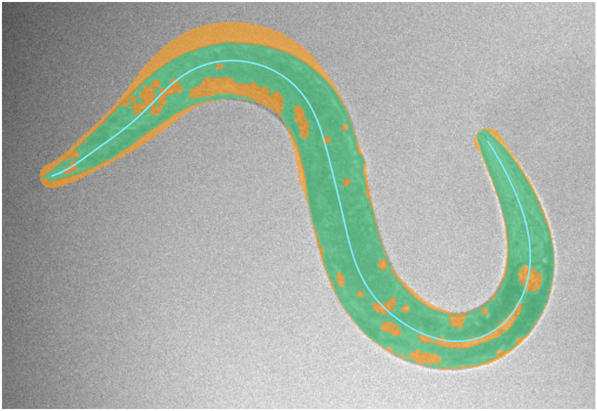
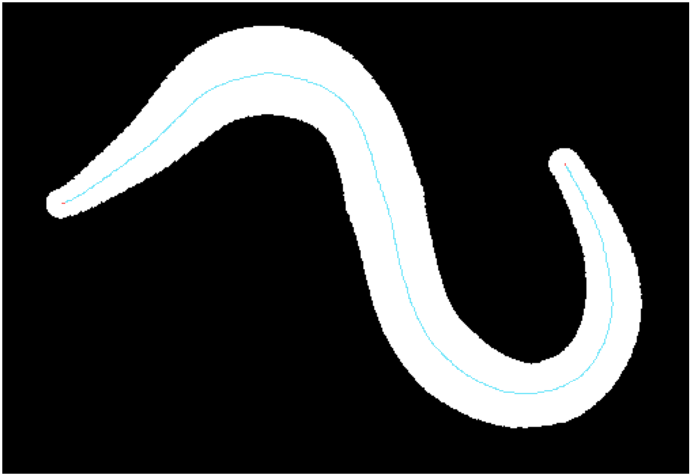
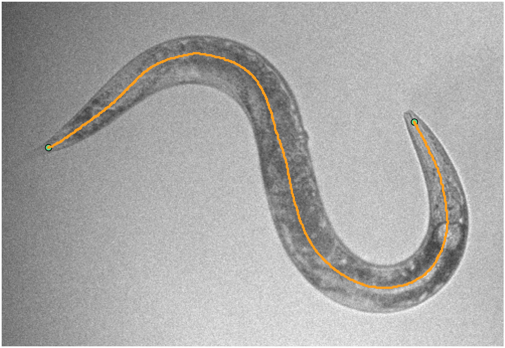
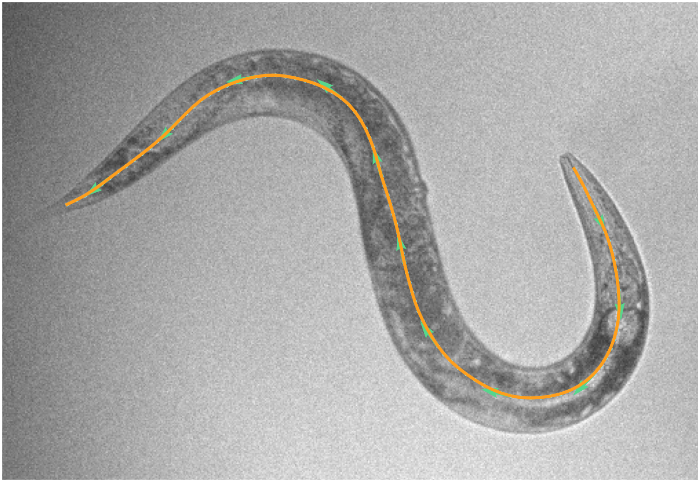
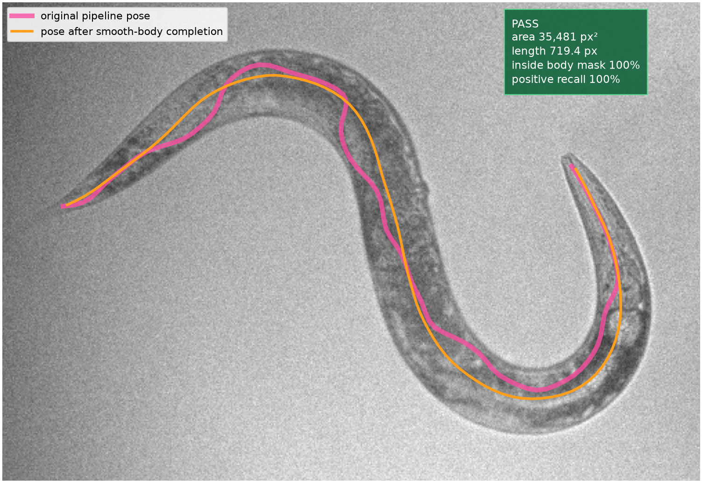
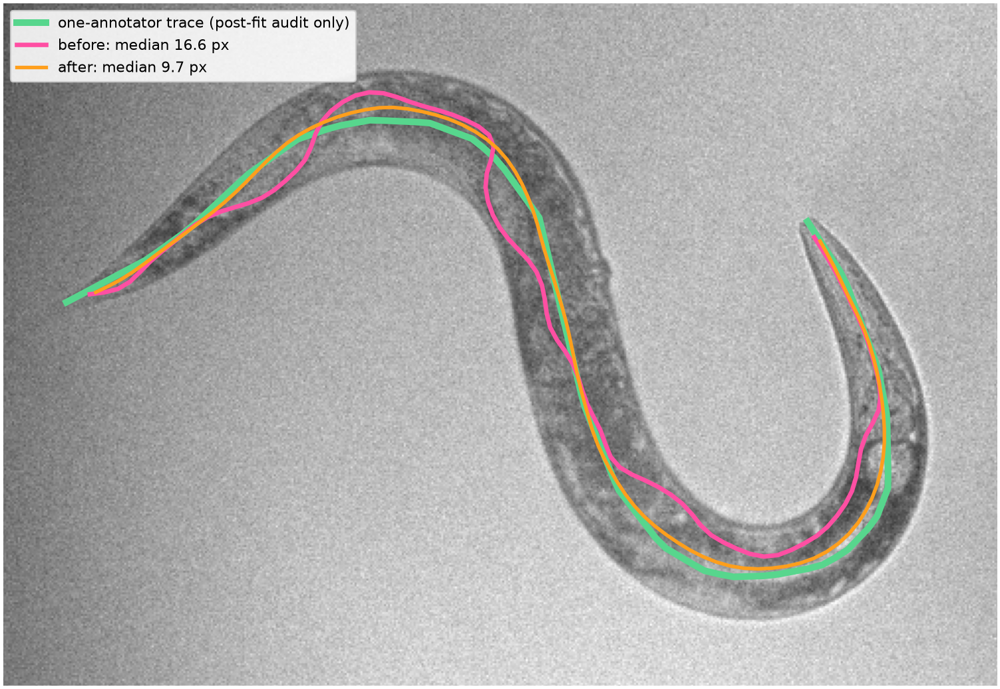

# Smooth-body prior: a one-frame audit

This experiment starts from the exact Section 3 component in the pose explainer. It asks a narrow question:

> Can a smooth midline with a slowly changing width fill the missing body pixels without losing the pixels we already trust?

On this frame, the prior makes the body topology much cleaner and improves agreement with the existing manual trace. Under the revised geometric gate, it is accepted as a modeled body candidate.

The flow is:

`Section 3 positives -> cavity-safe initialization -> smooth midline -> smooth containing width -> completed body -> skeleton -> longest path -> 100-point pose -> quality gate`

## Evidence boundary

- This is one intentionally tuned development-frame experiment, not a new best method.
- The real input is frame `3420` from `nir_videos/2023-09-19-01.h5`, dataset `/img_nir`. The script reads the provenance-preserving cached copy used by the repository.
- This frame previously helped choose cleanup settings for another development experiment. It is not independent validation.
- A single annotator's centerline is loaded only after fitting, for the final audit. There is no manual body mask, so the added pixels cannot be called true positives.
- The protected 2025 holdout remains unopened.

## 0. Start with the exact Section 3 positives

The cyan region is the same largest connected component shown in Section 3 of the original explainer. The script rebuilds it with the same local-background radius (`31 px`), light smoothing radius (`2 px`), foreground threshold (`z >= 2.6`), and closing radius (`2 px`). It contains **25,709 positive pixels**.



We treat these pixels as evidence that the worm is present. The model is required to keep every one of them. This does **not** prove that every cyan pixel is truly worm.

## 1. Build a safer starting path

The original component contains small enclosed gaps. Those gaps make its skeleton branch and loop.

For initialization only, we fill background cavities that cannot reach the image border. The open center of the U shape can reach the exterior, so it stays empty.



This fills **17 cavities**, or **2,607 pixels**. It is a topology assumption: it works for small internal cut-ins, but could be wrong at a tight self-contact.

## 2. Replace the rough path with a smooth latent midline

We skeletonize the initialization, take its longest path, and resample it to 100 points. Then we encode its turning angles with **16 cubic spline coefficients** and decode them back into a smooth curve.



The manual trace is not used here. The fit only sees the Section 3 pixels and the cavity rule above.

## 3. Fit a slowly changing width that contains the positives

For each positive pixel:

1. Find its nearest point on the smooth midline.
2. Measure the radius needed to reach it.
3. Add a `0.75 px` rasterization margin.
4. Raise neighboring radii as needed so the radius changes by no more than `1 px` between body stations.
5. Round sharp corners in that width profile without dropping below the required radius.

Equivalently, the full width can change by at most `2 px` per station.



The fitted full width ranges from **21.73 px** to **65.45 px**, below the declared **80 px** ceiling. After rasterization it contains **100%** of the original positive pixels.

The width ceiling and slow-change rule stop the easy but meaningless solution of making one enormous tube.

## 4. Render the completed body

The model draws a symmetric tube around the latent midline.

- Green: original Section 3 positives
- Orange: pixels added by the prior
- Cyan: latent midline



The completed body has **35,481 pixels**, including **9,772 added pixels**. Only **24.5%** of the added pixels have even weak local darkness (`z >= 0`) in the original score image. None reach the original foreground threshold (`z >= 2.6`). This is a diagnostic on inferred body pixels, not on the midline.

That does not prove the orange area is background. It does show that the prior, rather than strong local image evidence, is responsible for most additions.

## 5. Rerun thinning and spur removal

We now resume the original pipeline without changing its downstream operations: thin the modeled body to one pixel, then peel eight layers of terminal spurs.



The topology becomes much simpler:

| Measure | Before prior | After prior |
|---|---:|---:|
| Connected skeleton components | 1 | 1 |
| Endpoints | 12 | 2 |
| Branch pixels | 44 | 0 |
| Cycle present | yes | no |

## 6. Select the longest endpoint-to-endpoint path

With two endpoints and no branches, the longest connected path is now unambiguous.



This is the main geometric success of the prior: the many cut-ins no longer create competing skeleton branches.

## 7. Produce the 100-point pose

The selected path is resampled to 100 equally spaced points. The green arrows show the local tangent directions.



The resulting centerline is **719.36 px** long.

## 8. Apply the geometric quality gate

The completed body uses the revised `40,000 px²` modeled-area allowance. The midline is defined from the body geometry, so darkness is not sampled or scored along it.



The result **passes** the geometric checks:

| Gate | Required | Result |
|---|---:|---:|
| Body area | 2,500–40,000 px | 35,481 px — pass |
| Centerline inside modeled body | at least 95% | 100% — pass |
| Maximum full width | at most 80 px | 65.45 px — pass |
| Original-positive containment | 100% | 100% — pass |

The centerline is the medial path between the two sides of the modeled body. The darkness score is used upstream to find candidate border pixels, not as a visual target for the midline.

## 9. Audit against the manual centerline

Only after fitting and gating do we load the existing one-annotator trace. Scoring is orientation-symmetric.



| Metric | Original pipeline | Smooth-body result | Change |
|---|---:|---:|---:|
| Median point error | 16.58 px | **9.72 px** | better |
| 95th-percentile point error | 32.58 px | **13.63 px** | better |
| Mean tangent error | 14.24 deg | **4.63 deg** | better |
| Mean endpoint error | **10.60 px** | 13.77 px | worse |
| Body-length error | **4.32%** | 4.40% | slightly worse |

The middle of the recovered pose agrees better with the trace, while its endpoints do not. This is a mixed result, not a blanket improvement.

## Verdict

The experiment supports the proposed mechanism on this frame: a smooth latent midline plus a slowly changing containing width removes gaps, turns a branched skeleton into one clean path, and improves centerline and tangent agreement.

It does **not** yet support a robust pose-estimation claim. Most added pixels have little local image support, endpoint accuracy worsens, and `n = 1` cannot measure generalization.

The next fair test is to freeze these parameters now and run them unchanged on all 30 primary development annotations. That test must report both pose error and acceptance coverage. Only after that should the method be tested on an untouched recording or authorized holdout.

## Rebuild and inspect

Run from the repository root:

```bash
scripts/project_env.sh uv run --no-sync --frozen python \
  scripts/build_smooth_body_prior_experiment.py
```

The exact numeric output is in [`metrics.json`](smooth_body_prior_experiment/metrics.json). The masks, paths, widths, and poses are preserved in [`experiment_arrays.npz`](smooth_body_prior_experiment/experiment_arrays.npz) for pixel-level inspection.
