# Mask-fit diagnostic sheets

Each sheet shows the raw crop, the observed raw threshold and Section 3
component, every starting state with the winning final centerline, the
best fit's rendered boundary, the residual between rendered and observed
masks, and the energy trajectory of every start. IoU is agreement with
the hole-filled segmentation, not anatomical accuracy. Samples 09, 19, and 29 are
known empty frames.

## Sample 00: `2024-01-31-02` frame 0

Frozen pipeline: **frozen_accepted**. Mask fit: IoU **0.946** from `reference`, length 622 px, width 43.6 px, 96/100 points in view.

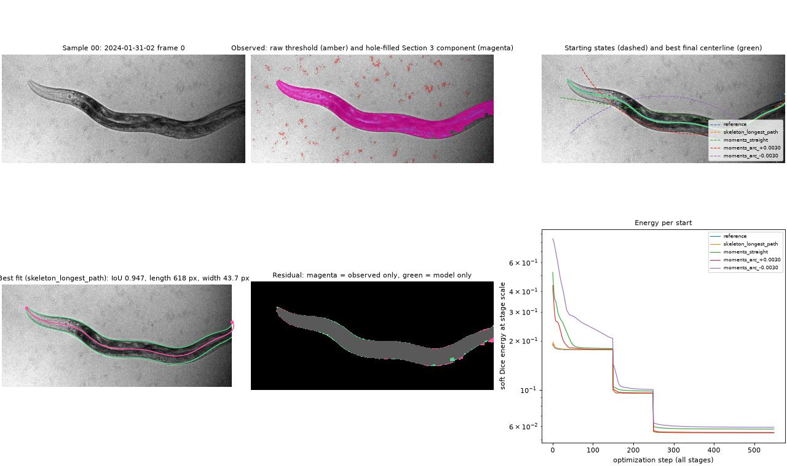

## Sample 01: `2024-01-31-02` frame 2275

Frozen pipeline: **frozen_rejected_A1**. Mask fit: IoU **0.907** from `skeleton_longest_path`, length 697 px, width 43.5 px, 100/100 points in view.

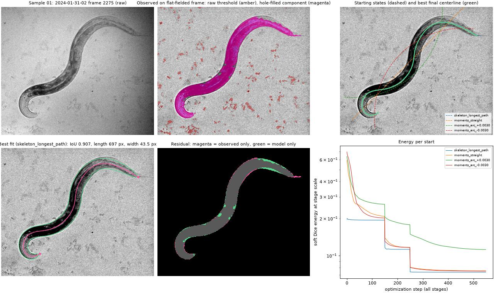

## Sample 02: `2024-01-31-02` frame 4551

Frozen pipeline: **frozen_rejected_A1**. Mask fit: IoU **0.887** from `skeleton_longest_path`, length 702 px, width 42.7 px, 100/100 points in view.

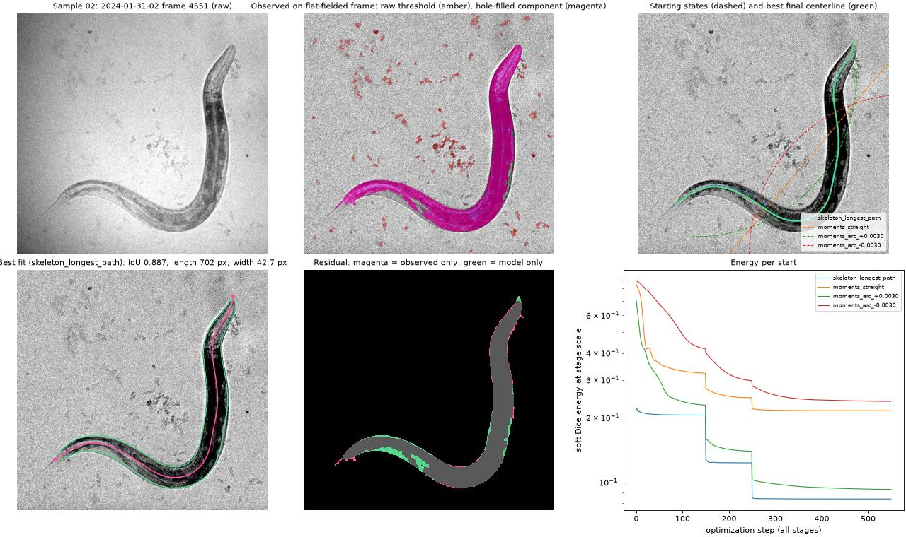

## Sample 03: `2024-01-31-02` frame 6826

Frozen pipeline: **frozen_accepted**. Mask fit: IoU **0.954** from `reference`, length 704 px, width 43.2 px, 100/100 points in view.

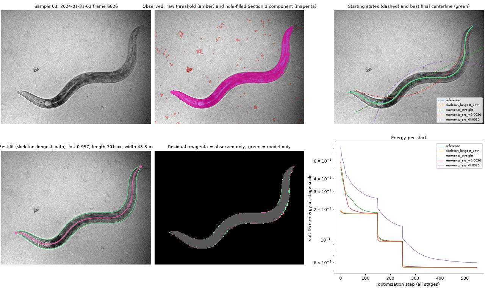

## Sample 04: `2024-01-31-02` frame 9102

Frozen pipeline: **frozen_rejected_A1**. Mask fit: IoU **0.902** from `moments_arc_+0.0030`, length 691 px, width 44.4 px, 100/100 points in view.

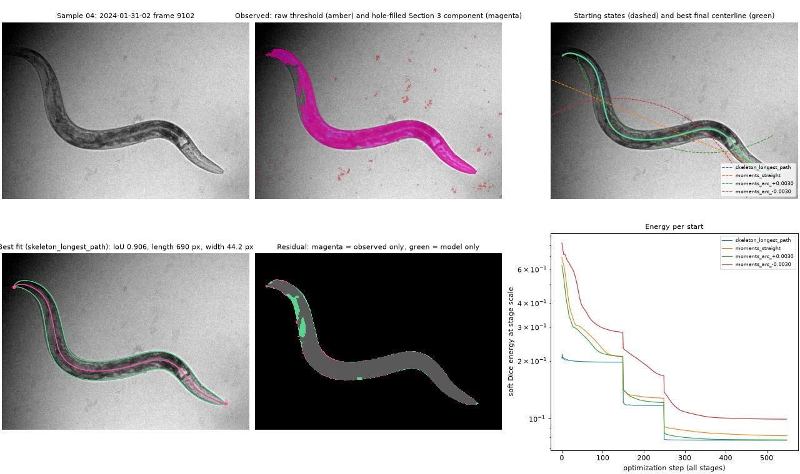

## Sample 05: `2024-01-31-02` frame 11377

Frozen pipeline: **frozen_rejected_A1**. Mask fit: IoU **0.911** from `skeleton_longest_path`, length 731 px, width 42.2 px, 100/100 points in view.

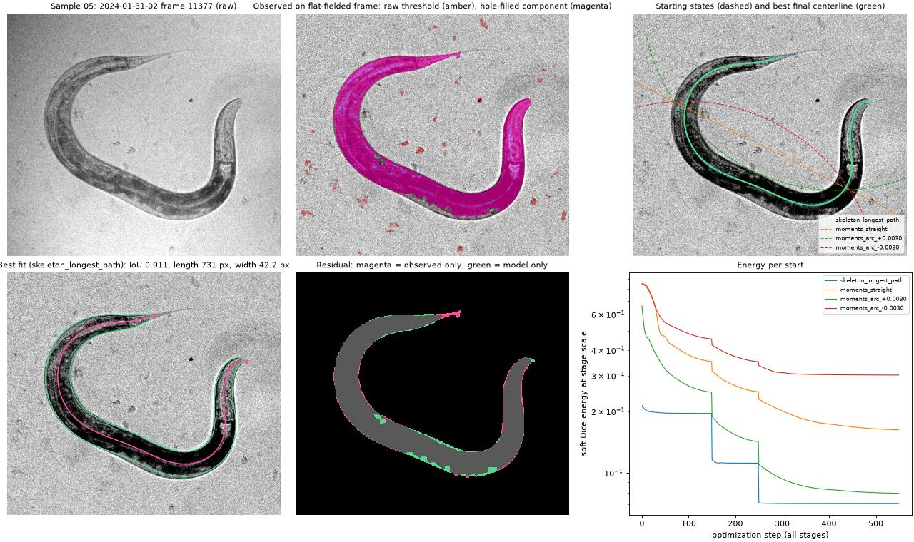

## Sample 06: `2024-01-31-02` frame 13653

Frozen pipeline: **frozen_rejected_A1**. Mask fit: IoU **0.900** from `skeleton_longest_path`, length 560 px, width 42.2 px, 93/100 points in view.

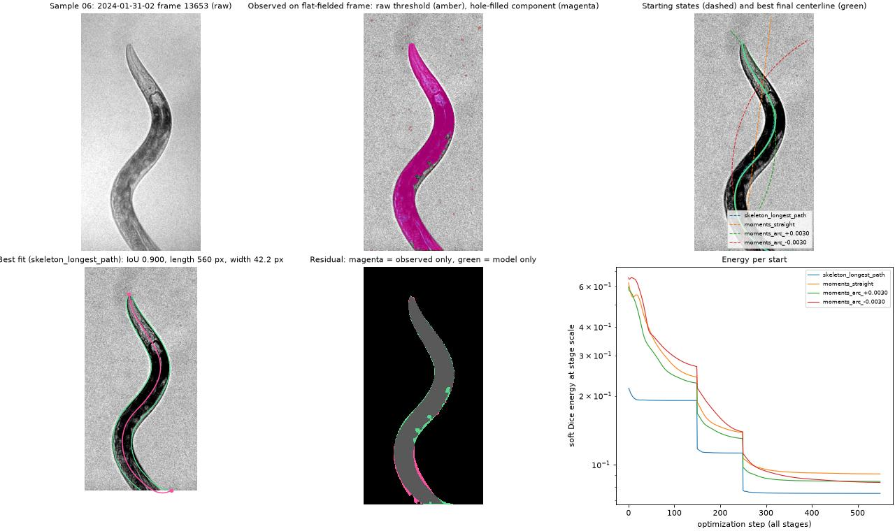

## Sample 07: `2024-01-31-02` frame 15928

Frozen pipeline: **frozen_rejected_A1**. Mask fit: IoU **0.924** from `skeleton_longest_path`, length 724 px, width 42.5 px, 100/100 points in view.

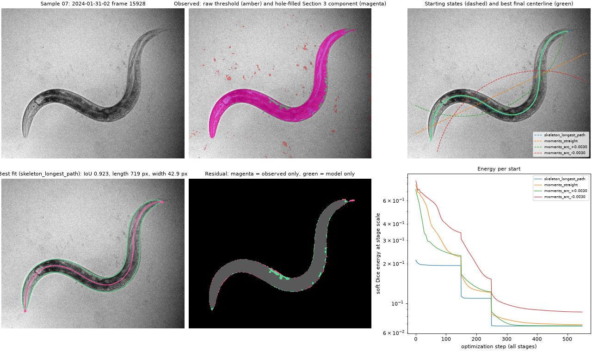

## Sample 08: `2024-01-31-02` frame 18204

Frozen pipeline: **frozen_accepted**. Mask fit: IoU **0.953** from `reference`, length 590 px, width 44.0 px, 78/100 points in view.

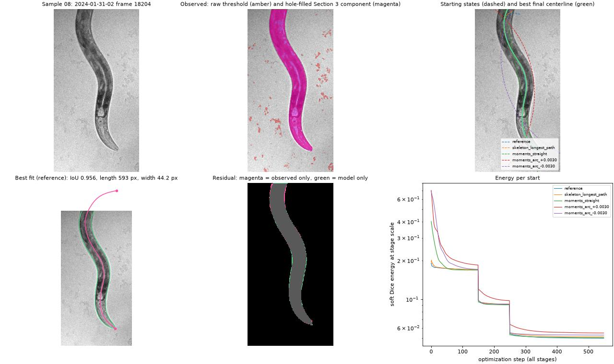

## Sample 09: `2024-01-31-02` frame 20480

Frozen pipeline: **expected_no_worm**. Mask fit: IoU **0.692** from `skeleton_longest_path`, length 589 px, width 15.8 px, 100/100 points in view.

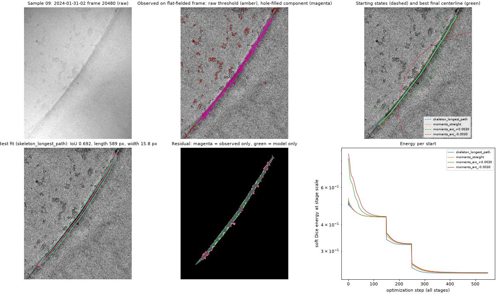

## Sample 10: `2023-08-22-01` frame 0

Frozen pipeline: **frozen_accepted**. Mask fit: IoU **0.907** from `skeleton_longest_path`, length 665 px, width 47.7 px, 98/100 points in view.

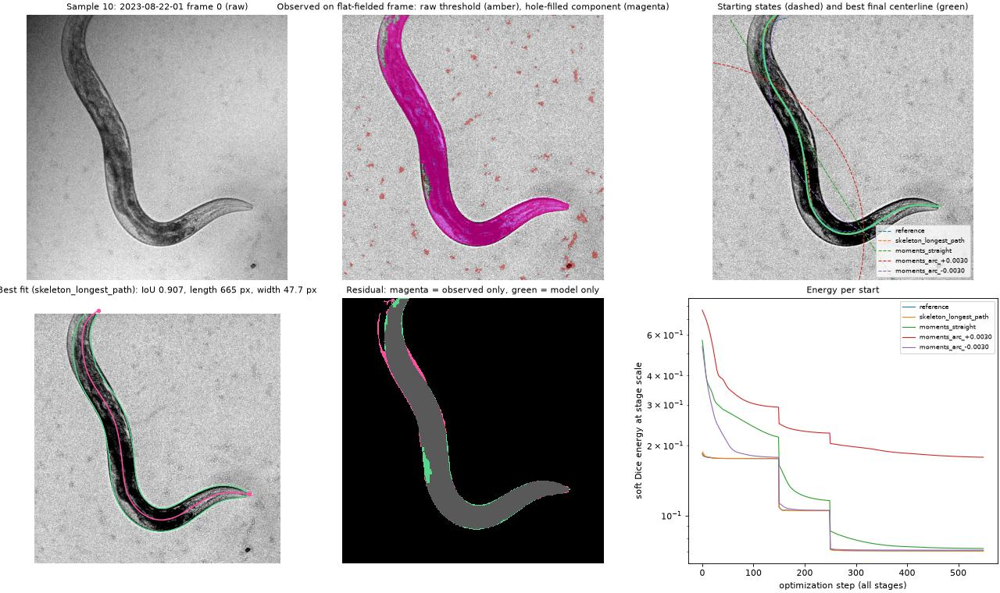

## Sample 11: `2023-08-22-01` frame 2260

Frozen pipeline: **frozen_rejected_A1**. Mask fit: IoU **0.899** from `moments_arc_+0.0030`, length 745 px, width 47.2 px, 99/100 points in view.

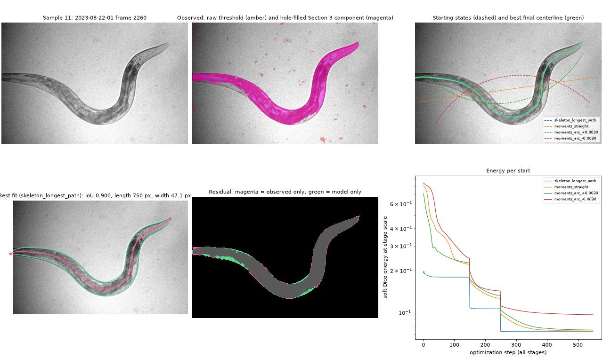

## Sample 12: `2023-08-22-01` frame 4520

Frozen pipeline: **frozen_rejected_A1**. Mask fit: IoU **0.898** from `skeleton_longest_path`, length 589 px, width 47.5 px, 98/100 points in view.

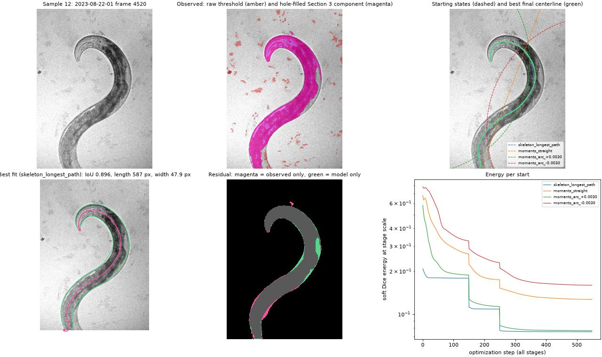

## Sample 13: `2023-08-22-01` frame 6780

Frozen pipeline: **frozen_accepted**. Mask fit: IoU **0.922** from `reference`, length 750 px, width 48.7 px, 95/100 points in view.

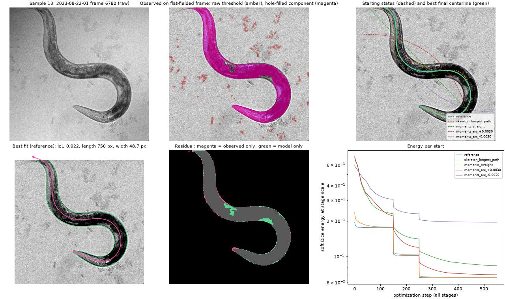

## Sample 14: `2023-08-22-01` frame 9040

Frozen pipeline: **frozen_accepted**. Mask fit: IoU **0.888** from `skeleton_longest_path`, length 719 px, width 47.5 px, 96/100 points in view.

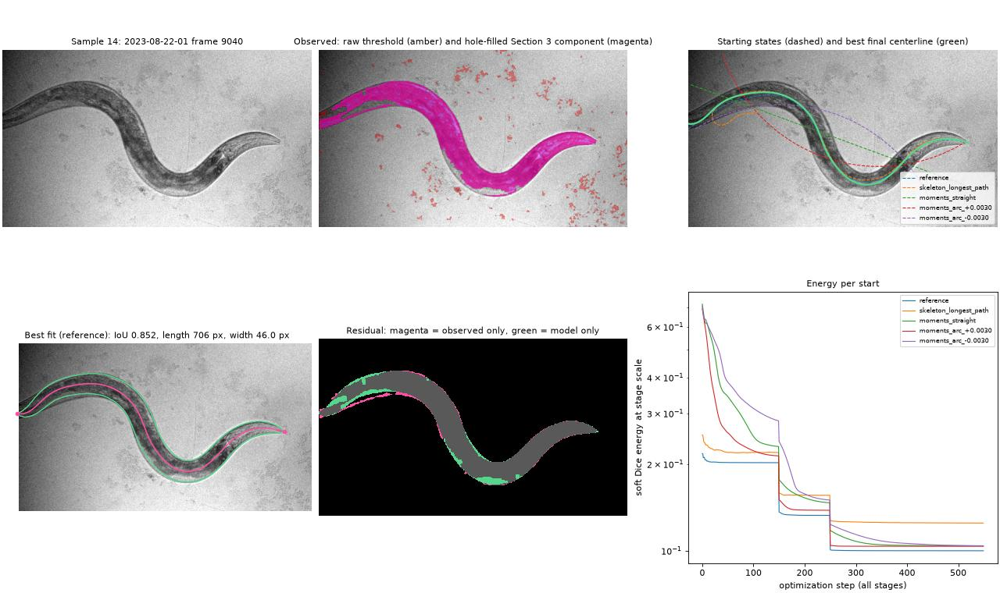

## Sample 15: `2023-08-22-01` frame 11300

Frozen pipeline: **frozen_rejected_A5_A6**. Mask fit: IoU **0.921** from `moments_straight`, length 576 px, width 45.0 px, 87/100 points in view.

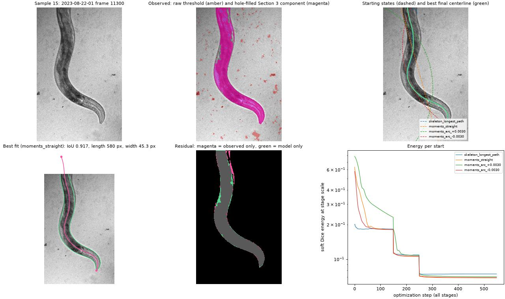

## Sample 16: `2023-08-22-01` frame 13560

Frozen pipeline: **frozen_rejected_A1**. Mask fit: IoU **0.919** from `moments_straight`, length 685 px, width 48.9 px, 97/100 points in view.

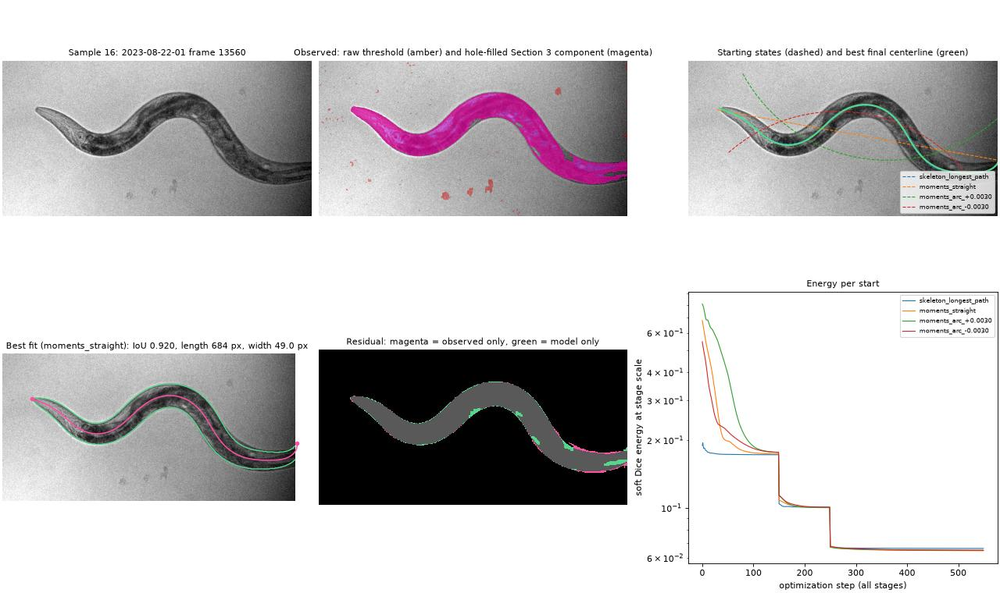

## Sample 17: `2023-08-22-01` frame 15820

Frozen pipeline: **frozen_rejected_A5_A6**. Mask fit: IoU **0.911** from `skeleton_longest_path`, length 752 px, width 48.2 px, 100/100 points in view.

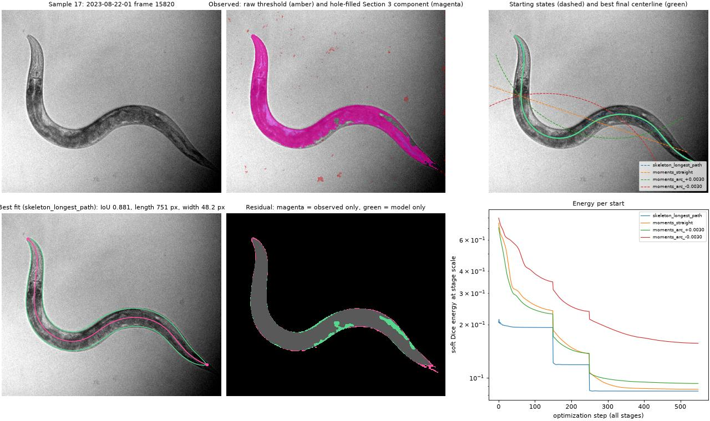

## Sample 18: `2023-08-22-01` frame 18080

Frozen pipeline: **frozen_rejected_A5_A6**. Mask fit: IoU **0.917** from `skeleton_longest_path`, length 752 px, width 48.8 px, 100/100 points in view.

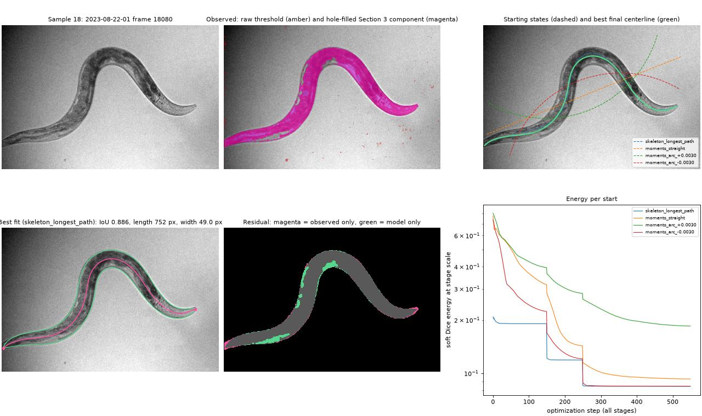

## Sample 19: `2023-08-22-01` frame 20340

Frozen pipeline: **expected_no_worm**. Mask fit: IoU **0.518** from `skeleton_longest_path`, length 218 px, width 11.1 px, 100/100 points in view.

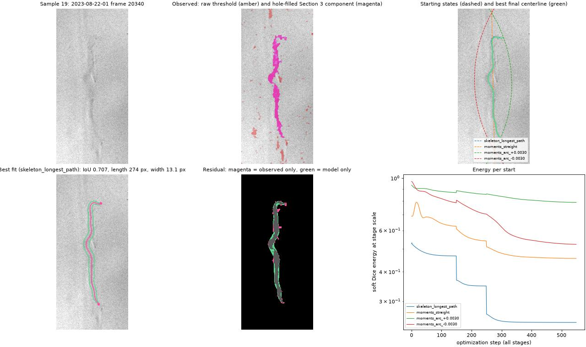

## Sample 20: `2023-06-23-01` frame 0

Frozen pipeline: **frozen_rejected_A5_A6**. Mask fit: IoU **0.911** from `skeleton_longest_path`, length 751 px, width 47.6 px, 100/100 points in view.

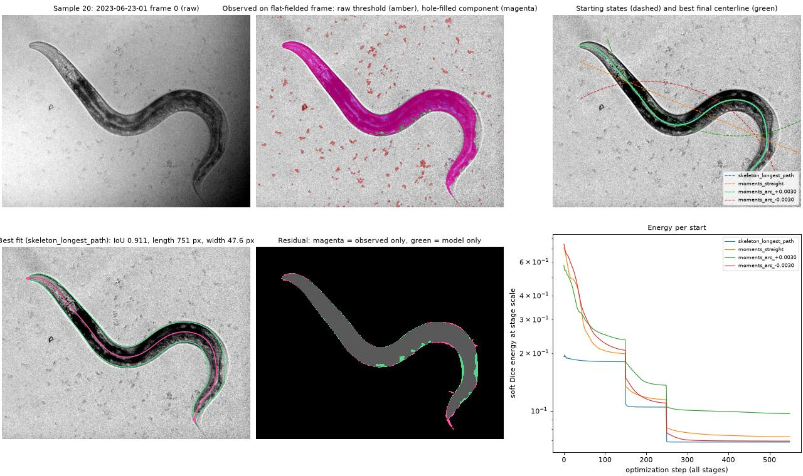

## Sample 21: `2023-06-23-01` frame 2284

Frozen pipeline: **frozen_accepted**. Mask fit: IoU **0.946** from `skeleton_longest_path`, length 750 px, width 48.8 px, 99/100 points in view.

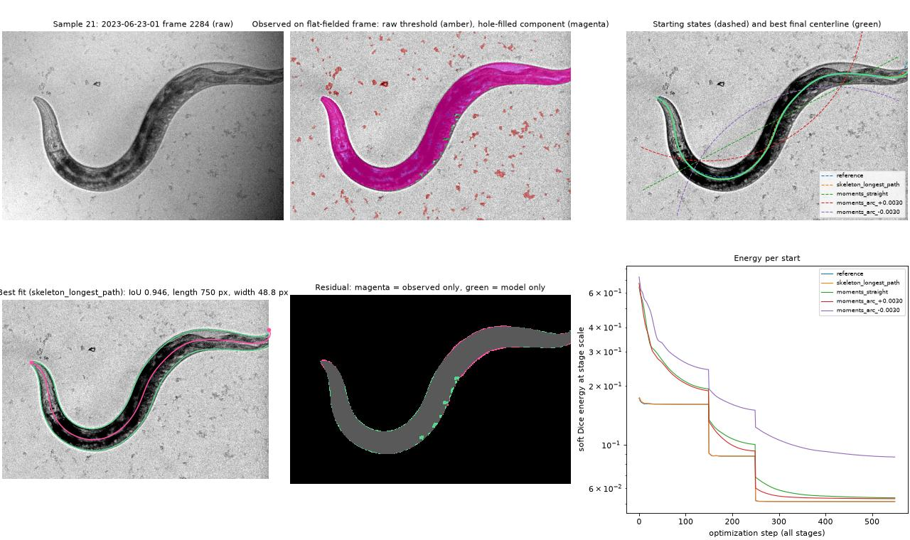

## Sample 22: `2023-06-23-01` frame 4569

Frozen pipeline: **frozen_accepted**. Mask fit: IoU **0.929** from `reference`, length 637 px, width 48.6 px, 83/100 points in view.

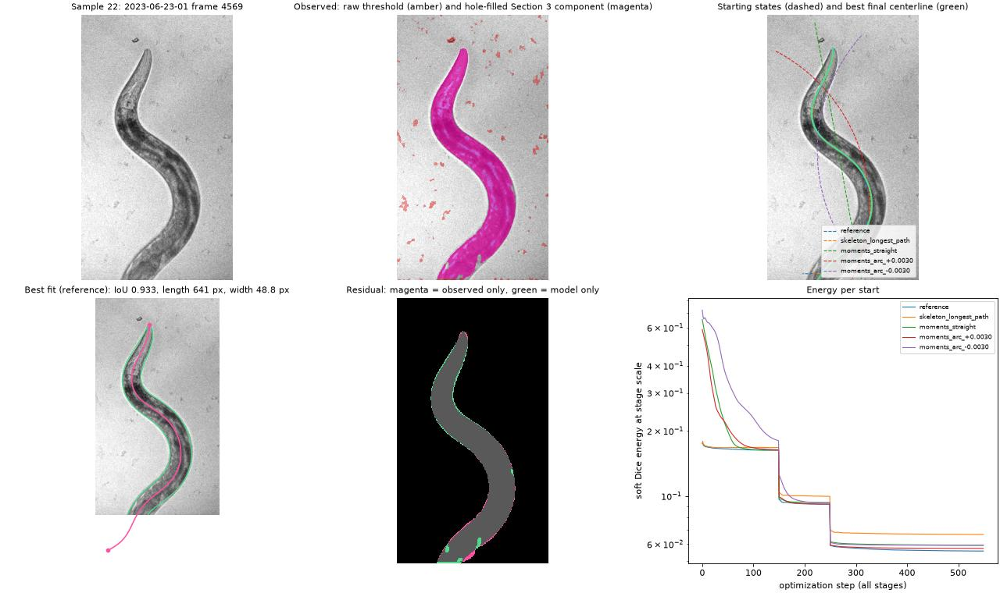

## Sample 23: `2023-06-23-01` frame 6853

Frozen pipeline: **frozen_rejected_A5_A6**. Mask fit: IoU **0.909** from `skeleton_longest_path`, length 750 px, width 48.6 px, 100/100 points in view.

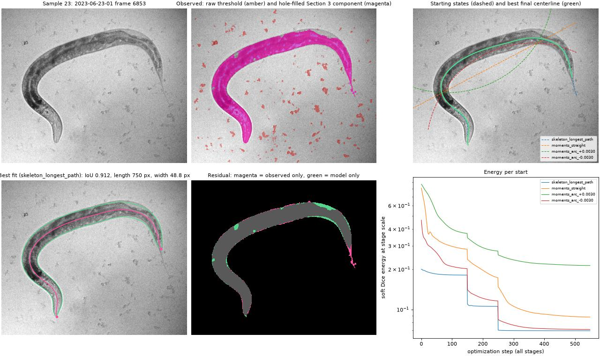

## Sample 24: `2023-06-23-01` frame 9138

Frozen pipeline: **frozen_accepted**. Mask fit: IoU **0.896** from `reference`, length 658 px, width 48.8 px, 100/100 points in view.

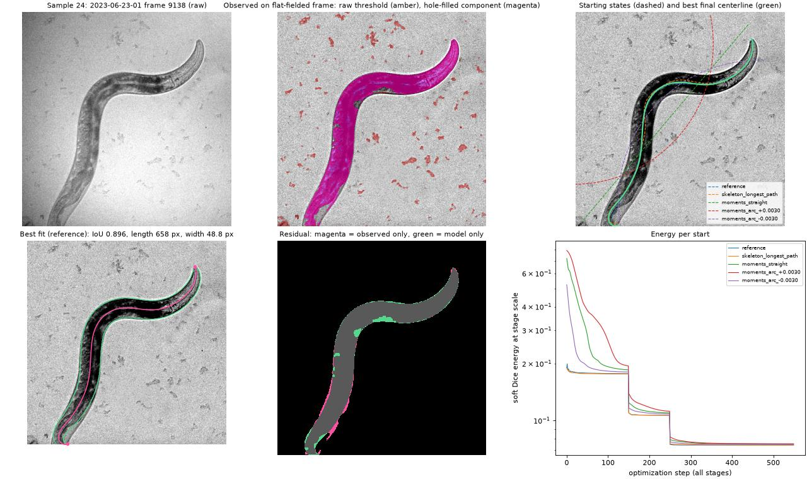

## Sample 25: `2023-06-23-01` frame 11422

Frozen pipeline: **frozen_rejected_A1**. Mask fit: IoU **0.904** from `skeleton_longest_path`, length 740 px, width 48.5 px, 97/100 points in view.

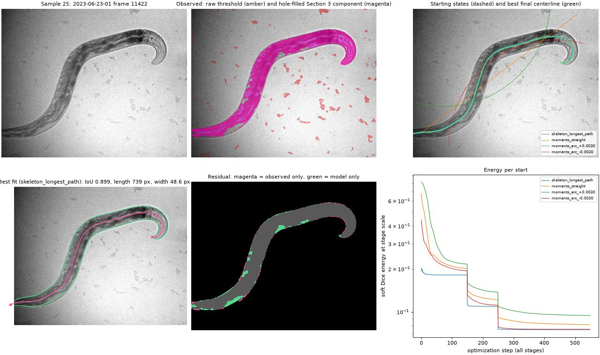

## Sample 26: `2023-06-23-01` frame 13707

Frozen pipeline: **frozen_accepted**. Mask fit: IoU **0.918** from `moments_arc_-0.0030`, length 584 px, width 47.4 px, 83/100 points in view.

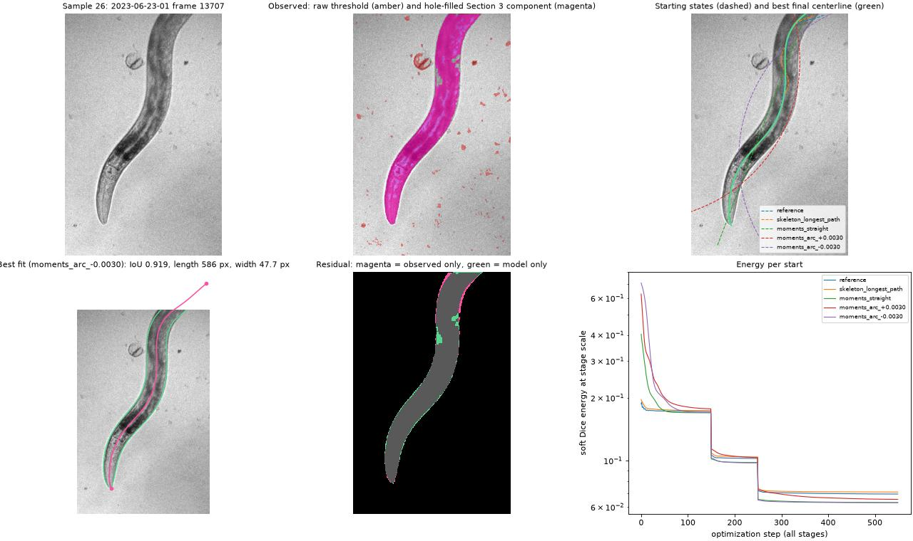

## Sample 27: `2023-06-23-01` frame 15991

Frozen pipeline: **frozen_rejected_A1**. Mask fit: IoU **0.868** from `skeleton_longest_path`, length 752 px, width 48.3 px, 100/100 points in view.

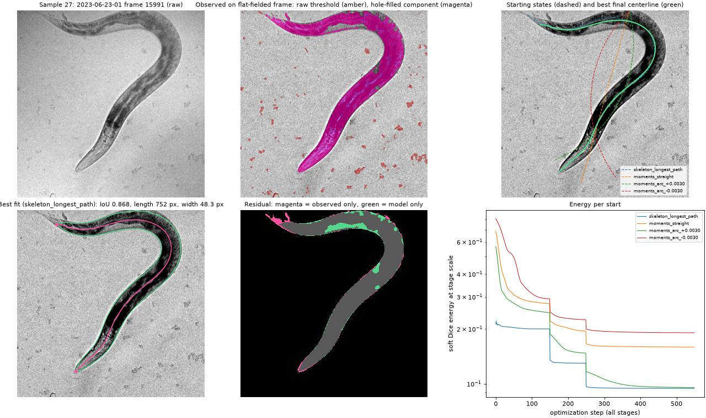

## Sample 28: `2023-06-23-01` frame 18276

Frozen pipeline: **frozen_accepted**. Mask fit: IoU **0.901** from `reference`, length 727 px, width 49.6 px, 100/100 points in view.

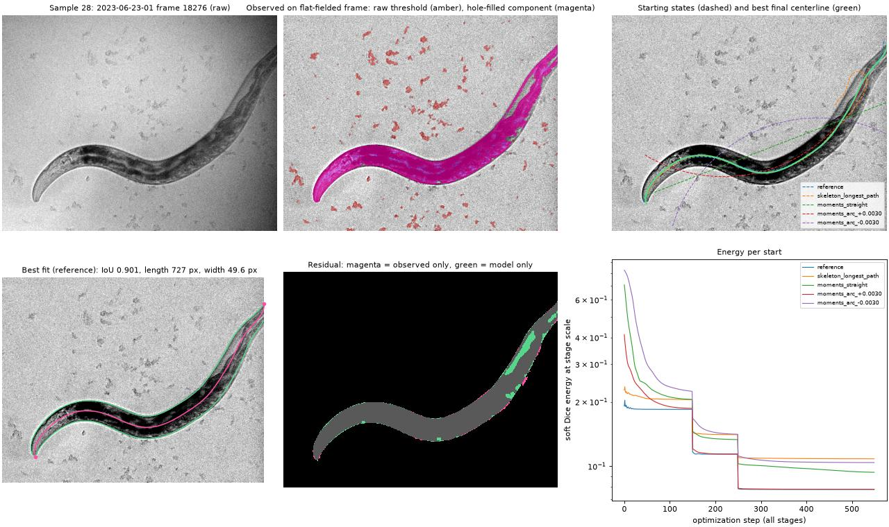

## Sample 29: `2023-06-23-01` frame 20561

Frozen pipeline: **expected_no_worm**. Mask fit: IoU **0.139** from `moments_straight`, length 385 px, width 13.5 px, 100/100 points in view.

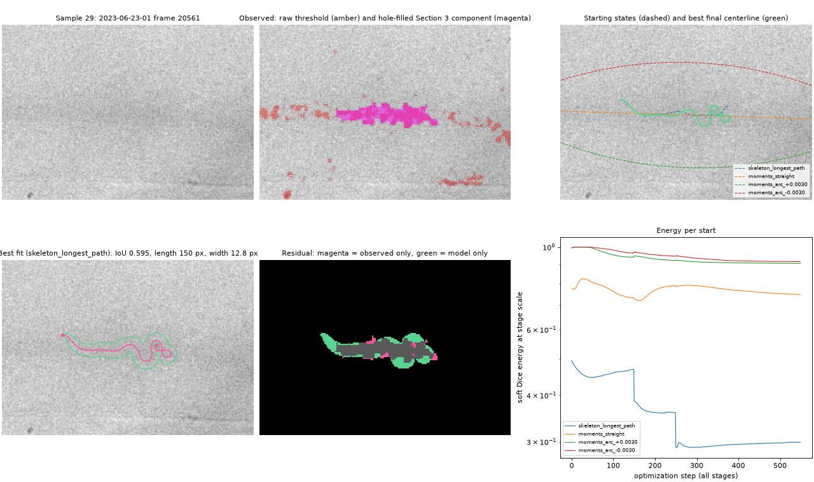
